# Helix KMP Master Architecture Source of Truth

**Architecture:** Helix KMP  
**Canonical baseline:** Helix KMP Baseline v1  
**Master source edition:** 1.3  
**Snapshot date:** 2026-09-02  
**Status:** Helix KMP Baseline v1 remains design-frozen at the four-law/core-boundary level; Master 1.3 is a correctness/no-drift pass over the 1.2 implementation-closure revision. Core runtime/data seams remain POC-qualified; early real-feature ergonomics remain subject to evidence-driven refinement.  
**Public CLI:** `helix-kmp`  
**Canonical source format:** Markdown  

> This file is the single comprehensive source from which all Helix KMP architecture, implementation, management, QA, contribution, AI-tooling, ADR, adoption, glossary, and HTML documentation may be derived.
>
> If a derived document conflicts with this file, this file wins unless this file is explicitly superseded by a later approved master edition.

---

## Master navigation

This file is intentionally exhaustive. Use this map to jump to the level of detail needed.

- **Foundations and reasoning:** [0. How to read this master](#0-how-to-read-and-maintain-this-master) · [1. Executive definition](#1-executive-definition) · [2. Four laws](#2-the-four-canonical-helix-laws) · [3. Design qualities](#3-derived-design-qualities-and-management-outcomes) · [4. Problem diagnosis](#4-problem-diagnosis-what-helix-is-designed-to-prevent) · [5. Design history and alternatives](#5-architecture-design-history-and-alternatives-explored) · [6. Architecture at a glance](#6-final-architecture-at-a-glance)
- **Core application architecture:** [7. Vocabulary](#7-canonical-vocabulary) · [8. Module taxonomy](#8-physical-module-taxonomy) · [9. Dependency direction](#9-dependency-direction) · [10. Reuse/extraction](#10-reuse-and-extraction-model) · [11. Presentation](#11-presentation-architecture) · [12. Runtime/identity](#12-runtime-ownership-and-identity) · [13. Capability API](#13-capability-api-and-business-model) · [14. Resources](#14-resource-architecture) · [15. Refresh/batching](#15-refresh-orchestration-and-batching) · [16. Commands/outbox](#16-commands-mutations-outbox-and-idempotency) · [17. Storage](#17-durable-storage-and-database-topology) · [18. Libraries/mechanisms](#18-technical-mechanisms-and-current-library-choices)
- **Quality and control plane:** [19. Observability](#19-observability-diagnostics-analytics-and-the-flight-recorder) · [20. Testing](#20-testing-and-quality-architecture) · [21. Mechanical enforcement](#21-mechanical-architecture-enforcement) · [22. CLI/scripts/AI Skills/context](#22-the-helix-kmp-control-plane) · [23. Evolution/doctor](#23-architecture-evolution-and-doctor) · [24. ADR governance](#24-adr-and-qualification-governance) · [25. ADR catalog](#25-current-adr-catalog) · [26. Qualification/evidence](#26-qualification-snapshot-and-evidence-ledger) · [27. Costs/risks](#27-known-costs-risks-and-honest-counterpoints)
- **Adoption, audiences, and documentation:** [28. Naming](#28-naming-and-public-identity) · [29. Starter adoption](#29-one-time-adoption-model-for-the-existing-kmp-starter) · [30. Cricket reference slice](#30-canonical-cricket-reference-slice) · [31. Non-mobile contribution](#31-contribution-without-android-expertise) · [32. QA model](#32-qa-operating-model) · [33. Management metrics](#33-management-outcomes-and-metrics) · [34. Derived-document rules](#34-documentation-derivation-rules)
- **Guardrails and reference:** [35. Red flags](#35-architecture-red-flags) · [36. Non-goals](#36-non-goals) · [37. External influences](#37-external-architecture-and-ecosystem-influences-explored) · [38. Public references](#38-public-reference-urls-used-for-qualificationreasoning) · [39. Compact mental model](#39-final-compact-mental-model) · [40. Maintenance checklist](#40-master-maintenance-checklist) · [41. Closing statement](#41-closing-architecture-statement)
- **Reusable source material:** [Appendix A - AGENTS.md](#appendix-a-full-root-agentsmd-template) · [Appendix B - AI Skills](#appendix-b-full-workflow-skill-templates) · [Appendix C - CLI workflows](#appendix-c-detailed-public-cli-workflow-examples) · [Appendix D - Why this / why not that](#appendix-d-decision-matrix-why-this-and-why-not-that) · [Appendix E - Rejected historical ideas](#appendix-e-historical-ideas-explicitly-not-part-of-current-helix) · [Appendix F - Provenance](#appendix-f-source-provenance)

## Current decision snapshot

This table is a quick orientation only. The referenced sections contain the reasoning, evidence, alternatives, and revisit conditions.

| Area | Current Helix KMP position | Classification |
|---|---|---|
| architecture unit | Feature owns Screens and logical Cells; Cell is not a base class or module | normative |
| module strategy | fixed small role taxonomy; start cohesive; extract/merge from evidence | normative |
| presentation | AndroidX ViewModel + UDF; State/Action required, UiCommand/Output optional | current default behind normative ownership rules |
| navigation | Navigation 3 for Screen destinations | current qualified choice |
| embedded smart lifetime | narrow keyed ViewModel owner keyed by FeatureInstanceKey | current qualified choice |
| business reads | grouped Capability Query interfaces | normative convention |
| writes | intent-shaped Commands | normative convention |
| resource model | Snapshot / Live / Projection | normative |
| Snapshot implementation | owned `SyncCoordinator` + SQLDelight + REST where appropriate | current replaceable choice |
| Live implementation | capability-owned keyed coordinator + shared resource state + WebSocket | normative ownership; mechanism replaceable |
| durable storage | SQLDelight; one physical DB is default, not invariant | current qualified choice |
| refresh | common external triggers/QoS; Capability owns freshness/retry/invalidation | normative responsibility split |
| batching | BatchHydrator may feed resource owners but never become observable state/query API | normative |
| DI | Koin + constructor injection + graph/compiler verification | current replaceable choice |
| observability | FeatureObserver + ProductAnalytics semantic seams; Kermit default; adapters optional | normative seam + current adapter choice |
| dynamic composition | registry only when product can independently change presence/order/variant | normative decision rule |
| GraphQL | deliberately deferred; backend is REST-oriented; future implementation remains possible behind Capability API | current product constraint |
| architecture tooling | stable `helix-kmp` CLI; deterministic replaceable scripts; graph-first facts | normative control-plane contract |
| AI operating model | few workflow Skills + generated context + same verification/permissions as humans | normative operating model |
| synchronized Query status | remotely synchronized reads expose a transport-neutral `ResourceObservation<T>` when loading/refresh/error matters | normative Capability contract |
| coroutine ownership | App owns the application runtime parent scope; Capability resource owners create/cancel child jobs; never borrow ViewModel scope for shared resources | normative lifetime rule |
| session/auth | Identity owns session/token refresh; Foundation network owns generic bearer/401 mechanism; terminal session end is a typed cross-cutting fact | normative ownership split |
| verification | fast affected tier for human/agent inner loop; full supported-target matrix in CI/release/qualification | normative operating contract |
| primitive policy | standard/framework primitive first; every bespoke Helix primitive needs a complete executable reference + regression + delete/revisit condition | normative design rule |
| documentation | this Markdown master is reasoning/source-of-truth; audience docs and HTML are derived | normative documentation governance |

# 0. How to read and maintain this master

## 0.1 Why this file exists

The architecture was developed through several rounds of design, POCs, adversarial reviews, alternative runtime/data proposals, library qualification, and documentation refinement. Smaller audience-specific documents are intentionally easier to read, but they omit history and detail.

This master preserves all of the following in one place:

- the problem Helix KMP is solving;
- the final architecture and its invariant rules;
- the design qualities and management outcomes it optimizes for;
- the full vocabulary and ownership model;
- module and dependency rules;
- presentation, runtime, data, refresh, persistence, observability, testing, and platform decisions;
- the AI/control-plane architecture: CLI, deterministic scripts, Skills, context packets, agent instructions, codemods, architecture graph, `doctor`, `impact`, and migration recipes;
- the libraries and architectures explored;
- why alternatives were selected, rejected, deferred, or kept as escape hatches;
- internal POC evidence and dependency qualification status;
- known costs and criticisms;
- explicit `Revisit when` conditions;
- the one-time adoption model for a lightly configured KMP starter;
- naming history and public-name constraints;
- rules for deriving concise management, QA, technical, and contribution documents.

The master is deliberately exhaustive. Derived documents should be shorter.

## 0.2 Information classes

Every important statement in this file belongs to one of four classes.

### NORMATIVE

A Helix KMP architectural rule. Examples:

- Feature must not depend on Capability implementation.
- `RouteKey`, `FeatureInstanceKey`, and `ResourceKey` are distinct identities.
- A Cell is not a mandatory base class or Gradle module.

Changing a normative rule is an architecture change and requires an ADR/update to this master.

### CURRENT IMPLEMENTATION CHOICE

A selected technology or mechanism behind a stable Helix boundary. Examples:

- Navigation 3;
- Koin;
- owned Snapshot resource runtime;
- SQLDelight;
- Kermit;
- Ktor.

These are not Helix's identity. They may be replaced when qualification or `Revisit when` evidence justifies it.

### QUALIFICATION / EVIDENCE

POC results, regression suites, version pinning, target support, and empirical metrics. Qualification can change without changing the architecture laws.

### HISTORICAL / ALTERNATIVE

An explored design that explains why the final architecture looks the way it does. Historical content is retained for reasoning, not implementation.

Examples:

- universal Cell `Loading | Content | Error | Hidden` state;
- presenter-composable Cells;
- direct `QueryStore` access from presentation;
- one global `RefreshCoordinator` owning freshness policy;
- module-per-Cell API/implementation pairs.

## 0.3 Canonical authority hierarchy

```text
Helix_KMP_Master_Source_of_Truth.md
        |
        +--> derived technical Markdown
        +--> derived management/QA/contribution Markdown
        +--> derived ADR/qualification pages
        +--> derived adoption runbook
        |
        +--> generated HTML documentation site
        +--> optional PDF/DOCX release snapshots
```

Do not independently edit multiple copies of the same architectural fact.

## 0.4 One source per architecture fact

| Fact | Canonical operational source |
|---|---|
| architecture meaning/rationale | this master source |
| module role | convention plugin and module path |
| project dependencies | actual Gradle graph |
| platform targets | KMP target/source-set configuration |
| scope/domain working set | naming convention; rare central override |
| ownership | CODEOWNERS or central ownership system |
| Kotlin public API | source declarations + ABI tooling |
| dependency qualification | central qualification register derived from this master + current evidence |
| architecture exceptions | central expiring exception registry |
| architecture index/context | generated from repository graph, never hand-maintained |

The master explains these facts; it must not cause teams to duplicate them in per-module YAML or custom architecture DSLs.

### 0.4.1 Normative duplication policy

The master is intentionally exhaustive, but **exhaustive does not mean multiple authorities**.

Rules:

- every normative architectural fact has one canonical normative section or canonical machine-readable policy block;
- ADRs, history, quick snapshots, management summaries, `AGENTS.md`, Skills, and derived documents may repeat a rendering of the fact, but they are not independent authorities;
- repeated prose must reference the canonical fact and, once the relevant generator/checker exists, must be generated or no-drift checked from it;
- graph validation, documentation generation, agent instructions, and CLI error messages should consume the same canonical policy inputs where practical;
- if two copies disagree, treat that as a documentation/build defect.

**Implementation-status rule:** the master must not call a repeated artifact "generated" merely because generation is planned. Until a generator/no-drift checker actually exists in the repository, the repeated artifact is a **specified derived copy** and its unautomated sync is tracked as control-plane debt. P1 adoption requires installing the no-drift generation/check path for root agent instructions and other mechanically derivable policy summaries.

This lets the master remain exhaustive while normal agents consume smaller derived views.

## 0.5 Change-control rule

A proposed architecture change should answer:

1. Which current rule/decision is changing?
2. Which evidence or `Revisit when` condition fired?
3. What is the expected reduction in change size, risk, complexity, or owned infrastructure?
4. What deterministic migration recipe is available?
5. Which POC/regression suites prove required behavior?
6. Which derived documents, generators, rules, Skills, and architecture-kit version must change?

Architecture fashion by itself is not evidence.

---

# 1. Executive definition

## 1.1 Formal definition

> **Helix KMP organizes presentation instances, business capabilities, resources, and durable state around explicit owners, while an automated control plane keeps boundaries consistent and evolves them from measurable evidence.**

A shorter public descriptor is:

> **A modular ownership architecture for Kotlin Multiplatform.**

An optional expanded descriptor is:

> **A modular ownership architecture for AI-first Kotlin Multiplatform applications.**

AI-first does not mean AI-dependent or autonomous-by-default. It means the architecture is intentionally legible, bounded, and mechanically operable by both humans and coding agents.

## 1.2 Product context that shaped the design

The architecture targets a substantial client product with:

- Kotlin Multiplatform;
- Compose Multiplatform;
- Android, iOS, Desktop, and Web/Wasm targets;
- feed/dashboard-style surfaces containing mostly simple content plus a minority of autonomous stateful widgets;
- reusable business behavior that may be consumed by multiple presentations;
- reusable visuals that may have different behavior in different places;
- multiple independent instances of the same stateful widget;
- shared expensive resources such as WebSockets, media players, batch queues, caches, and databases;
- REST-oriented backend APIs today;
- no expected GraphQL backend support in the near future;
- human, QA, backend/web, and AI-agent contribution;
- a desire to reduce dependence on deep Android-specific knowledge for ordinary product work.

The repository being adopted is a lightly configured KMP starter, not a mature legacy monolith and not an empty greenfield repository.

## 1.3 The primary architecture test

> **A boundary is good when it makes the expected change smaller.**

A visually elegant graph is not useful if a normal change requires:

- more modules;
- more public API;
- more context;
- more rebuilding;
- more tests;
- more owners;
- more coordination;
- or more architectural decisions.

This test governs extraction, module count, reuse, runtime abstraction, and control-plane investment.

---

# 2. The four canonical Helix laws

Helix has exactly four canonical laws. Do not create a second competing list of "principles" with equivalent normative status.

## 2.1 Law 1 - Explicit Ownership

Every meaningful state, resource, lifecycle, shared mutable runtime, and architecture fact has one authoritative owner.

Examples:

- a Screen/Cell ViewModel owns local presentation state;
- a Capability owns shared business/resource state;
- a keyed live-resource coordinator owns one shared socket lifecycle;
- Navigation 3 owns route/back-stack state;
- SQLDelight owns durable relational state;
- CODEOWNERS owns review ownership facts;
- Gradle owns actual dependency facts.

Avoid duplicated mutable truth.

## 2.2 Law 2 - Product-Facing Boundaries

Presentation and consumers speak product language rather than implementation mechanism language.

Prefer:

```kotlin
cricketQueries.liveScore(matchId)
bookmarkArticle(articleId)
```

Avoid presentation-facing contracts such as:

```kotlin
store.observe(ResourceKey.MatchScore(matchId))
database.matchQueries.select(...)
httpClient.get("/match/...")
```

Mechanisms may change. Product semantics should remain stable.

## 2.3 Law 3 - Independent Lifetimes

Different identities and state categories have different lifetimes and must not be accidentally tied together.

A route, a Cell instance, a shared match resource, a WebSocket, and an offline command do not have the same owner or lifetime.

## 2.4 Law 4 - Enforced Evolution

Architecture is generated, checked, diagnosed, measured, and migrated through tooling wherever practical.

The goal is:

```text
generate > compile-check > architecture-test > CI-check > document > hope
```

Documentation explains the architecture. Machines should enforce facts they can know.

## 2.5 Ownership card

```text
One state       -> one owner
One resource    -> one owner
One instance    -> one identity
One arch fact   -> one source of truth
```

---

# 3. Derived design qualities and management outcomes

These are outcomes/heuristics produced by the four laws. They are not additional laws.

## 3.1 Low blast radius

A conceptually small product change should normally touch a small, predictable working set.

Blast radius includes:

- source files changed;
- modules rebuilt;
- tests rerun;
- public APIs affected;
- teams/owners involved;
- agent context loaded;
- runtime qualification suites affected.

Surprising broad impact from a local product change is architecture feedback.

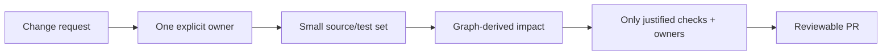

## 3.2 High cohesion

Code that changes for the same product reason stays together.

Examples:

- a Cell keeps its presentation behavior, state, fixtures, and tests together as complexity warrants;
- a Capability groups related product reads, commands, resource semantics, and hidden data implementation;
- pure UI rendering lives together without unrelated business logic.

High cohesion is not an excuse for a giant Feature. It means the current boundary contains things that belong together.

## 3.3 Low coupling

Unrelated areas know as little as possible about each other's internals.

Key mechanisms:

- Feature -> Capability API, never Capability Impl;
- peer Cells do not import one another's implementations;
- UI modules know no ViewModel/DI/navigation/business resource details;
- Capability implementations depend on other Capability APIs, not implementations;
- platform/vendor types stop behind stable seams.

## 3.4 Modular, not fragmented

Modules are compilation/ownership walls, not trophies.

Helix starts cohesive and physically extracts when evidence says a wall reduces expected change size.

Strong extraction signals include:

- second independent consumer;
- second owning team;
- stable API with volatile heavy implementation;
- incoming ABI/dependency fanout;
- build/test fanout;
- context-surface pressure;
- repeated illegal-edge attempts;
- low Git co-change between bundled areas.

Merge is also valid when fragmentation creates cost without isolation value.

## 3.5 Reusable by responsibility

There are three intentionally different reuse lanes.

| Reuse need | Helix home |
|---|---|
| pure visual rendering | `:ui:*` |
| reusable business/data behavior | `:capability:*` |
| complete autonomous stateful presentation | Feature-owned Cell/public presentation entry |

Do not force all reuse through one abstraction.

## 3.6 AI-agent friendly, not AI-dependent

Finite-context coding agents benefit when a task can be understood from one cohesive graph slice.

Helix therefore optimizes for:

- explicit ownership;
- bounded public APIs;
- generated context packets;
- deterministic Skills/CLI workflows;
- local fixtures/tests;
- architecture checks with repair guidance.

Context-window fit is useful but is not the sole reason for the architecture. If future agents safely comprehend whole repositories, low blast radius, high cohesion, low coupling, testability, explicit ownership, and deterministic verification still remain valuable.

## 3.7 Context-window fit

A normal task should usually fit:

```text
target implementation + target tests
+ direct dependency public APIs
+ applicable architecture rules
+ fixtures/acceptance examples
+ exact verification commands
```

Do not load sibling implementations or distant transitive internals by default.

Context thresholds are organization tuning parameters, not Helix laws.

## 3.8 Simple by default; complexity is earned

Examples:

- plain content: immutable model -> Composable;
- independently hostable stateful presentation: Cell;
- navigable destination: Screen;
- reducer/state machine: only for workflows that genuinely need one;
- UiCommand/Output: optional;
- registry: only on independently composable/dynamic surfaces;
- physical module extraction: evidence-driven.

## 3.9 Predictable contribution

Humans and agents should not invent module shapes or wiring for routine work.

Normal loop:

```text
intent
  -> workflow Skill
  -> graph-derived context
  -> generator/edit
  -> deterministic verification
  -> impact/evidence
  -> review
```

## 3.10 Deterministic feedback

Prefer fast, local, machine-verifiable failures over broad runtime surprises.

Examples:

- illegal dependency -> graph validator;
- forbidden import/public exposure -> architecture test;
- missing DI graph -> compiler/graph validation;
- public API change -> ABI diff;
- lifetime bug -> keyed-owner/nav regression test;
- visual change -> fixture/golden diff;
- resource duplication -> inspector + live-resource test.

## 3.11 Observable ownership

Debug/QA tooling should answer:

- Which Screen/Cell instance is this?
- Which ResourceKey does it observe?
- How many observers/subscribers exist?
- What owns the live connection?
- What is the freshness state?
- What wrote the resource last?
- Why did refresh run?
- What command/outbox work is pending?

## 3.12 Replaceable technology

Navigation 3, Koin, the owned Snapshot resource runtime, SQLDelight, Ktor, Coil, WebSocket implementation, and telemetry adapters are qualified choices, not Helix identity.

## 3.13 Evidence-driven evolution

Architecture changes happen because evidence fires, not because a reviewer prefers a pattern.

Signals include:

- second consumer/team;
- public API churn/fanout;
- compile/test impact;
- context size;
- Git co-change;
- duplicated resource logic;
- DB/schema pressure;
- repeated exceptions;
- owned-infrastructure complexity;
- ADR revisit condition.

---

## 3.14 Standard primitive first

Prefer mechanisms already understood by the Kotlin/Compose/KMP ecosystem before creating Helix-owned runtime abstractions.

Good defaults include ordinary Kotlin types, AndroidX ViewModel, `StateFlow`/`Flow`, Ktor, SQLDelight, Compose primitives, Gradle/module visibility, and standard KMP `expect/actual` where it solves the platform seam directly.

A bespoke Helix primitive is justified only when a concrete requirement is not met cleanly by available standard/framework mechanisms.

Before a bespoke primitive becomes a baseline dependency, it must have:

1. one clearly stated missing requirement;
2. the smallest practical API surface;
3. one complete executable usage in the canonical Cricket/reference slice;
4. regression tests for the behavior that justified it;
5. diagnostics good enough that humans and agents can repair failures;
6. a `Revisit when` / deletion condition.

This applies especially to keyed embedded presentation ownership, FeatureObserver helpers, Resource Inspector hooks, Helix CLI schemas, and graph/doctor conventions.

## 3.15 How the qualities connect to delivery outcomes

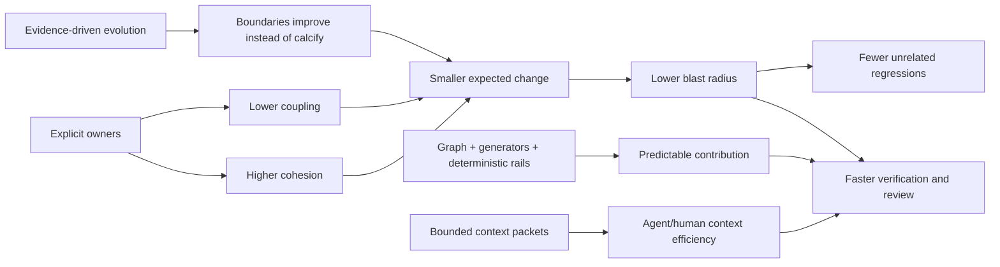

Management value is not "more modules." The intended outcome is **smaller, safer, easier-to-understand changes with reusable ownership and faster evidence**.

---

# 4. Problem diagnosis: what Helix is designed to prevent

## 4.1 Screen-scoped God ViewModels

Typical failure:

```text
HomeScreen
  -> HomeViewModel
       - article state
       - cricket state
       - recommendations state
       - video coordination
       - refresh timers
       - navigation decisions
       - analytics
       - sockets
```

Use cases alone fix data-call layering but do not necessarily fix state/coordination ownership. The screen remains the aggregation point.

## 4.2 Stateful widget reuse tied to a screen

A complex widget in a feed talks to the screen ViewModel. Moving it to another surface requires:

- copying ViewModel logic;
- widening the parent ViewModel;
- creating ad-hoc state plumbing;
- or introducing feature-to-feature internal dependencies.

Helix gives autonomous presentation a Cell boundary when independent hosting/lifetime is valuable.

## 4.3 State survives accidentally because it sits in a screen ViewModel

Resource durability should not be an accidental side effect of navigation lifetime.

Shared resource state belongs below presentation. Presentation state belongs to its logical Screen/Cell owner.

## 4.4 Same widget twice causes identity collision

If two instances are keyed only by screen/type/business entity, local expansion/selection state can collide.

Helix separates:

- presentation instance identity;
- resource identity;
- route identity.

## 4.5 N widgets cause N network calls or ad-hoc batching

Fetching must not be coupled to visual placement. Batch/BFF optimization belongs below stable capability/resource boundaries.

## 4.6 Shared live resources duplicate connections

A WebSocket opened by each Cell/ViewModel creates duplicate resource ownership. Helix gives live resources a keyed capability-owned coordinator.

## 4.7 Architecture rules live only in senior engineers' heads

This fails for:

- new hires;
- cross-stack contributors;
- QA automation engineers;
- AI agents;
- high parallelism.

Helix moves conventions into generation, graph rules, tests, CLI workflows, Skills, and migration recipes.

## 4.8 AI amplifies old architecture weaknesses

AI did not create God objects, hidden coupling, or weak ownership. It changes their cost weighting:

- ambiguous ownership leads agents to plausible but wrong locations;
- huge working sets consume context and reduce accuracy;
- duplicated conventions drift faster when code generation volume rises;
- runtime-only failures create slow agent repair loops.

The response is not "make every file tiny." The response is explicit cohesive boundaries plus deterministic feedback.

---

# 5. Architecture design history and alternatives explored

This section is historical. Its purpose is to preserve reasoning so future teams do not restart old debates without new evidence.

## 5.1 Stage A - Conventional KMP screen architecture

The starting mental model was broadly:

```text
Screen
  -> ViewModel
      -> Use Case
          -> Repository
              -> API / DB
```

Strengths:

- familiar;
- easy for simple screens;
- AndroidX ViewModel lifecycle semantics are well understood;
- use cases can isolate business intent.

Observed pressure:

- complex feed widgets remained screen-owned;
- reuse of business/data behavior and reuse of presentation were conflated;
- screen ViewModels grew as widgets accumulated;
- independently hosted widget identity/lifetime remained unsolved;
- shared sockets/batching/resource state tended to leak upward.

The lesson retained by Helix: keep ViewModel/UDF where it is useful, but scope ownership to the logical presentation unit rather than assuming Screen is always the unit.

## 5.2 Stage B - AI-First Modular KMP Blueprint

The first comprehensive architecture introduced the durable module roles still present in Helix:

```text
:app:*
:feature:*
:capability:*-api
:capability:*-impl
:ui:*
:foundation:*
:platform:*
:platform:*-api
:platform:*-impl
:storage:*
:testkit:*
:tooling:*
:build-logic
```

Key ideas retained:

- locality before abstraction;
- reuse the smallest useful unit;
- product meaning above technical mechanism;
- explicit dependency direction;
- presentation/resource/durable/workflow state have different owners;
- scope is logical, not a new Gradle parent/aggregator;
- graph-first architecture enforcement;
- KMP four-target qualification;
- generated golden paths and AI Skills;
- `doctor`, context, affected verification, refactoring recipes;
- POC-first runtime/library qualification;
- observable feature identity;
- stable vendor-neutral observability seams.

Early blueprint conventions later changed:

- individual read use-case classes such as `ObserveLiveScore` -> grouped capability Query interfaces;
- `Effect` terminology -> optional fenced `UiCommand`;
- generic smart widget notion -> explicit Cell primitive;
- feature-to-feature composition rules -> clearer hierarchical public-entry/no-peer-coupling rule;
- refresh use cases -> split trigger orchestration + capability freshness semantics.

## 5.3 Runtime exploration - Navigation 3 vs Decompose

### Navigation 3

Selected because the required destination behavior was validated while preserving a smaller runtime vocabulary:

- user-owned back stack;
- typed route keys;
- entry-scoped ViewModel ownership/destruction;
- adaptive scene support;
- Android/iOS/Desktop/Web Compose Multiplatform support;
- navigation implementation isolated at app/route boundary.

Gap: embedded smart list items are not navigation destinations, so Helix owns one narrow keyed ViewModel-owner helper.

### Decompose

Seriously evaluated because it provides:

- component-local lifecycle;
- `StateKeeper`/`InstanceKeeper`-style retention;
- back handling;
- nested child navigation;
- child-item/panel ownership patterns;
- Compose-independent logic layer.

Why not selected by default:

- current product requirements did not need a general component tree runtime;
- one small qualified keyed owner solved the embedded-widget case;
- using both Nav3 and Decompose as general ownership systems would add vocabulary and integration cost.

Escape hatch:

Reconsider Decompose if the product becomes dominated by nested autonomous mini-app/component trees with their own navigation, back, saved state, retained child hierarchy, and independent lifecycle.

## 5.4 Stage C - Fable/Claude "Cell Architecture" proposal

A later adversarial proposal reframed the app around four planes. In this discussion **Cell meant a mobile/client presentation component**, not the unrelated backend/AWS "cell-based architecture" pattern.

The proposal's original conceptual stack was:

```text
Screen plane
  thin composition / ordered CellSpecs / Host services
        |
        v
Cell plane
  autonomous presentation units
        |
        v
Data plane
  QueryStore / shared SSOT / refresh / batching
        |
        v
Rails plane
  generators / compiler+CI rules / agent context / goldens
```

Its original Cell ceremony was roughly:

```text
PortfolioCardCell.kt
PortfolioCardPresenter.kt
PortfolioCardUi.kt
PortfolioCardFixtures.kt
PortfolioCardPresenterTest.kt
PortfolioCardUiTest.kt
CLAUDE.md
```

and the presenter idea was conceptually closer to:

```kotlin
@Composable
fun present(...): CellState
```

with Cells reading a shared QueryStore directly. Screens were intended to become thin ordered `CellSpec` hosts; even a one-Cell screen could be treated as a degenerate registry composition. Data refresh/freshness was centralized under a broad RefreshCoordinator, and the proposal leaned toward stronger physical Cell isolation.

These details are preserved here because several final decisions are explicit reactions to them: **Cell survived; mandatory presenter/CellState/QueryStore/registry/seven-file/per-Cell-doc/module ceremony did not.**

Its strongest ideas were:

- screen is too coarse for independently useful stateful widgets;
- Cell as a bindable/autonomous presentation unit;
- no sideways peer coupling;
- explicit per-instance identity;
- shared resource identity distinct from presentation instance;
- fixtures as review surface;
- generator/rails as architecture;
- a flight recorder/resource inspector;
- quantitative split/extraction rules;
- architecture-kit versioning and codemod migrations.

The proposal also suggested several ideas that were intentionally not adopted as-is:

| Proposal | Final Helix decision |
|---|---|
| Cell presenter is a Composable function rather than ViewModel | Keep ViewModel/UDF as default qualified presentation owner; Circuit/Molecule presenter model remains an alternative if measured ceremony warrants it. |
| universal generic `Cell<State, Event>` contract | Reject. Cell is a logical primitive, not a required class/interface. |
| universal `Loading | Content | Error | Hidden` CellState | Reject. State is feature-specific; rendering nothing is legal but `Hidden` is not a mandatory state. |
| direct `QueryStore` access from Cell | Reject. Presentation talks to product-facing Capability Queries. |
| one global RefreshCoordinator owns TTL/freshness | Modify. Common layer owns external triggers + generic QoS; Capability owns resource freshness/retry/invalidation semantics. |
| registry for every screen | Modify. Registry only where product can independently change presence/order/variant. |
| one API/Impl module pair per Cell | Reject. Cells live inside Feature modules by default; physical extraction is evidence-driven. |
| Decompose behind facade as default runtime | Reject for current topology; retain as escape hatch. |
| compile-time DI framework such as Metro/kotlin-inject | Do not switch by default; retain Koin + graph/compiler validation while qualified. |
| flight recorder/resource inspector | Adopt and strengthen. |
| fixture gallery | Adopt. |
| no-sideways | Adopt with clarification: hierarchical composition is allowed; peer implementation coupling is prohibited. |
| generator + hard rails + soft context | Adopt, but avoid mandatory per-Cell documentation ceremony. |

### 5.4.1 Historical proposal mechanics and tool suggestions - preserved for provenance, not normative

The Cell Architecture proposal contained several concrete implementation suggestions and threshold rules. They are recorded here so future reviewers can distinguish **what was actually proposed** from the final Helix policy. None of the items in this subsection are current requirements unless restated elsewhere in the normative sections.

#### Original generation and testing loop

The proposal imagined a generator similar to:

```text
./tools/new-cell.sh portfolio PortfolioCard
  -> Cell contract / key / params
  -> presenter
  -> UI
  -> fixtures
  -> presenter tests
  -> screenshot tests
  -> per-Cell CLAUDE.md delta
  -> registry wiring
  -> RefreshSpec wiring
```

Specific ecosystem examples proposed for that loop included:

- **Molecule + Turbine-style testing** for presenter/state production;
- **Roborazzi or Paparazzi** for Android/Compose screenshot goldens;
- **swift-snapshot-testing** as an iOS analogy;
- a fixture-gallery screen as the non-developer review surface;
- Circuit's code-generation approach as evidence that generators can make component ceremony cheaper to produce;
- **Tuist scaffold** as an iOS-side analogy for golden-path generation.

Final Helix treatment:

- fixtures/gallery and deterministic visual review were adopted;
- exact screenshot/test libraries are **not architecture requirements**;
- presenter-specific Molecule/Turbine testing is not the default because ViewModel/UDF remained the baseline;
- generation is retained, but the generator must scale file count with complexity rather than stamping a fixed seven-file Cell;
- per-Cell `CLAUDE.md` is not mandatory; root `AGENTS.md` plus generated context packets and nested delta instructions are preferred.

#### Original runtime alternatives for embedded components

The proposal discussed several ways to retain independently stateful items:

```text
Circuit SubCircuit / retained presenter composition
Decompose child-item/component ownership
first-party or custom Compose retain{...}-style retention
custom keyed owner
```

Final Helix treatment:

- Nav3 owns Screen navigation lifetime;
- a narrow keyed `StatefulLazyItem(FeatureInstanceKey)` owner handles smart embedded Cell lifetime;
- Decompose remains the escape hatch if the helper grows into a component runtime;
- Circuit remains a reconsideration candidate if presentation ceremony becomes a measured tax;
- if Compose/Navigation ships first-party keyed ownership with equivalent semantics, Helix should delete its custom helper rather than preserve owned infrastructure.

#### Original fixed split heuristics

The proposal suggested intentionally simple mechanical thresholds:

```text
Split screen-embedded logic into a Cell when:
  - it is used on a second surface, OR
  - it owns an independent refresh cadence, OR
  - it exceeds roughly 150 lines of screen-embedded logic.

Promote a Cell/feature boundary physically when:
  - the module exceeds roughly half the smallest supported agent context window, OR
  - a second owning team appears.
```

These were useful provocations because they replaced subjective "this feels big" judgment with observable evidence. Final Helix deliberately **softened the hard numbers**:

- second independent consumer/surface remains strong evidence;
- independent lifetime/refresh remains strong evidence that presentation ownership should be separated;
- line count alone is too gameable and language/style-dependent to be a law;
- context size is a doctor signal, not a permanent architecture threshold;
- team ownership, ABI/dependency fanout, build/test fanout, exception pressure, co-change, and repeated illegal-edge attempts are evaluated together;
- `helix-kmp doctor` recommends extraction/merge with evidence; boundary moves remain reviewed changes.

This change is important for long-term AI evolution: context-window fit is a useful current optimization, but Helix should still make sense if future agents can comprehend much larger repositories.

#### Historical module-visibility/tooling analogies

The proposal also referenced:

- Gradle module visibility and Kotlin `internal`;
- API/Impl module pairs;
- **SPM/Bazel target visibility** as analogies from other ecosystems;
- affected-module CI to reduce agent feedback latency;
- ABI dumps to make public-contract changes explicit;
- compile-time DI options such as **Metro**, **kotlin-inject**, and **Dagger/Anvil** for stronger missing-binding diagnostics.

Final Helix keeps the ideas - visible dependency boundaries, ABI awareness, affected verification, and DI graph verification - while avoiding a requirement to reproduce the exact external tools or switch DI frameworks without measured benefit.

## 5.5 Cell naming clarification

The final vocabulary intentionally keeps **Cell** as a technical primitive.

A proposed rename to "Presentation Unit" was rejected because Cell is shorter, distinctive, and already captures the independently hostable presentation concept.

However, Cell is not allowed to trigger a biology taxonomy explosion. Do not invent architecture nouns such as Genome/Gene/Organ/Protein merely for theme consistency.

## 5.6 Stage D - Merged Helix KMP architecture

The merged design kept the original blueprint's familiar KMP/module/runtime foundations, adopted the strongest Cell/control-plane/resource-debug ideas, and removed unnecessary ceremony.

Core synthesis:

- Feature remains the physical/product presentation scope;
- Screen remains a navigation destination;
- Cell becomes the autonomous stateful embedded presentation primitive;
- ViewModel/UDF remains default presentation owner;
- capability APIs become grouped Queries + intent Commands;
- resource taxonomy becomes Snapshot / Live / Projection;
- `ResourceKey`, `FeatureInstanceKey`, `RouteKey` are explicitly distinct;
- common refresh owns triggers/QoS only;
- capability owns freshness/resource semantics;
- physical DB topology and module granularity are defaults, not dogma;
- control plane is graph-first and AI-operable;
- fixtures and runtime inspector are first-class architecture seams.

## 5.7 Final external critique and accepted corrections

A later review raised seven substantive criticisms. The architecture incorporated the useful corrections.

### Criticism 1 - AI context benefit is a decaying asset

Concern: context-window optimization may become less valuable as agent models improve, while architectural ceremony remains.

Accepted correction:

- AI context fit is a **derived quality**, not the primary justification for Cells/modules;
- durable reasons remain ownership, low blast radius, reuse, testability, observability, and safe parallel work;
- Helix may simplify context tooling if whole-repo comprehension becomes reliably superior.

### Criticism 2 - Generator amortizes writing, not reading

Concern: generated seven-file Cells still cost humans/agents reading time.

Accepted correction:

> **File count is not an invariant.**

A simple Cell may be two files. A complex Cell may be several. Structure scales with complexity.

### Criticism 3 - Architecture frozen before enough real Cells

Concern: POCs validate mechanics but not long-term feature ergonomics.

Accepted correction:

- Baseline v1 is design-frozen to stop theoretical churn;
- core seams are POC-qualified;
- the **first roughly 10 real production Cells after adoption** should be treated as an ergonomics pilot (not toy/demo Cells);
- the number 10 is a practical sampling window, not a permanent Helix law;
- measured pain can fire ADR revisit conditions before conventions spread across dozens of features.

Suggested early metrics:

- files touched per feature change;
- architecture-ceremony lines vs useful product logic;
- context loaded per agent task;
- agent retries/repair loops;
- time-to-fix;
- build/test fanout;
- architecture exceptions;
- resource-debug time;
- Cell reuse count.

### Criticism 4 - One SQLDelight database can become a new hotspot

Accepted correction:

- one physical DB is a convenient starting topology, **not an invariant**;
- logical table/resource ownership remains capability-specific;
- monitor migration/invalidation/co-change/performance pressure;
- split physical DBs only when evidence says isolation pays.

Known cost retained: SQLDelight reactive invalidation can be coarser than entity-normalized caches, and mapping server shapes into relational tables is real work.

### Criticism 5 - Refresh orchestration needs arbitration

Accepted correction:

Common refresh infrastructure owns domain-blind QoS/backpressure:

```text
Priority: CRITICAL_VISIBLE | VISIBLE | BACKGROUND | PREFETCH
Network:  ANY_NETWORK | UNMETERED_PREFERRED | UNMETERED_ONLY
```

It may own:

- global concurrency limits;
- backpressure;
- cancellation;
- deduplication;
- metered/data-saver policy;
- battery/background policy.

It must not hard-code product semantics such as "portfolio is more important than promo."

### Criticism 6 - Goldens are too fragile to be a safety model

Accepted correction:

Goldens are one **visual rail**, never the safety model. Behavioral, architecture, resource, integration, accessibility, and E2E checks remain independent gates.

Framework-upgrade golden churn should be reviewed separately from feature changes where practical.

### Criticism 7 - Helix is bespoke

Accepted mitigation:

- keep the vocabulary small;
- use standard KMP/Gradle/Compose/ViewModel/Flow mechanisms underneath;
- hide bespoke tooling behind a stable CLI;
- keep generated conventions simple;
- maintain `Revisit when` escape hatches;
- avoid multiplying private nouns and frameworks.

## 5.8 GraphQL/Relay/Apollo alternative explored and deferred

A later critique argued that Helix's REST-oriented data plane resembles capabilities normally provided by Relay/Apollo-style normalized GraphQL clients. The correspondence proposed in that review was approximately:

| Helix/REST concern | Relay/Apollo analogue |
|---|---|
| BatchHydrator / aggregate BFF fetch | composed GraphQL surface query / fragment composition |
| `ResourceKey` / business identity | normalized entity/cache key |
| Projection/selectors | fragment-derived reads / cache watchers |
| table-granular SQL invalidation | entity-level normalized cache updates |
| REST bootstrap + WebSocket convergence | query/subscription writes into one normalized entity store |

Potential upside if the backend supported GraphQL:

- fewer hand-maintained aggregate hydrators;
- entity-level deduplication and consistency;
- more precise invalidation than relational table-level notifications;
- query/mutation/subscription convergence through one normalized cache;
- backend query shape composed from client data requirements.

The review initially recommended a four-target Apollo Kotlin spike before the first real Cell because, if it qualified, it might materially simplify the data implementation while leaving the Cell plane intact.

That recommendation was then **explicitly cancelled** after the product/backend constraint was clarified: the backend does not support GraphQL and is not expected to support it in the near future. Building GraphQL infrastructure or a speculative POC would optimize for a path the product does not currently have.

Apollo Kotlin was still evaluated conceptually because it demonstrates the replaceability of the Helix boundary:

- Apollo Kotlin runtime and its in-memory normalized cache support `wasmJs`;
- Apollo's SQLite normalized cache did not provide the required JS/Wasm durable-cache path in the reviewed snapshot;
- therefore Apollo would not automatically replace cross-target durable/offline storage even if GraphQL were introduced.

Final decision:

- **do not run or fund a GraphQL-specific POC now**;
- retain REST/owned Snapshot runtime/SQLDelight/WebSocket implementation;
- keep Capability APIs transport-neutral so GraphQL/Apollo can be introduced later if backend/product economics change;
- if GraphQL is introduced, keep Apollo/schema/generated transport models below Capability implementation rather than exposing raw GraphQL fragments/models as Cell contracts;
- do not redesign Helix around fragment-colocated presentation contracts merely to mimic Relay.

This is an important flexibility test: changing the resource/transport implementation should not require redesigning Cells, ViewModels, or Capability consumers.

## 5.9 SDUI / server-driven composition

Server-driven UI was explored as a spectrum, not a binary architecture choice.

Final decision:

- client-driven composition is default;
- registry + typed Cell descriptors provide much of the client-side seam needed for experiments/personalization;
- full SDUI is justified only when backend-controlled ordering/components/experiments/personalization become dominant product economics;
- Cells and Capabilities remain reusable if the composition source later becomes server-driven.

## 5.10 Lean modular-monolith retreat path

A deliberately simpler alternative was considered:

- keep module/dependency invariants;
- keep capability/resource SSOT;
- use one Screen ViewModel with hoisted widget state;
- skip keyed Cell runtime/registry unless necessary.

This can capture much of Helix's value for small/static products. It loses on the core case that motivated Helix: multiply instantiated autonomous widgets with independent presentation state and shared resource lifetime.

Helix should be allowed to simplify toward this shape if real product evidence shows autonomous Cells/runtime machinery do not pay for themselves.

---

## 5.11 Universal/global application store alternative

A Redux/MVI-style universal application store was considered as a simplifying answer to shared state and cross-screen consistency. It was not selected as the default architecture.

Why it is attractive:

- one obvious place to observe application state;
- deterministic reducer/event vocabulary;
- potentially strong replay/debug tooling;
- familiar mental model for teams coming from Redux-style systems.

Why Helix does not choose it as the universal owner:

- navigation state, local presentation state, shared server/resource state, durable offline intent, media/socket lifecycles, and platform state have **different identities and lifetimes**;
- one store tends to become an accidental common owner and raises coupling/blast radius;
- independent reusable Cells would still need instance identity and lifetime rules;
- resource mechanisms such as sockets, DB transactions, batching, and retry do not become simpler merely because their snapshots are mirrored into one reducer;
- it creates another global runtime/framework commitment when standard ViewModel/Flow + Capability resources already cover the required cases.

A reducer/state machine remains valid **inside a genuinely complex workflow** when it improves that owner. The rejected idea is making one global reducer/store the mandatory ownership model for the whole application.

## 5.12 Master Source 1.1 adversarial implementation-closure review

A subsequent Claude review of all 6,374 Master 1.1 lines concluded that the application architecture should not be reopened, but identified implementation seams where agents could still diverge.

The review explicitly preserved the four information classes, boundary test, three identities, Capability-owned subscriber-counted live resources, trigger/QoS versus Capability freshness split, GraphQL deferral, merge-as-valid-evolution, and human/agent verification/permission parity.

Master 1.2 disposition:

| Review point | 1.2 disposition |
|---|---|
| repeated normative facts inside master | accept problem; retain one exhaustive master but designate canonical anchors/policy blocks and generated repetitions |
| dependency matrix not machine-readable | accept; add canonical machine-readable dependency policy |
| Capability API/Impl pair too eager | modify; local one-consumer behavior stays local, extracted reusable Capability uses API/Impl by default |
| Platform API/Impl pair too eager | accept/modify; simple platform mechanism may be one `:platform:*` expect/actual module |
| enforcement rails not ranked | accept; add enforcement-strength ladder |
| control plane oversized before first Cells | accept staging, not removal |
| dynamic Home can become transitive Feature root | accept for registry surfaces; App populates registry |
| Query error/freshness contract absent | accept; add `ResourceObservation<T>` |
| shared-resource coroutine scope absent | accept; App parent scope + Capability child jobs |
| Cell ViewModel acquisition absent | accept; add complete reference |
| FeatureInstanceKey examples inconsistent | accept; define construction contract |
| auth/session ownership absent | accept; Identity owns session/refresh, Foundation network owns generic mechanism |
| FeatureObserver boilerplate | accept; non-generic trace delegate |
| third-party Snapshot orchestration cost could exceed value | revisit condition fired 2026-09-04; use the owned runtime |
| flags/localization/theme/background replay unplaced | accept; assign owners |
| verify latency missing | strong accept; fast/full tiers |
| private primitives need complete references | accept; Standard Primitive First |
| context tooling may decay | accept priority correction |
| OpenAPI generation | conditional accept when backend contract is authoritative |
| Compose `retain` may replace keyed host | immediate qualification task; do not assume equivalence before four-target proof |

No Helix law changed. Master 1.2 is an implementation-closure revision.

## 5.13 Master Source 1.2 verification review and correctness pass

Claude then verified the 1.2 file against its own changelog rather than accepting the changelog on faith.

Accepted defects/corrections:

1. canonical Koin ViewModel parameter syntax needed the `ParametersDefinition` lambda form;
2. cross-module `CellSpec` could not be `sealed`;
3. dependency policy needed default-deny semantics and executable conditional predicates;
4. Foundation policy/prose needed one machine-decidable classification;
5. `ResourceObservation` needed an explicit module home and concrete reference mapping;
6. Output collection needed stable callback handling and lifecycle-aware collection;
7. transcribed "latest upstream version" facts were already stale and must not be master truth;
8. control-plane staging was duplicated/inconsistent between Sections 22 and 29;
9. placement identity needed a stronger type;
10. `ResourceObservation` legal combinations needed to be explicit;
11. `SessionEnded` needed an API-module home and correctness-bearing session truth;
12. Mermaid labels needed HTML/newline-safe syntax for generated docs.

Master 1.3 fixes these without reopening the four laws or core architecture.

---

# 6. Final architecture at a glance

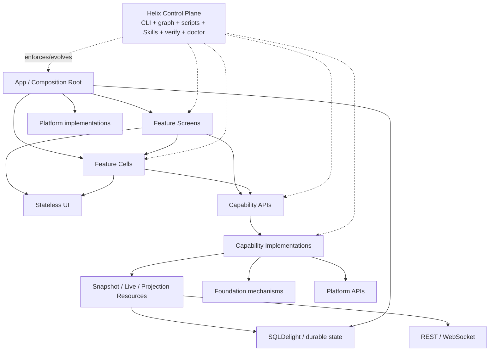

The diagram is conceptual. Actual allowed dependencies are specified later.

## 6.1 Application plane and control plane

Helix can be understood as two intertwined systems.

### Application plane

Owns product behavior and runtime state:

- Screens;
- Cells;
- UI;
- Capabilities;
- Resources;
- Foundation/Platform mechanisms;
- persistence;
- navigation;
- DI.

### Control plane

Owns consistency and evolution:

- convention plugins;
- graph rules;
- architecture tests;
- ABI checks;
- generators;
- `helix-kmp` CLI;
- deterministic scripts;
- AI Skills/context packets;
- `impact`/`doctor`;
- refactoring recipes/codemods;
- qualification suites;
- exception registry;
- architecture-kit migrations.

This dual structure is one reason the name **Helix KMP** was selected: application and control/evolution paths are intertwined but remain distinguishable.


---

# 7. Canonical vocabulary

The vocabulary is intentionally small. New architecture nouns require strong justification.

## 7.1 Feature

A **Feature** is a product-facing presentation scope and normally a physical `:feature:*` module.

Examples:

- `:feature:home`
- `:feature:cricket`
- `:feature:article`
- `:feature:subscription`

A Feature may own:

- Screens;
- Cells;
- presentation ViewModels;
- State/Action/UiCommand/Output types;
- presentation mappers;
- local presentation helpers;
- feature fixtures and tests;
- public presentation entry points needed by parent surfaces.

A Feature does not become the owner of shared business/resource state merely because one of its Screens needs it.

## 7.2 Screen

A **Screen** is a navigation destination or other major owner-level presentation surface.

A Screen may:

- own screen-local presentation state;
- compose Cells and pure UI;
- map Outputs to navigation/owner actions;
- own static/dynamic composition policy for its surface;
- host pull-to-refresh or surface-level triggers.

A Screen should not aggregate unrelated domain resource state in one God ViewModel.

Ordinary Screens are called Screens. Do not call everything a "Screen Cell."

## 7.3 Cell

A **Cell** is:

> **An independently hostable stateful presentation unit owned by a Feature.**

Examples:

- `LiveScoreCell`
- `PortfolioCardCell`
- `PromoCarouselCell`
- `FollowedTeamsCell`

A Cell is not:

- a mandatory base class;
- a mandatory interface;
- a Gradle module;
- a Capability;
- a Resource;
- a design-system component;
- a registry descriptor;
- a navigation destination by definition.

There is no required architecture type:

```kotlin
interface Cell<State, Action>
```

A concrete Cell entry may simply be:

```kotlin
@Composable
fun LiveScoreCell(
    matchId: MatchId,
    instanceKey: FeatureInstanceKey,
    onOutput: (LiveScoreOutput) -> Unit,
)
```

### Why Cell exists

Use Cell when a presentation unit needs one or more of:

- independent hosting on multiple surfaces;
- its own presentation state/lifetime;
- reuse without copying parent Screen logic;
- independent testing/fixtures;
- low blast radius for a meaningful stateful widget;
- independent instance identity while sharing business resources.

Do not introduce a Cell for every row/icon/label.

## 7.4 CellSpec

`CellSpec` is optional composition metadata for registry-driven surfaces.

Example:

`CellSpec` lives in the API-safe presentation foundation (`:foundation:presentation`) because registry hosts and independently compiled Feature modules must share the contract.

```kotlin
interface CellSpec {
    val instanceKey: FeatureInstanceKey
}
```

Concrete specs remain Feature-owned and may live in separate Feature modules:

```kotlin
data class LiveScoreCellSpec(
    val matchId: MatchId,
    override val instanceKey: FeatureInstanceKey,
) : CellSpec
```

`CellSpec` is deliberately **not sealed**: Kotlin sealed direct subtypes must live in the same module/package, which would prevent independently compiled Feature modules from implementing a shared registry contract.

`CellSpec` does not turn Cell into a base-class architecture.

## 7.5 UI

A **UI** unit is stateless reusable rendering.

Typical contract:

```text
immutable model + callbacks -> Composable
```

It may be local to a Feature until independent reuse appears. If extracted physically, it belongs in `:ui:*`.

UI must not own or import:

- ViewModels;
- Koin;
- navigation;
- repositories;
- Capability APIs/implementations;
- Snapshot resource runtime;
- SQLDelight generated types;
- raw networking.

## 7.6 Capability

A **Capability** is a reusable product/business boundary.

Examples:

- Cricket;
- Article;
- Identity;
- Subscription;
- Bookmarks;
- Comments.

It exposes product semantics and hides implementation mechanisms.

A Capability normally has:

```text
:capability:<name>-api
:capability:<name>-impl
```

but code may start local while it has one consumer and be extracted when evidence justifies a stable reusable boundary.

## 7.7 Capability API

Contains:

- stable domain/product models;
- grouped Query interfaces;
- intent-shaped Command contracts;
- rare stable cross-capability contracts.

It does not expose repositories by default.

It must not expose:

- Ktor types;
- Snapshot resource runtime types;
- SQLDelight rows/queries;
- WebSocket frames;
- Compose/ViewModel types;
- implementation classes.

## 7.8 Capability implementation

Owns hidden product/data behavior:

- use-case/command implementations;
- repositories;
- endpoint DTOs;
- mapping;
- Snapshot resource orchestration;
- SQLDelight access;
- REST/WebSocket clients;
- live-resource coordinators;
- refresh/freshness semantics;
- batching/hydration;
- outbox/retry/idempotency where required.

Capability-internal source naming:

- inside `<Name>CapabilityImpl`, raw backends are `<Name>RemoteSource` (one per transport and the
  only class touching the HTTP client) and `<Name>LocalSource` (one per durable store and the only
  class touching SQLDelight); a `<Name>DatabaseProvider` fun interface hands the local source its
  database handle;
- `<Name>CapabilityImpl` is the only class combining sources and owns DTO/row-to-model mappers;
- names are role-based and platform-neutral: avoid `Store` (Store5 type, Redux/TCA state
  container), `Service` (Android component, microservice), `Storage` (web `localStorage`), `Cache`
  (the table is the source of truth), and Android's `DataSource` formula;
- Android Guide to app architecture mapping: `RemoteDataSource` -> `RemoteSource`,
  `LocalDataSource` -> `LocalSource`, `Repository` -> `Capability` (Queries + Commands).

## 7.9 Query

A **Query** reads/observes product resource state without expressing a business mutation.

Final default is grouped interfaces, for example:

```kotlin
interface CricketQueries {
    fun match(matchId: MatchId): Flow<ResourceObservation<Match>>
    fun liveScore(matchId: MatchId): Flow<ResourceObservation<LiveScore>>
    fun commentary(matchId: MatchId): Flow<ResourceObservation<List<Commentary>>>
}
```

This replaced the earlier default of one trivial class per read such as `ObserveLiveScoreUseCase`.

A dedicated Query/use-case class is still acceptable when behavior is substantial enough to deserve its own named abstraction.

## 7.10 Command

A **Command** expresses business intent that may change state.

Examples:

- `FollowTeam`
- `BookmarkArticle`
- `SubmitVote`
- `PurchaseSubscription`

Commands remain intent-shaped rather than being grouped into generic CRUD.

Avoid names such as:

- `UpdateEntity`
- `SaveData`
- `ExecuteMutation`

unless that is genuinely the product meaning.

## 7.11 Domain Event

A typed **Event** is a fact that already happened and may have multiple independent reactions.

Use only when direct calls would create undesirable fanout/coupling.

Examples:

- `UserLoggedOut`
- `SubscriptionChanged`

Do not create a global string EventBus.

## 7.12 Resource

A **Resource** is shared observable product data with a stable identity and an authoritative owner below presentation.

Helix recognizes three resource types:

1. Snapshot Resource;
2. Live Resource;
3. Projection.

## 7.13 Snapshot Resource

Fetched/synchronized resource whose current state can be observed.

Examples:

- Article;
- match metadata;
- profile;
- weather;
- recommendation page.

Typical current implementation:

```text
Query -> SyncCoordinator.observing(local/SQLDelight) + sync/REST
```

Capability-internal source names follow §7.8.

## 7.14 Live Resource

A shared keyed resource with an ongoing stream/connection lifecycle.

Examples:

- live score;
- market ticker;
- presence;
- live comments.

The resource/connection lifetime is capability-owned, not Cell-owned.

## 7.15 Projection

A derived read over existing resources.

Examples:

```text
cart + promotions -> checkout summary
match + user favorites -> followed-match state
article + bookmark -> article-detail projection
```

Simple projections may use `Flow.combine`. Expensive/frequently rendered joins may justify a named/materialized read projection.

## 7.16 Foundation

Product-agnostic technical mechanisms.

Examples:

- network client construction;
- clocks/time;
- coroutine dispatchers;
- observability contracts;
- generic presentation primitives;
- preferences mechanism.

Foundation must not know Cricket, Article, Subscription, or other product vocabulary.

## 7.17 Platform mechanism / optional Platform API + Impl

OS/device mechanisms. A simple mechanism may be one cohesive KMP module using source sets / `expect`-`actual`; API/Impl pairs are used when implementation selection/isolation earns the physical split.

Examples:

- sharing;
- notifications;
- permissions;
- file picker;
- secure storage;
- camera;
- background work;
- connectivity.

Product meaning remains in Feature/Capability.

## 7.18 Storage

Physical database assembly:

- contributor registration for Capability-owned SQLDelight schemas;
- per-platform driver construction and opening;
- the merged migration sequence;
- assembly-level cross-capability queries/projections where needed.

Storage does not own capability tables or become the product-facing data API. The App composition
root bridges the assembled database to each Capability's narrow database-source interface.

## 7.19 App

The composition root.

Owns:

- platform startup;
- Navigation root;
- DI graph assembly;
- concrete Capability/Platform implementation selection;
- assembled-database binding to Capability implementations;
- global adapter installation.

Nothing depends on App.

## 7.20 Scope

A **scope** is a logical tooling/context grouping such as `cricket`, not a new module role.

Example working set:

```text
scope=cricket
  :feature:cricket
  :capability:cricket-api
  :capability:cricket-impl
  :ui:cricket-score
```

Do not create:

```text
:scope:cricket
:capsule:cricket
```

Do not create aggregator modules that re-export all scope modules.

Scope is derived from naming conventions and rare central overrides.

## 7.21 State

Immutable render state required to reconstruct the current UI.

State shape is product-specific.

## 7.22 Action

Something the user/environment did that the presentation owner handles.

## 7.23 UiCommand

Transient instruction to **this Screen/Cell's own UI**.

Correctness must not depend on delivery.

Good:

```text
FocusSearchField
ScrollToComment(commentId)
ShowSnackbar(messageId)
```

Bad:

```text
ShowComment(comment)    // domain state
UpdateScore(score)      // resource truth
LoadArticle(article)    // correctness-bearing data
```

## 7.24 Output

Semantic message from a child presentation unit to its owner.

Example:

```kotlin
sealed interface LiveScoreOutput {
    data class OpenMatch(val matchId: MatchId) : LiveScoreOutput
}
```

## 7.25 RouteKey

Navigation identity.

Example:

```text
cricket-details/match-123
```

## 7.26 FeatureInstanceKey

Presentation/runtime instance identity.

Examples:

```text
home-feed:live-score:match-123
article-99:related-live-score:match-123
```

## 7.27 ResourceKey

Shared product/resource identity.

Example:

```text
match-123
```

## 7.28 RefreshTrigger / refresh orchestration

Common external opportunity such as:

- foreground;
- reconnect;
- visibility;
- pull-to-refresh;
- periodic trigger.

The trigger does not own product freshness semantics.

## 7.29 BatchHydrator

An internal optimization that may call an aggregate backend endpoint and feed results to capability-owned resource writers.

It is not an observable app-state owner or presentation Query surface.

## 7.30 FeatureObserver

Vendor-neutral operational observability interface for presentation/capability runtime evidence.

## 7.31 ProductAnalytics

Separate typed product/business analytics seam.

Do not conflate operational tracing with business analytics.

## 7.32 ResourceObservation

A transport-neutral observation envelope for synchronized Capability reads when presentation needs current value plus refresh/failure semantics.

It is **not** a universal presentation State and does not expose Snapshot runtime/Ktor/SQLDelight types.

Canonical semantics are defined in Section 13.7.

## 7.33 Control plane

The architecture-operating system around the codebase:

- CLI;
- graph;
- generators;
- scripts;
- Skills;
- context;
- verification;
- diagnostics;
- impact;
- codemods;
- qualification;
- architecture-kit evolution.

---

# 8. Physical module taxonomy

## 8.1 Standard roles

```text
:app:*
:feature:*
:capability:*-api
:capability:*-impl
:ui:*
:foundation:*
:platform:*-api
:platform:*-impl
:storage:*
:testkit:*
:tooling:*
:build-logic
```

This is a taxonomy of allowed roles, not a requirement to create every role or an empty module for every concept.

## 8.2 Role responsibilities

### `:app:*`

- composition root;
- navigation/back-stack root;
- DI graph assembly;
- platform startup;
- concrete implementation selection;
- target-specific app shells.

### `:feature:*`

- Screens;
- Cells;
- presentation ViewModels;
- State/Action/UiCommand/Output;
- feature-owned fixtures/tests;
- minimal public presentation entries.

### `:capability:*-api`

- grouped Queries;
- Commands;
- stable product/domain models;
- rare stable cross-capability contracts.

### `:capability:*-impl`

- implementation logic;
- repositories;
- REST/DTO/mapping;
- Snapshot resource orchestration;
- capability-owned SQLDelight schema and access;
- WebSocket/live coordinators;
- batching;
- command/outbox internals.

### `:ui:*`

- stateless reusable rendering;
- immutable UI models;
- callbacks;
- visual resources.

### `:foundation:*`

Generic technical mechanisms with no product vocabulary.

For graph enforcement, every Foundation module has one of two **derived subroles** selected by its convention plugin:

```text
foundation_api
  safe to expose to Feature / UI / Capability API
  product-neutral contracts, IDs, clocks, resource observation, presentation helpers

foundation_runtime
  lower implementation/runtime mechanism
  networking, concurrency/runtime engines, serialization/vendor-facing machinery
```

Physical paths remain `:foundation:*`; this is a validator classification, not a new directory hierarchy.

Examples:

```text
:foundation:presentation     -> foundation_api
:foundation:resource         -> foundation_api
:foundation:resource-runtime -> foundation_runtime
:foundation:sqldelight       -> foundation_runtime
:foundation:time             -> foundation_api
:foundation:network          -> foundation_runtime
:foundation:runtime          -> foundation_runtime
```

### `:platform:*` and optional `:platform:*-api` / `:platform:*-impl`

Simple KMP platform mechanisms may begin as one cohesive `:platform:<name>` module using normal source sets / `expect`-`actual`.

Split into `-api` / `-impl` only when a physical wall reduces expected change size: multiple selectable implementations, heavy/vendor dependencies, independent replacement/testing, or stable consumer API versus volatile implementation.

The responsibility remains OS/device mechanisms either way.

### `:storage:*`

- contributor schema assembly;
- per-platform drivers and database opening;
- merged migration sequencing;
- assembly-level cross-capability joins/projections.

### `:testkit:*`

- shared test primitives/fakes/helpers;
- not a place for product-specific scenarios that belong near the owning Feature/Capability.

### `:tooling:*`

- Helix CLI;
- graph;
- context/impact/doctor;
- generators;
- recipes;
- qualification harness;
- gallery tooling.

### `:build-logic`

Included build containing role convention plugins and graph/verification tasks.

## 8.3 Start cohesive

Do not create a pre-emptive matrix such as:

```text
:feature:x-api
:feature:x-impl
:cell:y-api
:cell:y-impl
:ui:x-impl
```

for every concept.

Create physical isolation when it has measurable value.

Capability clarification:

- one-consumer business/data behavior may remain local while genuinely local;
- when promoted to a reusable cross-module Capability, the default extracted shape is `:capability:<name>-api` + `:capability:<name>-impl`;
- revisit that split if measured KMP build/IDE cost proves it does not reduce expected change size.

Platform clarification:

- simple platform mechanism may remain one `:platform:<name>` module;
- `-api` / `-impl` is an extraction/selection tool, not mandatory ceremony.

---

# 9. Dependency direction

## 9.0 Canonical machine-readable dependency policy

**This block is the normative source for role-to-role dependency validation.** Human-readable tables below are rendered explanations.

`helix-kmp` / build logic should extract or generate validator input from this block. Generated caches are allowed; manually edited duplicate policy files are not.

<!-- HELIX_DEPENDENCY_POLICY_BEGIN -->
```json
{
  "schema": 2,
  "defaultDecision": "deny",
  "roles": {
    "app": {
      "allow": [
        "feature",
        "ui",
        "capability_api",
        "capability_impl",
        "foundation_api",
        "foundation_runtime",
        "platform",
        "platform_api",
        "platform_impl",
        "storage"
      ]
    },
    "feature": {
      "allow": [
        "ui",
        "capability_api",
        "foundation_api",
        "platform",
        "platform_api"
      ]
    },
    "ui": {
      "allow": [
        "ui",
        "foundation_api"
      ]
    },
    "capability_api": {
      "allow": [
        "capability_api",
        "foundation_api"
      ]
    },
    "capability_impl": {
      "allow": [
        "capability_api",
        "foundation_api",
        "foundation_runtime",
        "platform",
        "platform_api"
      ]
    },
    "foundation_api": {
      "allow": [
        "foundation_api"
      ]
    },
    "foundation_runtime": {
      "allow": [
        "foundation_api",
        "foundation_runtime"
      ]
    },
    "platform": {
      "allow": [
        "foundation_api",
        "foundation_runtime"
      ]
    },
    "platform_api": {
      "allow": [
        "foundation_api"
      ]
    },
    "platform_impl": {
      "allow": [
        "platform_api",
        "foundation_api",
        "foundation_runtime"
      ]
    },
    "storage": {
      "allow": [
        "capability_impl",
        "foundation_api",
        "foundation_runtime"
      ]
    }
  },
  "conditionalAllows": [
    {
      "id": "DEP-FEATURE-FEATURE-PUBLIC-PRESENTATION-ONLY",
      "from": "feature",
      "to": "feature",
      "predicate": {
        "type": "target_public_api_and_source_import",
        "targetPublicPackageSuffix": ".api",
        "sourceMayImportOnlyTargetPackageSuffix": ".api"
      }
    }
  ]
}
```
<!-- HELIX_DEPENDENCY_POLICY_END -->

Policy semantics:

- `defaultDecision = deny` means every role pair not explicitly allowed is rejected;
- no second `deny` list is needed;
- `foundation_api` and `foundation_runtime` are convention-plugin classifications of physical `:foundation:*` modules;
- the Feature -> Feature exception is machine-checkable:
  - the target Feature's externally reusable presentation surface must be public only under its `.api` package;
  - source analysis must prove the caller imports only that target `.api` package;
  - any import from the target Feature outside `.api` fails `DEP-FEATURE-FEATURE-PUBLIC-PRESENTATION-ONLY`;
- Feature convention/source checks must reject public Feature symbols outside the approved `.api` surface except generated/platform-required artifacts.

Stable rule identifiers appear in CLI/CI failures and `doctor` output.

This block governs **main/application dependency edges**. Test source sets may depend on `:testkit:*` through test configurations, and `:tooling:*` / `:build-logic` are validated as build/control-plane code rather than as runtime application dependencies.

## 9.1 Allowed matrix

| From | May depend on | Must not depend on |
|---|---|---|
| App | Feature, UI, Capability API/Impl, Foundation API/Runtime, Platform API/Impl, Storage | nothing may depend on App |
| Feature | UI, Capability API, `foundation_api`, Platform API/cohesive Platform; child Feature only through approved `.api` public presentation surface | Capability Impl, `foundation_runtime`, raw repository/data implementation, peer Feature internals |
| UI | UI/design + `foundation_api` | Feature, ViewModel, Koin, navigation, Capability, `foundation_runtime`, repository, DB/network |
| Capability API | other Capability APIs where semantically real + `foundation_api` | Compose, Feature, UI, `foundation_runtime`, network, DB, resource runtime, implementation |
| Capability Impl | own/other Capability APIs, `foundation_api`, `foundation_runtime`, Platform APIs/cohesive Platform | Feature, UI, Storage, other business Capability Impl |
| Foundation API | `foundation_api` | product Feature/Capability vocabulary; `foundation_runtime` |
| Foundation Runtime | `foundation_api`, `foundation_runtime` | product Feature/Capability vocabulary |
| Platform | `foundation_api`, `foundation_runtime`, platform SDK/source sets | product Feature/UI internals |
| Platform API | `foundation_api` | product Feature/UI internals; implementation/vendor details |
| Platform Impl | own Platform API, `foundation_api`, `foundation_runtime`, platform SDK | product Feature/UI internals |
| Storage | Capability Impl schema contributors, `foundation_api`, `foundation_runtime`, DB/tooling mechanisms | product presentation |
| Anything | - | App |

## 9.2 Key prohibitions

These are high-value rules and should fail mechanically.

```text
Feature -> Capability Impl                       FORBIDDEN
Feature -> raw repository/DB/network impl       FORBIDDEN
UI -> Feature/ViewModel/Koin/navigation         FORBIDDEN
UI -> Capability/repository/resource runtime/SQLDelight FORBIDDEN
Capability API -> Compose/ViewModel             FORBIDDEN
Capability API -> network/DB/resource runtime/impl      FORBIDDEN
Capability Impl -> Feature/UI                   FORBIDDEN
Capability Impl -> another business Impl        FORBIDDEN
Anything -> App                                 FORBIDDEN
Peer Cell impl -> peer Cell impl                FORBIDDEN
```

## 9.3 Hierarchical Feature composition

Hierarchical presentation composition is allowed when a parent actually renders a child's **public presentation entry**.

Example:

```text
HomeScreen -> Cricket LiveScore public Cell entry      OK
LiveScoreCell -> another Cell implementation           NOT OK
LiveScoreCell -> Subscription Capability API           OK
```

Rules:

- an externally reusable child presentation entry is placed in the child Feature's approved `.api` package;
- public symbols outside that Feature `.api` surface fail source/ABI policy;
- parent may import only the child Feature's `.api` package;
- child does not import parent;
- child ViewModel/data internals stay internal;
- shared business/resource facts go through Capabilities;
- do not use Feature dependency merely to obtain business logic.

The graph conditional allow and source-import check together make this exception decidable rather than prose-only.

## 9.4 Physical and logical cycle checks

Check both:

1. physical Gradle cycles;
2. logical business cycles after normalizing `foo-api + foo-impl` into one Capability family.

A physical API/Impl split can otherwise hide a semantic cycle.

## 9.5 Approved cycle remedies

When a cycle appears, use one of:

- extract shared Capability behavior;
- extract shared stateless UI;
- lift coordination to the nearest common owner;
- merge modules that are not truly independent.

Do not hide cycles behind:

- service locators;
- global EventBus;
- arbitrary interface-only modules created solely to fool Gradle;
- implementation-to-implementation dependencies.

## 9.6 Standard Gradle syntax

Use ordinary Gradle project dependencies:

```kotlin
dependencies {
    implementation(project(":capability:cricket-api"))
}
```

Architecture meaning is derived from role/path/graph.

Do not introduce a custom dependency DSL such as:

```kotlin
architecture {
    dependsOnCapability("cricket")
}
```

unless future evidence proves Gradle cannot express a required fact.

## 9.7 No per-module architecture YAML

Do not require each module to author files like:

```text
module.yaml
scope.yaml
architecture.yaml
```

for facts already derivable from build/source/ownership data.

Rare exceptional mappings belong in one reviewed central override registry.

## 9.8 Public API and ABI

- keep implementation types internal;
- use explicit API mode for stable public API modules where useful;
- use Kotlin ABI validation for Capability APIs/shared UI libraries;
- public-surface widening should be an intentional reviewed diff.

## 9.9 Phase-two target visibility

Role rules answer which *kind* of module may depend on another kind.

If real accidental coupling later appears, add target-specific visibility, for example:

```text
:ui:cricket-internal visible only to scope=cricket
```

Do not add this complexity before evidence requires it.

---

# 10. Reuse and extraction model

## 10.1 Reuse decision tree

```text
Need exact rendering only?
  -> keep local or extract :ui:*

Need reusable business/data semantics?
  -> Capability API/Impl

Need the complete autonomous stateful widget?
  -> reuse Feature-owned public Cell entry

Need only one consumer today?
  -> keep cohesive/local until extraction evidence appears
```

## 10.2 UI extraction

Move only:

- immutable rendering model;
- stateless Composable;
- shared visual resources.

Do not move:

- ViewModel;
- navigation;
- Koin;
- Capability calls;
- repository/data implementation.

## 10.3 Capability extraction

Trigger: a second independent consumer needs business/data behavior, or other evidence says a stable physical boundary reduces expected change size.

Move:

- stable product models;
- grouped Query/Command contracts;
- hidden implementation/repository/data.

## 10.4 Module extraction is objective, not stylistic

Possible `doctor` signals:

- independent consumers;
- second owner team;
- context budget breach;
- public API/ABI fanout;
- compile/test fanout;
- dependency fanout;
- repeated illegal-edge pressure;
- low co-change between pieces;
- volatile implementation behind stable API.

## 10.5 Merge over-fragmented boundaries

If modules:

- always change together;
- share one owner;
- have no independent consumer;
- add build/reading overhead;

then merging may improve architecture.

"More modular" is not synonymous with "more modules."


---

# 11. Presentation architecture

## 11.1 Choose the lightest presentation shape

Helix does not require one universal runtime profile.

### Profile A - Simple content

Use for ordinary feed/list/content rows with no autonomous state/lifetime.

```text
immutable model -> Composable
```

No ViewModel, DI owner, Cell identity, registry, or module is required merely because the item is visible on screen.

### Profile B - Cell

Use when embedded presentation needs independent state/hosting/lifetime/reuse.

```text
Cell entry
  -> ViewModel
  -> State/Action
  -> Capability APIs
```

### Profile C - Screen

Use for navigable destination ownership.

```text
RouteKey -> NavEntry -> Screen ViewModel -> presentation
```

A Screen may compose Cells.

### Profile D - Complex workflow

A complex editor/checkout/media/workflow may use an internal reducer or state machine when that genuinely clarifies correctness.

Helix does not impose a global reducer/store runtime on all presentation.

## 11.2 Cell structure is complexity-driven

Simple Cell:

```text
WeatherCell.kt
WeatherCellTest.kt
```

Larger Cell:

```text
:feature:cricket/
  live_score/
    LiveScoreCell.kt
    LiveScoreViewModel.kt
    LiveScoreState.kt
    LiveScoreFixtures.kt
    LiveScoreViewModelTest.kt
    LiveScoreUiTest.kt
```

Possible generator command:

```bash
helix-kmp create cell cricket live-score
```

The generator does not force seven files. It selects/creates the minimum standard structure required by the requested profile.

For a stateful Cell, the generator defaults to **State + Action only**. `UiCommand` and `Output` are added only when the caller explicitly requests those concepts (for example through generator options) or the generated acceptance shape demonstrates they are required. The generator should not create empty event types merely for symmetry.

Illustrative public intent:

```bash
helix-kmp create cell cricket live-score
helix-kmp create cell cricket live-score --with-output
helix-kmp create cell search results --with-ui-command
```

The exact option spelling is a CLI-version detail; the architectural rule is that optional concepts are **opt-in rather than boilerplate**.

## 11.3 UDF ViewModel convention

Stateful Screens/Cells use AndroidX ViewModel as the default state/coroutine owner, with a minimal unidirectional vocabulary.

Default:

```text
State   mandatory
Action  mandatory
```

Optional:

```text
UiCommand
Output
```

Do not require a generic base class such as:

```kotlin
FeatureViewModel<State, Action, UiCommand, Output>
```

The convention is vocabulary/behavior, not inheritance.

## 11.4 State

State is immutable render truth for the presentation owner.

Example:

```kotlin
data class LiveScoreState(
    val title: String,
    val homeScore: String,
    val awayScore: String,
    val isRefreshing: Boolean,
    val isOffline: Boolean,
)
```

### No universal state machine

Do not require:

```text
Loading | Content | Error | Hidden
```

for every Cell.

A generator may scaffold common Loading/Content/Error examples when useful, but they are not an interface.

Rendering nothing is legal when product semantics say no UI should exist, for example "no live match." That does not require a universal `Hidden` state.

## 11.5 Action

Action represents user/environment input to the owner.

Example:

```kotlin
sealed interface LiveScoreAction {
    data object Retry : LiveScoreAction
    data object Refresh : LiveScoreAction
    data object OpenMatch : LiveScoreAction
}
```

UI interactions should normally enter the ViewModel/owner first so it can apply:

- access/auth checks;
- product/business guards;
- analytics;
- state transition;
- command invocation.

Do not bypass the owner merely because the final action is navigation.

## 11.6 UiCommand

UiCommand is optional and local/transient.

Rule:

> **Correctness must not depend on UiCommand delivery.**

A lint/Konsist-style fence should prohibit correctness-bearing domain/resource payloads where practical.

Allowed payloads:

- primitive values;
- IDs;
- presentation targeting values.

Examples:

```text
ScrollToComment(commentId)     OK
ShowComment(comment)           NOT OK
FocusSearchField               OK
SetCurrentArticle(article)     NOT OK
```

Historical evolution: earlier drafts used generic `Effect`; final terminology is `UiCommand` because it better communicates the narrow local-UI purpose.

## 11.7 Output

Output is optional semantic communication to the owning presentation layer.

Example:

```kotlin
sealed interface LiveScoreOutput {
    data class OpenMatch(val matchId: MatchId) : LiveScoreOutput
}
```

Output is not a general peer-to-peer event channel.

## 11.8 Classification rule

```text
Must UI reconstruct it?                 -> State
Did the user/environment do it?         -> Action
Transient instruction to my own UI?     -> UiCommand
Semantic message to my owner?           -> Output
```

## 11.9 Prefer derived StateFlow

Resource truth should normally flow into presentation rather than be mirrored into mutable copies.

Prefer:

```text
resource Flow
  -> map/combine
  -> stateIn
  -> StateFlow<State>
```

Use `MutableStateFlow` for genuinely local presentation state such as:

- selected local tab;
- draft form input;
- expansion state;
- local filtering/sorting options.

Do not copy shared resource truth into multiple independently mutable ViewModel fields.

## 11.10 Feature public presentation boundary

Feature implementation types remain internal.

A public presentation entry should expose only what a parent needs to host it:

- stable parameters/IDs;
- callbacks/Outputs;
- Composable entry or facade.

Consumers do not obtain another Feature's ViewModel directly.

## 11.11 Kill switches and flags

If a product flag determines whether a Cell exists, exclude it at the composition site **before instantiation** where practical.

Registry surface:

```text
flag/policy -> CellSpec list -> registry -> instantiate Cell
```

Static surface:

Use a conventionized guard location generated by the standard template rather than scattered ad-hoc `if (flags...)` checks throughout Cell internals.

The Cell should not need to know that a global kill switch exists merely to render itself.

## 11.12 Composition registry decision rule

Ask one mechanical question:

> **Can product independently change which Cells exist on this surface or their ordering/variant?**

### YES -> registry from day one

Typical surfaces:

- Home;
- Discover;
- Dashboard;
- experiment-heavy feed;
- personalization surfaces;
- remote kill-switch/dynamic insertion surfaces;
- likely SDUI evolution points.

### NO -> normal Compose hierarchy

Typical surfaces:

- Login;
- Settings;
- Article detail;
- Checkout;
- Video player;

unless requirements change.

If repeated retrofits show the classification is wrong, revisit the default.

### 11.12.1 Registry dependency ownership

Static hierarchical composition may directly depend on a child's minimal public presentation entry.

For a registry-driven surface, the host Feature must not become the compile-time transitive root of every registered Feature.

```text
Feature modules provide registrations/renderers
        -> App composition root populates generic Cell registry
        -> dynamic host depends only on generic registry/CellSpec contract
        -> registry resolves the concrete Feature entry
```

Rules:

- generic registry/CellSpec hosting contract lives in a small presentation-neutral mechanism such as `:foundation:presentation`;
- concrete renderer/parameter handling remains owned by the Feature;
- App/assembly installs registrations;
- dynamic Home/Discover does not import every registered Feature;
- do not introduce this indirection into static screens.

## 11.13 No-sideways presentation

Peer presentation units do not depend on one another's internals.

```text
HomeScreen -> Cricket public Cell entry       OK
CricketLiveScore -> Subscription API          OK
CricketLiveScore -> PromoCell implementation  NOT OK
```

When two Cells appear coupled, ask whether the shared fact belongs in:

- a Capability Resource;
- a Projection;
- a parent owner/composition decision;
- an explicit domain Event in the rare many-to-many case.

## 11.14 Fixtures are architecture, not decoration

Meaningful/stateful Cells provide fixtures for relevant states.

Examples:

```text
loading
content
empty
offline
error
long text
large font
dark mode
compact
expanded
stale/live
subscription-required
```

Do not force irrelevant fixture states.

Fixtures should support:

- Compose preview;
- screenshot/golden tests;
- accessibility review;
- product/design review;
- QA reproduction;
- AI-agent visual validation.

## 11.15 Fixture gallery

A debug/review surface enumerates meaningful Cells and fixture states without a live backend.

Possible CLI:

```bash
helix-kmp gallery
```

This is particularly important for non-mobile/non-developer review.

## 11.16 Presentation ceremony metrics

Because generated structure still has reading cost, monitor real Cells. During adoption, use the **first roughly 10 real production Cells** as the initial falsification sample; after that, continue metrics where they remain useful.

Useful metrics:

- file count per Cell;
- architecture/scaffolding LOC vs product logic LOC;
- common files always opened together;
- repeated boilerplate hidden by generator but costly to read;
- agent context tokens per normal Cell change;
- time to locate state/resource owner;
- number of exceptions/workarounds.

If the convention repeatedly produces more structure than value, simplify it.

---

# 12. Runtime ownership and identity

## 12.1 The ownership questions

For every stateful/runtime object, be able to answer:

1. What is its identity?
2. Who creates it?
3. Who owns it?
4. How long should it live?
5. What event destroys/releases it?
6. How does it recover after process/application restart if required?

If these answers are vague, the runtime ownership is not finished.

## 12.2 Navigation ownership

Current selected runtime: Navigation 3.

```text
RouteKey
  -> NavEntry
      -> entry ViewModelStoreOwner
          -> Screen ViewModel
```

When the entry is removed from the back stack, its Screen ViewModel must be destroyed.

Feature code emits semantic navigation Outputs/callbacks; app/navigation code owns URL/history mapping.

## 12.3 Typed routes

Example:

```kotlin
sealed interface RouteKey

data object HomeRoute : RouteKey

data class MatchRoute(
    val matchId: MatchId,
) : RouteKey
```

URL-visible state that must survive direct links/browser refresh belongs in route contracts, not only inside a ViewModel.

## 12.4 Smart embedded Cell ownership

Embedded Cells in lazy containers need a lifetime between raw composition and navigation entries.

Target behavior:

```text
logical Cell exists and is visible
  -> composition exists
  -> keyed owner exists

Cell scrolls offscreen
  -> composition may be disposed
  -> keyed owner/state retained

Cell returns
  -> same FeatureInstanceKey
  -> same presentation state

Cell removed from logical collection
  -> owner clear requested immediately
  -> ViewModel cleared when no composed item holds the owner
```

## 12.5 `StatefulLazyItem`

`StatefulLazyItem` is the working name for one narrow shared helper that owns keyed embedded ViewModel lifecycle.

It is infrastructure, not a general component framework.

It may provide:

- keyed `ViewModelStoreOwner`;
- lifecycle owner/capping if required;
- saved-state bridge where needed;
- deterministic cleanup on logical removal;
- diagnostic FeatureInstanceKey.

When hosting Cells inside a lazy list, the host derives `activeKeys` from the viewport with
`rememberViewportKeys`, including its bounded prefetch buffer. Refresh gating remains a ViewModel
concern: use `stateIn(SharingStarted.WhileSubscribed(...))` with periodic refresh inside the shared
flow so work stops when the item leaves composition and resumes when it returns.

It should not grow into:

- nested navigation runtime;
- back-dispatch tree;
- arbitrary retained component hierarchy;
- custom state keeper ecosystem;
- general child runtime framework.

The helper delegates keyed store ownership and ref-counted retirement to lifecycle 2.11.0
`ViewModelStoreProvider`. Reconsider Decompose if it grows beyond this narrow scope or recurring
lifecycle bugs show that a component runtime is warranted.

## 12.6 Required keyed-owner regression suite

At minimum:

1. compose item;
2. mutate local presentation state;
3. remove from composition due to scroll/recycling while logical item remains;
4. return to composition;
5. verify state remains;
6. remove item from logical dataset;
7. verify owner/ViewModel clears immediately when uncomposed, or after disposal when removal races
   an active composition reference;
8. re-add as new logical instance;
9. verify old state does not leak.

## 12.7 Three independent identities

```text
ResourceKey
  = business/shared resource identity
  = match-123

FeatureInstanceKey
  = local presentation/runtime identity
  = home-feed/live-score/slot-987

RouteKey
  = navigation identity
  = cricket-details/match-123
```

Example:

```text
Cell A
  FeatureInstanceKey = home-feed/live-score/slot-12
  ResourceKey        = match-123
  expanded           = false

Cell B
  FeatureInstanceKey = article-99/live-score/related-slot-1
  ResourceKey        = match-123
  expanded           = true
```

Result:

- independent presentation state;
- shared business resource;
- one live-resource connection where policy allows.

## 12.8 FeatureInstanceKey construction contract

**Module home:** presentation identity primitives (`FeatureInstanceKey`, `CellPlacementId`) live in `:foundation:presentation`, classified as `foundation_api`.

`FeatureInstanceKey` is not an arbitrary string convention.

The host owns a distinct placement identifier:

```kotlin
@JvmInline
value class CellPlacementId private constructor(
    val value: String,
) {
    companion object {
        fun fromHostStableId(value: String): CellPlacementId {
            require(value.isNotBlank())
            return CellPlacementId(value)
        }
    }
}
```

Feed/registry models carry placement identity separately from business resource identity:

```kotlin
data class CricketPlacement(
    val placementId: CellPlacementId,
    val matchId: MatchId,
)
```

`FeatureInstanceKey` combines surface + Cell type + placement:

```kotlin
@JvmInline
value class FeatureInstanceKey private constructor(val value: String) {
    companion object {
        fun forPlacement(
            surface: String,
            cellType: String,
            placement: CellPlacementId,
        ): FeatureInstanceKey =
            FeatureInstanceKey("$surface/$cellType/${placement.value}")
    }
}
```

Rules:

- placement identity remains stable across reorder/recomposition while the logical placement exists;
- two instances of the same Cell type on one surface require different `CellPlacementId`s;
- a `MatchId`, `ArticleId`, `ResourceKey`, list index, or other domain/resource identifier cannot be passed directly because the factory requires `CellPlacementId`;
- hosts derive `CellPlacementId` from their own stable placement/slot identity, not from the ResourceKey;
- construct the `FeatureInstanceKey` once in the host and pass/reuse that exact value;
- debug registry/lazy hosts **must detect duplicate active `FeatureInstanceKey`s** within one owner/surface and fail loudly in development/test builds.

The string delimiter remains an implementation detail; the typed placement semantics are normative.

## 12.9 State survival ladder

### Durable/resource state

Owner: Capability/SQLDelight/secure storage/outbox as appropriate.

Survives process death according to product retention policy.

Examples:

- article cache;
- match snapshot;
- bookmarks;
- pending durable command.

### Presentation-instance state

Owner: Screen/Cell ViewModel keyed by route/FeatureInstanceKey.

Survives composition churn/configuration according to runtime owner.

Examples:

- expanded section;
- selected local tab;
- unsaved UI mode.

### Saveable scraps

Small state that must restore after owner recreation and is appropriate for save-state mechanisms.

Do not use saved state as a duplicate domain/resource store.

### Composition-only state

Transient render/animation/layout state that can disappear with composition.

## 12.10 Feature lifetime is not resource lifetime

A Cell leaving composition or a Screen navigating away does not automatically mean a shared resource should be destroyed.

Resource lifetime belongs to the Resource/Capability policy.

## 12.11 Configuration changes and process death

Principle:

- presentation state restores according to owner semantics;
- shared/durable product data restores from resource/durable storage;
- the UI should not rely on a Screen ViewModel as the durability mechanism.

## 12.12 Adaptive layouts

Responsive rearrangement belongs in Compose.

Navigation/presentation ownership should not depend on passing `isTablet`/screen width into ViewModels unless product behavior, not merely layout, changes.

Navigation 3 Scenes/adaptive libraries may render multiple entries/panes while keeping typed route ownership.

## 12.13 Web/browser behavior

For Web/Wasm, permanent qualification must cover:

- browser Back;
- browser Forward;
- URL synchronization;
- direct URL entry;
- page refresh;
- deep links.

Browser-history integration is isolated in app/navigation infrastructure, not Feature code.

## 12.14 Coroutine scope ownership for shared runtime/resource work

Law 1 applies to coroutine scopes.

```text
App composition/root
  owns application runtime parent scope
      -> Capability implementation creates named child jobs/scopes
          -> live coordinators / refresh / outbox / transfer jobs
```

Rules:

- App creates the parent runtime scope through Foundation/runtime infrastructure.
- Use a `SupervisorJob`-style failure boundary, injected dispatcher/context, and central uncaught-error reporting.
- App cancels it on application/runtime shutdown where supported.
- Capability resource owners own/cancel their child jobs according to Capability lifetime.
- live/resource work may outlive ViewModel/composition when subscriber/grace/background policy says the Resource still lives.
- never pass `viewModelScope` into a shared Capability Resource/coordinator.
- never use `GlobalScope` as Helix ownership.
- Feature/business code should not hard-code `Dispatchers.*` where injected dispatcher policy applies.
- platform background scheduling is separate from this in-process scope.

Illustrative mechanism:

```kotlin
class ApplicationRuntimeScope(
    dispatcher: CoroutineDispatcher,
    exceptionHandler: CoroutineExceptionHandler,
) : AutoCloseable {
    private val job = SupervisorJob()
    val scope = CoroutineScope(job + dispatcher + exceptionHandler)
    override fun close() = job.cancel()
}
```

Exact wrapper names may differ; ownership/cancellation semantics are normative.

---

# 13. Capability API and business model

## 13.1 Product language above mechanism

Presentation depends on Capabilities, not repositories/cache/network primitives.

Example:

```kotlin
interface CricketQueries {
    fun liveScore(matchId: MatchId): Flow<ResourceObservation<LiveScore>>
    fun match(matchId: MatchId): Flow<ResourceObservation<Match>>
    fun commentary(matchId: MatchId): Flow<ResourceObservation<List<Commentary>>>
}
```

Commands:

```kotlin
fun interface FollowTeam {
    suspend operator fun invoke(teamId: TeamId)
}
```

## 13.2 Asymmetric lightweight CQRS

Helix uses a CQRS-inspired vocabulary without separate buses/databases.

```text
Query   -> grouped observable reads
Command -> intent-oriented writes/business actions
Event   -> rare fact broadcast when many-to-many decoupling is real
```

The asymmetry is intentional: trivial reads do not need one class each, but business mutations benefit from explicit intent names.

## 13.3 Repositories are internal by default

A repository is often too implementation-oriented and too broad to be the stable cross-module product API.

Expose a repository contract only when it is genuinely the smallest stable product contract across multiple consumers.

## 13.4 Anti-corruption adapters

When integrating an existing/third-party subsystem, adapt it inside Capability implementation.

Do not leak:

- vendor DTOs;
- database rows;
- SDK models;
- transport-specific nullability/field layout;
- cache request/response types.

## 13.5 Cross-capability dependencies

A Capability implementation may depend on another Capability's API if business semantics genuinely require it.

Do not depend on another Capability implementation.

Watch logical cycles.

## 13.6 Query/Command path examples

### Query

```text
LiveScoreViewModel
  -> CricketQueries.liveScore(match-123)
  -> Cricket capability impl
  -> shared resource
  -> StateFlow derivation
```

### Command

```text
Action.FollowTeam
  -> ViewModel
  -> FollowTeam(team-7)
  -> command implementation
  -> API/local transaction
  -> update/invalidate affected resources
```

## 13.7 Resource observation, status and sync contract

**Module home:** `:foundation:resource`, classified as `foundation_api`.

Capability API modules depend on this one product-neutral contract; they must not redefine local copies.

The database is the value owner. A Capability implementation observes its durable rows through a
cold flow and lets `SyncCoordinator<Key>` from `:foundation:resource-runtime` (`foundation_runtime`)
coordinate the work that writes them: one worker runs per key, callers join an in-flight worker
instead of starting another, `syncIfDue` skips a key attempted within `minInterval`, observers are
counted around the upstream flow so the first collection starts one due background sync, every
emission of the constructor's `retryTriggers` flow restarts only observed keys whose last attempt
failed `OFFLINE` (connectivity returning is not evidence that a synchronised value changed), and
`status(key)` exposes the per-key ledger as `SyncStatus`. The trigger flow is platform blind; a
Capability passes its `ConnectivityMonitor.reconnects()`.
The ledger is process-local and bounded: once it exceeds `maxEntries`, the oldest unobserved idle
key is evicted, which resets its status, so consumers collect `status` inside `observing` for the
same key. The coordinator never reads, caches, or compares values, has no grace timeout, and does
not catch failures of the durable flow: a durable read that throws is a defect to surface, not a
resource state.

A plain `Flow<T>` is insufficient for a remotely synchronized read when presentation must distinguish initial load, loaded content, refresh-in-flight, failure without a value, and failure with a retained value.

Canonical contract:

```kotlin
data class ResourceObservation<T : Any>(
    val value: T?,
    val operation: ResourceOperation,
) {
    init {
        if (value == null) require(operation !is ResourceOperation.Idle)
    }

    companion object {
        fun <T : Any> initial(): ResourceObservation<T> =
            ResourceObservation(value = null, operation = ResourceOperation.Refreshing)
    }
}

sealed interface ResourceOperation {
    data object Idle : ResourceOperation
    data object Refreshing : ResourceOperation

    data class Failed(
        val problem: ResourceProblem,
    ) : ResourceOperation
}

data class ResourceProblem(
    val category: ResourceProblemCategory,
    val retryable: Boolean,
)

enum class ResourceProblemCategory {
    OFFLINE,
    TEMPORARY,
    ACCESS,
    PERMANENT,
    UNKNOWN,
}

data class SyncStatus(
    val inFlight: Boolean,
    val lastFailure: ResourceProblem?,
    val hasSucceeded: Boolean,
)

sealed interface RefreshOutcome {
    data object Succeeded : RefreshOutcome

    data class Failed(
        val problem: ResourceProblem,
    ) : RefreshOutcome
}
```

`T : Any` is deliberate. If "no business value" is a valid domain result, model that explicitly in `T`; do not use the outer nullable `value` for both "not loaded" and "domain says absent."

Refresh (synchronization) Commands return `RefreshOutcome` for the caller's transient feedback;
other Commands return their own domain result. The observation stream carries persistent status;
the two are never derived from each other.

**Value semantics:** `value` is what the durable source currently holds for the key, or `null`
while the Capability cannot yet vouch for it. A Capability that needs "this collection was
synchronized at least once" persists that marker next to the rows and writes it in the same
transaction as the rows, so an empty synchronized collection is a legal `Idle` value and a
never-synchronized one stays `null`. The contract carries no age or freshness policy; a Capability
that needs one models the timestamp inside `T`.

**Status mapping:** `SyncStatus.toOperation(hasValue)` in `:foundation:resource` is the one
mapping from the durable value and the key's `SyncStatus` to an operation, in this order:
`Refreshing` while `inFlight`; `Failed(lastFailure)` when the last attempt failed; `Refreshing`
while the value is still `null`; otherwise `Idle`. `SyncCoordinator.observations(key, values)` in
`:foundation:resource-runtime` applies it: it combines the durable value flow with `status(key)`,
drops unchanged emissions and wraps the result in `observing` for the same key, so a Capability
hands over its value flow and never repeats the mapping. A confirmed detail 404 maps to
`Failed(PERMANENT, retryable = false)` through `lastFailure`. A clean ledger with a `null` value
remains `Refreshing` while the durable query catches up or until a later attempt confirms a result.
A Capability's sync function is `remoteResult.commit { persist(it) }`. Its local source observes
SQLDelight through `:foundation:sqldelight`'s `observeList`, `observeOneOrNull`, `observeOne`, and
`observeDatabase` helpers.

**RefreshQos semantics:** `CRITICAL_VISIBLE` means the user is blocked on the resource; `VISIBLE`
means the user is looking at it; `BACKGROUND` is maintenance/reconnect work that must not compete
with visible work; and `PREFETCH` is speculative and may be dropped. `ANY_NETWORK` permits any
available network; `UNMETERED_PREFERRED` may fall back to metered; and `UNMETERED_ONLY` skips on a
metered network.

`SyncCoordinator` passes QoS to `sync`. First-observer work and the offline retry on reconnect use
`RefreshQos.background()`. No scheduler exists yet, so every class executes immediately.

The legal structural combinations are exhaustive:

| value | operation | meaning/example |
|---|---|---|
| `null` | `Refreshing` | initial load, or an unsynchronized key whose sync is in flight |
| `null` | `Failed(...)` | failure with no value to show, including a detail 404 mapped to `PERMANENT` |
| `T` | `Idle` | durable value, no active sync |
| `T` | `Refreshing` | durable value shown while a sync runs |
| `T` | `Failed(...)` | durable value retained after a failed sync, typically offline |

Rules:

- coordinator/Ktor/SQLDelight exceptions and implementation types never leak through this contract.
- `ResourceObservation` is not a universal UI State; ViewModels map it to product-specific State.
- product-specific failure semantics may add stable domain contracts; raw HTTP/errors do not escape.
- session expiration is primarily an Identity/session transition; `ACCESS` may describe the read attempt while that transition resolves.
- purely local reads with no synchronization semantics may remain `Flow<T>`.
- Projections derive observation status intentionally instead of discarding failure information.
- Live Resources may use the same envelope; socket diagnostics remain implementation/inspector data unless product-facing.

Example:

```kotlin
interface CricketQueries {
    fun liveScore(matchId: MatchId): Flow<ResourceObservation<LiveScore>>
    fun match(matchId: MatchId): Flow<ResourceObservation<Match>>
    fun commentary(matchId: MatchId): Flow<ResourceObservation<List<Commentary>>>
}
```

---

# 14. Resource architecture

## 14.1 Core rule

Shared product/resource truth belongs below presentation.

Presentation observes product-facing Capability Queries. Resource implementation remains hidden.

## 14.2 Snapshot Resource

Typical current architecture:

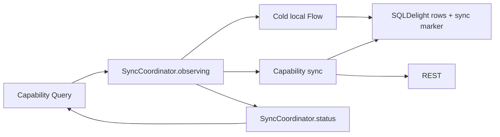

`SyncCoordinator` is owned runtime infrastructure, not a Capability API. It coordinates work and
status; the database owns the value.

## 14.3 Snapshot semantics

A Capability defines:

- what the resource identity is;
- which durable rows and sync marker make up the value;
- whether a retained value is shown while a sync runs or after it fails;
- explicit refresh behavior;
- offline behavior;
- mapping/error semantics.

The common coordinator must not invent those semantics globally.

## 14.4 Live Resource

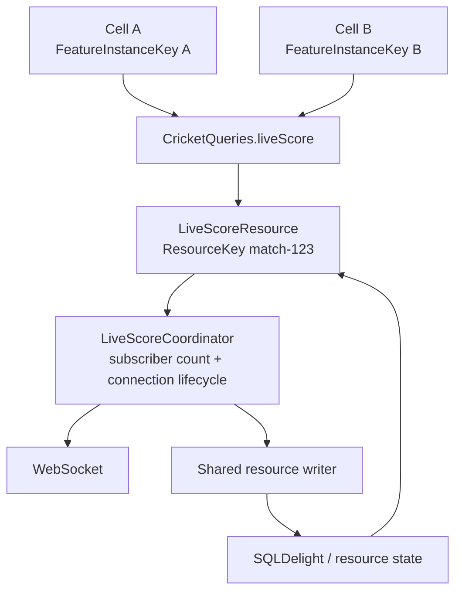

Required semantics per ResourceKey:

```text
0 subscribers
  -> no active connection after grace/background policy

first subscriber
  -> ensure current/bootstrap state
  -> connect if policy requires

additional subscribers
  -> share existing resource/connection

socket event
  -> validate/sequence/reconcile
  -> write through shared resource path

last subscriber leaves
  -> grace policy
  -> disconnect/release
```

Reconnect/backoff belongs to the Capability/live-resource owner.

## 14.5 The sync coordinator is not the UI event/lifecycle layer

The coordinator joins sync work per key, counts observers, and records process-local status over a
Capability-owned durable source of truth. It does not own presentation lifecycle.

Do not use it as:

- Cell lifetime runtime;
- UiCommand bus;
- navigation state;
- peer presentation event bus;
- generic WebSocket subscriber ownership framework.

## 14.6 REST + live write convergence

REST bootstrap/refresh and WebSocket updates can race.

The Capability Resource must define a single write/reconciliation path appropriate to the product, for example:

- server version/sequence;
- timestamp/revision policy;
- socket event sequence;
- source priority only if domain-correct.

The Resource Inspector should expose last write origin and, where available, socket/revision sequence.

Do not leave competing presentation-level mutable copies to resolve races accidentally.

## 14.7 Projection

Projection derives from owned resources rather than copying them.

Late subscribers should converge on current underlying state.

Use named/materialized projection only when repeated expensive combines/joins justify it.

## 14.8 Single-owner rule for expensive mutable resources

| Resource | Authoritative owner | Consumers | Cleanup policy |
|---|---|---|---|
| live-score connection | keyed LiveScoreCoordinator | Cricket resources/queries | subscriber + background/grace policy |
| video/audio players | PlaybackCoordinator/player pool | Video capability/widgets | viewport/audio focus/pool/release |
| batch request queue | BatchRefresh/Hydration coordinator | multiple capability writers | size/time/deadline flush |
| upload/download queue | TransferCoordinator | Commands/features | persist/recover if required |
| location session | location coordinator | Capability consumers | permission/foreground/subscriber policy |

Presentation expresses interest/intent; it does not directly construct or retain the shared resource.

---

# 15. Refresh orchestration and batching

## 15.1 Split responsibilities

### Capability owns

- resource identity;
- when a key is due and what a retained value means;
- Snapshot resource behavior;
- invalidation;
- retry policy;
- whether a trigger actually requires work.

### Common orchestration owns

- foreground trigger;
- reconnect trigger;
- visibility trigger;
- pull-to-refresh trigger;
- periodic trigger execution;
- trigger diagnostics;
- generic concurrency/backpressure/network policy.

## 15.2 Declarative hook example

```kotlin
refreshHooks.register(
    trigger = RefreshTrigger.Foreground,
) {
    articleSync.syncIfDue(ArticleKey.All, RefreshQos.background())
}
```

The common layer says an opportunity occurred. The Capability says whether it is needed.

## 15.3 Pull-to-refresh

User-forced refresh is semantically distinct from passive due-checking.

```text
Foreground -> syncIfDue(key, RefreshQos.background())
PullToRefresh -> sync(key, RefreshQos.visible())
```

## 15.4 Domain-blind QoS

Generic priority:

```text
CRITICAL_VISIBLE
VISIBLE
BACKGROUND
PREFETCH
```

Generic network policy:

```text
ANY_NETWORK
UNMETERED_PREFERRED
UNMETERED_ONLY
```

Scheduler may own:

- max concurrent work;
- queue/backpressure;
- cancellation;
- identical-work dedupe/single-flight;
- data-saver/metered policy;
- background/battery policy.

Scheduler must not become a product-domain brain.

## 15.5 Why not a global policy-heavy RefreshCoordinator

A giant global coordinator would create a second resource framework beside the owned Snapshot runtime and SQLDelight, then centralize product semantics in a common manager.

Helix centralizes **external opportunity + generic scheduling**, not domain freshness policy.

## 15.6 BatchHydrator

Example:

```text
HomeHydrator
  -> POST /home/batch
      -> cricket payload -> Cricket resource writer
      -> article payload -> Article resource writer
      -> promo payload   -> Promo resource writer
```

Rules:

```text
MAY fetch aggregate BFF response
MAY translate pieces
MAY feed owning capability/resource writers
MAY use one transaction where correct

MAY NOT own observable application state
MAY NOT become a Query surface
MAY NOT bypass capability ownership semantics
SHOULD auto-register with debug Resource Inspector
```

Presentation consumers continue observing Capability Queries and do not know batching occurred.

---

# 16. Commands, mutations, outbox, and idempotency

## 16.1 Simple command

Use direct remote/local command when durability/retry correctness does not require an outbox.

```text
Action
 -> ViewModel
 -> Command
 -> capability impl
 -> API / DB
 -> update or invalidate resources
```

## 16.2 Optimistic command

When immediate feedback is required:

```text
write optimistic owned state
 -> send command
 -> reconcile confirmation/failure
```

The optimistic state still has one authoritative owner.

## 16.3 Durable outbox

Use only when user intent must survive:

- offline periods;
- process death;
- ambiguous network response;
- delayed background delivery.

Pattern:

```text
local transaction
  - update durable local state
  - insert PendingCommand(commandId, payload, status)

sync coordinator
  - send/retry idempotently
  - confirm/reconcile
  - clear/mark command
```

Track where useful:

- stable CommandId/idempotency key;
- attempt count;
- error category;
- created time;
- next retry;
- permanent failure state.

Do not route every POST through an outbox.

---

# 17. Durable storage and database topology

## 17.1 SQLDelight role

SQLDelight is the current qualified durable relational store.

Rules:

- generated query/row types remain implementation details;
- Capability implementations map DB types to product/domain models;
- each Capability implementation owns its `.sq`/`.sqm` files and generated schema interface;
- `:storage:database` composes contributors, drivers, and opening, then verifies the merged
  migration sequence from its checked-in snapshot;
- assembly-owned `.sq` may express cross-capability joins/projections;
- migration versions are unique across every schema-contributing module;
- presentation never depends on SQLDelight.

### 17.1.1 File and table naming

- one `<Name>Schema.sq` per Capability under its `db/` package; the generated accessor is
  `<name>SchemaQueries`, which cannot collide with the Capability's `<Name>Queries` API;
- table names are camelCase (SQLDelight's own example idiom), so generated row classes are
  PascalCase;
- generated row/query types stay inside the local source class; the `.sq` file name has no schema
  effect, while a table rename is a `.sqm` migration.

## 17.2 One physical database is a default, not a law

Starting topology:

```text
:capability:<a>-impl/db --\
:capability:<b>-impl/db ---> :storage:database/AppDatabase -> one physical database
:capability:<c>-impl/db --/
```

Logical schema ownership remains capability-specific while storage owns the assembled database's
physical lifecycle. One database is the default; the hard product budget is at most five, and an
additional database requires a genuinely different lifecycle.

Do not split databases pre-emptively.

Revisit physical topology if evidence shows:

- migration serialization/ownership contention;
- invalidation fanout;
- performance/isolation need;
- schema co-change patterns;
- team ownership conflicts;
- build/test blast radius.

## 17.3 Known SQLDelight costs

- relational mapping from non-relational server payloads is real code;
- table/query invalidation can be coarser than entity-normalized caches;
- migrations cross multiple product areas when one physical DB is shared;
- Web/Wasm driver behavior is version-sensitive.

These are managed costs, not reasons to expose DB types upward.

## 17.4 Preferences and secure storage

Generic key-value mechanism may live in Foundation/Platform.

Product semantics such as notification preferences or user settings belong in a Capability.

Secure tokens/secrets use platform secure-storage APIs and Identity/session ownership.

---

# 18. Technical mechanisms and current library choices

Helix architecture is stable across library replacement. This section records the current baseline and alternatives.

## 18.1 Compose Multiplatform

**Choice:** Compose Multiplatform across Android, iOS, Desktop, Web/Wasm.

Why:

- shared UI/presentation implementation;
- Navigation 3 support on non-Android targets from Compose Multiplatform 1.10;
- common preview/tooling improvements;
- fits the current product's cross-platform strategy.

Known Web caveat:

Reconsider if Web becomes a first-class independently optimized product requiring SEO, DOM integration, accessibility, or web-native capabilities that Compose/Wasm cannot reasonably satisfy.

## 18.2 Navigation 3

**Choice:** Navigation 3, with the exact implementation pin owned by the repository version catalog.

Historical qualification note: the architecture POC used the then-selected 1.1.x line and validated the required back-stack/ViewModel behavior. Do not interpret that historical pin as the current upstream release.

Internal qualification:

- back-stack behavior passed;
- deep-link/URL mapping POC passed under the project integration;
- entry-scoped ViewModel destruction passed;
- Web browser-history remains a permanent qualified seam.

Qualification policy:

- exact Nav3/CMP versions come from the repository version catalog;
- target support/browser-history behavior is checked against the upstream sources in Section 38 at upgrade time;
- browser Back/Forward/URL/direct-entry/refresh/deep-link behavior remains permanently regression-qualified.

```text
Navigation 3 runtime behavior:        qualified at repository pin
Nav3 CMP support:                     qualified at repository pin
Nav3 browser-history integration:     QUALIFIED-WITH-WARNING
```

Required Web regression suite:

- Back;
- Forward;
- URL sync;
- direct URL;
- refresh;
- deep link.

### Why not Decompose now

See history and ADRs. It provides more component runtime than current product requirements need.

## 18.3 AndroidX ViewModel

**Choice:** default Screen/Cell presentation owner.

Why:

- familiar;
- testable;
- constructor DI friendly;
- works with NavEntry owner + qualified keyed embedded owner;
- avoids adding another presentation runtime.

### Why not Circuit/Molecule by default

Their presenter/state-production models influenced the desire for lower ceremony and local state production, but another presentation runtime is not needed to satisfy current ownership semantics.

Revisit if measured ViewModel/presentation ceremony dominates useful logic and a mature alternative materially deletes code across all required targets.

## 18.4 Owned sync coordinator

**Choice:** `SyncCoordinator<Key>` in `:foundation:resource-runtime`, internal to Capability
implementation and owned by this project. The database owns the value.

The revisit condition fired twice. On 2026-09-04 the first representative Posts implementation
compared the third-party Store5 wiring with a small owned network-bound-resource reference. With
its cache disabled, Store5 supplied only fetch deduplication and a source-of-truth barrier while the
project still needed converters in both directions, a snapshot plus validator wrapper for the
never-synchronised state, freshness inferred from read origin, a mutex that queued duplicate network
calls, duplicated grace timeouts, and per-post lease, eviction, and cancellation machinery. The
owned `SnapshotResource` that replaced it kept a per-key confirmed value and derived freshness by
comparing durable emissions with a completion re-read. On 2026-09-05 its release-gate review showed
that this made the runtime a second value owner next to SQLDelight: it needed invalidation
generations, self-heal syncs, structural equality on every emission, and re-read gates to stay
consistent, and a detail write to a shared table could still change the feed's freshness without any
feed sync. ADR-43 removed the value from the runtime.

Historical POC provenance: Store5 was adopted as the Kotlin analogue of TanStack Query, whose
observer-driven fetching, in-flight deduplication, and reconnect refetch shaped the resource
contract in 13.7. The architecture experiment used Store5 `5.1.0-alpha10` for cache-first reads,
explicit refresh, offline startup, a SQLDelight source of truth, two observers, and REST plus live
update integration. That evidence remains history, not current implementation guidance.

The coordinator keeps the public observation shape: `ResourceObservation` lost its freshness field
and `SyncStatus` was added. It provides per-key worker joining, due-checking with a minimum
interval, observer counting around a Capability-supplied flow, an offline retry of observed keys on
reconnect, caller-cancellation isolation, and a bounded status ledger. SQLDelight remains the only value owner;
a Capability persists its own synchronized marker in the same transaction as the rows. Live
resources still use their own keyed shared stream and coordinator.

Revisit if measured diagnostics, correctness, target support, or repeated Capability-specific
policy show that this narrow runtime no longer earns its ownership cost.

## 18.5 SQLDelight

**Choice:** SQLDelight, with the exact production pin owned by the repository version catalog.

Historical POC provenance: the validated Web Worker/durable-storage experiment used `2.2.1`.

POC evidence:

- required Android/iOS/Desktop behavior;
- actual browser Web Worker path validated for Web/Wasm target integration;
- migrations/query/driver smoke behavior retained as qualification suite.

Official 2.2.1 web-worker docs require asynchronous database generation for the web worker driver.

Revisit on target support/performance/tooling failure or if another KMP durable store materially improves requirements.

## 18.6 Ktor

**Choice:** generic network mechanism.

Ownership split:

```text
:foundation:network
  -> HttpClient construction
  -> serialization configuration
  -> timeouts
  -> common request IDs/interceptors
  -> auth mechanics (per-request opt-in)
  -> retry policy (per-request opt-in)
  -> failure model
  -> generic connectivity/telemetry hooks

Capability Impl
  -> product endpoints
  -> DTOs
  -> mapping
  -> repository/resource behavior
```

Features do not depend on Ktor clients directly.

## 18.6.1 Auth/session/network ownership

Authentication has cross-cutting mechanics but one product owner.

### Identity owns product/session semantics

The Identity Capability owns:

- signed-in / signed-out session state;
- access/refresh credential lifecycle;
- single-flight token refresh semantics;
- logout/sign-out;
- terminal session-expiry decision;
- secure credential persistence semantics through Platform secure storage.

### Foundation network owns generic HTTP mechanics

Foundation network may define a neutral inversion such as:

```kotlin
interface CredentialProvider {
    suspend fun currentCredential(): String?
    suspend fun refreshCredential(rejected: String?): CredentialRefreshResult
}

sealed interface CredentialRefreshResult {
    data class Refreshed(val credential: String) : CredentialRefreshResult

    /** The credentials are invalid; the provider has already applied its session semantics. */
    data object Rejected : CredentialRefreshResult

    /** Refresh could not run right now (offline, server down); the session is unchanged. */
    data object Unavailable : CredentialRefreshResult
}
```

Identity implementation supplies it through App composition.

[`network.md`](network.md) owns the HTTP client assembly and plugin mechanics.

Refresh returning `Rejected` or `Unavailable` surfaces the original 401 to the caller; the client
never retries with a credential it knows to be invalid.

The authenticated Ktor client may:

1. request current bearer token;
2. inject it generically;
3. on eligible `401`, invoke single-flight refresh;
4. retry the original request according to policy;
5. send refresh requests through the same client without `authenticated()`.

Product endpoints, DTO mapping, and business semantics remain in owning Capability implementations.

### Terminal session end

Correctness-bearing session truth lives in `:capability:identity-api`:

```kotlin
sealed interface SessionState {
    data object SignedOut : SessionState

    data class SignedIn(
        val accountId: AccountId,
    ) : SessionState
}

interface IdentityQueries {
    fun session(): StateFlow<SessionState>
}
```

The optional cross-cutting event contract also lives in **Identity API**, not Identity Impl:

```kotlin
enum class SessionEndReason {
    EXPIRED,
    REVOKED,
    SIGNED_OUT,
}

sealed interface IdentityEvent {
    data class SessionEnded(
        val reason: SessionEndReason,
    ) : IdentityEvent
}

interface IdentityEvents {
    val events: Flow<IdentityEvent>
}
```

Terminal transition:

```text
Identity Impl
  -> clears authoritative credential/session state
  -> updates IdentityQueries.session() to SignedOut
  -> may publish IdentityEvent.SessionEnded
```

App/navigation correctness follows `SessionState`, not transient event delivery. Other Capabilities that must guarantee user-scoped cleanup must also reconcile from the durable/observable session owner (or an explicit logout orchestration path); they must not rely solely on seeing `SessionEnded`.

`SessionEnded` remains useful as a typed happened-fact for independent best-effort reactions/diagnostics. It is not a global string EventBus.

Other Capability implementations may depend on `:capability:identity-api`; they do not import Identity implementation just to obtain tokens.

## 18.6.2 Backend contract generation

When the backend publishes an authoritative, CI-maintained OpenAPI (or equivalent) contract, prefer generated transport DTO/client definitions inside Capability implementation.

Rules:

- generated transport code stays implementation-only;
- map generated models to stable product/domain models before Capability API;
- CI detects contract/code-generation drift;
- generated files are not hand-edited;
- do not force generation when the backend contract is stale/non-authoritative.

This is a recommended anti-drift mechanism, not a universal Helix law.

## 18.7 Koin and Koin compiler/graph validation

**Choice:** Koin for DI, with constructor injection and full-graph verification/compiler validation where qualified.

Rules:

- App composition root assembles graph;
- objects use constructor injection;
- avoid `KoinComponent`/global `get()` in business/data classes;
- Features depend on interfaces/product types, not implementation selection.

Historical qualification:

- application graph verification passed;
- the exact earlier Kotlin 2.4.10/tooling combination emitted an "unverified Kotlin version" warning because the tested adapter level lagged;
- this was classified as dependency/toolchain risk, not an architecture failure.

Current public compiler-plugin releases have improved Kotlin 2.4.x support, but the project should not upgrade merely from public claims: rerun the internal KMP graph/build qualification suite on the exact version combination.

### Why not Metro / kotlin-inject / Dagger+Anvil now

Compile-time DI has attractive local diagnostics. The current Koin baseline is already integrated/qualified enough that switching would trade working familiarity for new tooling without deleting enough required architecture.

Revisit if Koin graph/compiler validation becomes unreliable or another KMP DI option materially reduces owned complexity.

## 18.8 Kermit and OpenTelemetry

**Choice:** stable semantic interfaces with Kermit default; optional OpenTelemetry/vendor adapters by qualified target.

```text
FeatureObserver
  -> KermitObserver
  -> DebugInspectorObserver
  -> RecordingTestObserver
  -> optional OpenTelemetryObserver
```

Separate:

```text
ProductAnalytics
```

Historical POC qualification found the selected OpenTelemetry Kotlin version did not provide the required Wasm path, so Web used neutral/Kermit instrumentation.

Current OpenTelemetry Kotlin remains a developing project; target support/version changes are an adapter qualification concern, not a Feature API concern.

## 18.9 Coil image loading

Start with one reusable image UI mechanism, for example `:ui:image`:

- shared application `ImageLoader`;
- placeholders/errors;
- accessibility defaults;
- preview/test behavior;
- observability hooks.

Coil/vendor types should not leak into unrelated Feature/Capability APIs.

Split deeper image-loader infrastructure only if real needs appear:

- non-Compose image loading;
- prefetch;
- authenticated requests;
- custom decoders;
- multiple loader policies;
- deep image-pipeline telemetry.

## 18.10 Preferences

Generic preferences mechanism belongs in Foundation; product-specific settings belong in Capabilities.

Do not scatter raw preference keys through Features.

[`preferences.md`](preferences.md) owns the preferences, document and secure-storage mechanics.

## 18.11 Platform services

| Mechanism | Platform home | Product meaning |
|---|---|---|
| Share sheet | `:platform:sharing-api/impl` | content-sharing command/analytics |
| Notifications | `:platform:notifications-api/impl` | notification Capability/inbox/preferences/routing |
| Permissions | `:platform:permissions-api/impl` | Feature/Capability policy |
| File picker | `:platform:file-picker-api/impl` | upload/import behavior |
| Secure storage | `:platform:secure-storage` (single module, §7.17) | Identity/session Capability |
| Background work | `:platform:background-work-api/impl` | sync/download/reminder Capability |

## 18.11.1 Product configuration, flags, experiments, design system, and localization

### Product configuration / remote flags

Typed product flags, kill switches, experiment assignment, and remote variants belong to a ProductConfiguration/Experiments Capability (name may follow product language).

- vendor Remote Config/experimentation SDK types and raw string keys stay in implementation;
- presentation consumes typed product concepts;
- kill-switch exclusion occurs at composition/registry before Cell instantiation where practical;
- raw flag reads do not scatter through Cell internals.

### Design system / theme

Shared visual tokens and stateless visual primitives belong in a UI/design-system responsibility, for example:

```text
:ui:design-system
```

It owns typography, spacing, colors/theme tokens, shared stateless primitives, and genuinely visual accessibility defaults. Product/business rules do not move into the design system.

### Localization

Shared locale/plural/formatting/resource mechanisms may live in:

```text
:ui:localization
```

Feature-specific strings may remain with the Feature when cohesive.

Rules:

- localized display strings are never domain identifiers;
- domain/business logic receives stable typed values, not translated text;
- locale-sensitive formatting that changes business meaning belongs to the relevant Capability.

## 18.11.2 Durable outbox/background replay across targets

Durable Command/outbox ownership remains with the owning Capability.

Portable in-process retry opportunities:

```text
app foreground
network reconnect
explicit user retry
periodic opportunity while process is alive
```

Background execution is best-effort Platform machinery:

```text
Android -> platform background work implementation
iOS     -> best-effort background scheduling when product/OS permits
Desktop -> application/OS scheduling only when justified
Web/Wasm-> never assume reliable execution after page/process exit
```

Platform background work may wake/request the Capability runner; it does not own outbox state or business retry semantics. Correctness must tolerate background scheduling not running; the next foreground/reconnect resumes durable work.

## 18.12 No generic utils module

A helper remains local until it has a coherent reusable responsibility.

When promoted, name the responsibility:

```text
:foundation:time
:foundation:presentation
:ui:localization
:capability:content-sharing
```

If it can only be named `utils`, `misc`, `helpers`, or `common-utils`, keep it local until the responsibility is clear.


---

# 19. Observability, diagnostics, analytics, and the flight recorder

## 19.1 Stable seams

Product/presentation code depends on semantic internal contracts, not telemetry vendors.

Example conceptual contracts:

```kotlin
data class FeatureIdentity(
    val feature: String,
    val instance: FeatureInstanceKey,
    val route: RouteKey? = null,
)

interface FeatureObserver {
    fun created(identity: FeatureIdentity)
    fun action(identity: FeatureIdentity, name: String)
    fun stateChanged(identity: FeatureIdentity, stateCategory: String)
    fun uiCommand(identity: FeatureIdentity, name: String)
    fun output(identity: FeatureIdentity, name: String)
    fun destroyed(identity: FeatureIdentity)

    suspend fun <T> operation(
        identity: FeatureIdentity,
        name: String,
        block: suspend () -> T,
    ): T
}

interface ProductAnalytics {
    fun track(event: ProductEvent)
}
```

Exact method shapes may evolve. The stable architectural separation is what matters.

### 19.1.1 Non-generic Feature trace delegate

Rejecting a universal `FeatureViewModel<State, Action, ...>` superclass does not mean each ViewModel should hand-write observer plumbing.

Provide a tiny non-generic helper that binds `FeatureIdentity` once:

```kotlin
class FeatureTrace(
    private val identity: FeatureIdentity,
    private val observer: FeatureObserver,
) : AutoCloseable {
    init { observer.created(identity) }

    fun action(name: String) = observer.action(identity, name)
    fun state(category: String) = observer.stateChanged(identity, category)
    fun uiCommand(name: String) = observer.uiCommand(identity, name)
    fun output(name: String) = observer.output(identity, name)

    suspend fun <T> operation(
        name: String,
        block: suspend () -> T,
    ): T = observer.operation(identity, name, block)

    override fun close() = observer.destroyed(identity)
}
```

Generator/reference ViewModels wire it consistently and close it with ViewModel lifecycle.

The helper owns no product state, has no State/Action generic parameters, is not a ViewModel superclass, and is replaceable if the runtime later provides an equivalent interception seam.

A small factory keeps identity construction consistent:

```kotlin
fun interface FeatureTraceFactory {
    fun create(
        feature: String,
        instanceKey: FeatureInstanceKey,
        route: RouteKey? = null,
    ): FeatureTrace
}
```

The factory/observer implementation is supplied by App/observability composition; Features do not construct vendor telemetry adapters.

## 19.2 Why analytics and operational telemetry are separate

Operational telemetry answers:

- what happened in the software?
- how long did it take?
- which owner/resource/connection was involved?
- where did an error occur?

Product analytics answers:

- what product behavior did the user perform?
- which business funnel/event occurred?

Do not make Feature code call Firebase/OTel/Kermit/vendor SDKs directly.

## 19.3 Trace path

A debug trace should be able to reconstruct:

```text
UI Action
  -> Screen/Cell ViewModel
  -> Capability Query/Command
  -> Store/Repository/Coordinator
  -> SQL / HTTP / WebSocket
  -> resource write/emission
  -> ViewModel State
  -> Compose rendering
```

## 19.4 Resource Inspector

The Resource Inspector / flight recorder is a first-class AI/QA/debug architecture seam.

It should know resources automatically wherever possible.

Preferred factory pattern:

```kotlin
createResourceStore(...)
createLiveResource(...)
createBatchHydrator(...)
```

Debug binding:

- auto-registers metadata;
- captures resource lifecycle summaries.

Release binding:

- may be no-op/minimal as required.

## 19.5 Inspector information

Useful debug fields:

```text
Feature / Screen / Cell
FeatureInstanceKey
RouteKey
ResourceKey
resource type: Snapshot | Live | Projection
observers/subscriber count
source of truth
freshness / snapshot age
in-flight refresh
last REST refresh
live connection status
reconnect count
last write origin
server/socket sequence/revision where available
which FeatureInstanceKeys observe the resource
pending/outbox command count
last Action
last Output
current state category
active operation
```

## 19.6 Example inspector view

```text
LiveScoreCell
---------------------------------------
feature             cricket
instance            home-feed:score:123
route               home
resource             match-123
resource type        LIVE
subscribers          2
presentation owner   retained keyed item
state                Live
last action          Refresh
last output          OpenMatch
freshness            1.2s
socket               connected
reconnects           1
last write           websocket seq=9192
last REST refresh    28s
```

## 19.7 Telemetry safety

Do not serialize full ViewModel/domain/resource state into production telemetry by default.

Prefer:

- state categories;
- durations;
- result/error categories;
- safe resource type/owner metadata;
- bounded correlation identifiers where privacy-reviewed;
- trace context rather than high-cardinality metric labels.

Avoid user IDs/article IDs/match IDs/instance UUIDs as uncontrolled metric dimensions.

Apply:

- consent;
- redaction;
- sampling;
- data minimization;
- offline buffering policy;
- retention policy

at the appropriate adapter/export layer.

---

# 20. Testing and quality architecture

## 20.1 Principle

Every important architectural boundary should have an executable oracle.

No single test type is the specification.

During the **first roughly 10 real production Cells after adoption**, testing/ergonomics data is also architecture evidence: measure reading/ceremony/context/retry/debug cost rather than assuming the design is already production-optimal.

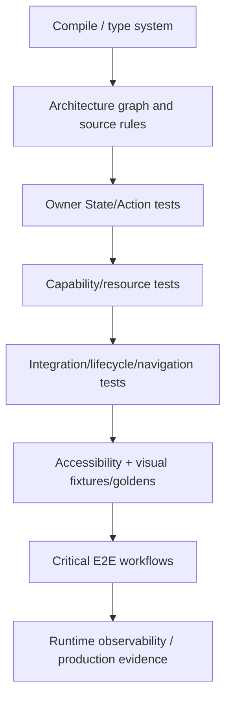

## 20.2 What each layer proves

### Compiler/module graph

Proves structural legality such as dependency direction.

### Architecture/source tests

Proves rules such as:

- UI imports no ViewModel/Koin/navigation/Capability;
- Capability API imports no infrastructure;
- ViewModel visibility/public API rules;
- UiCommand payload restrictions where statically knowable;
- no forbidden peer Cell coupling.

### Presentation-owner tests

Prove:

- initial State;
- resource -> State projection;
- Action handling;
- local presentation state;
- UiCommand semantics;
- Output semantics.

### Capability/resource tests

Prove:

- cache/SSOT behavior;
- mapping;
- freshness/refresh;
- offline behavior;
- command reconciliation;
- batching;
- concurrency;
- live-resource sharing/reconnect;
- outbox/idempotency.

### Runtime tests

Prove:

- NavEntry destruction;
- back/deep-link/browser behavior;
- keyed Cell offscreen retention;
- logical removal cleanup;
- adaptive pane ownership;
- process/configuration recovery.

### Fixtures/goldens

Prove rendering changed or remained stable for explicit fixture states.

They do **not** prove business correctness.

### Accessibility

Proves semantic/readability/accessibility expectations separately from pixels.

### E2E

Proves high-value user workflows across boundaries.

## 20.3 Test expectations by role

| Role | Typical required evidence |
|---|---|
| UI | fixture/golden states where valuable, accessibility semantics, callback tests |
| Feature | ViewModel State/Action/UiCommand/Output, content integration, fixtures |
| Capability API | contract examples/fakes where useful |
| Capability Impl | resource/command/repository/cache/socket/batching/mapping/failure/concurrency |
| Storage | SQL behavior, migrations, transactions |
| Runtime | navigation, saved state, adaptive, keyed lifetime cleanup |
| Architecture | graph, source rules, ABI, DI graph |

## 20.4 Fakes

Prefer direct fake Capability contracts and fake Feature state over booting the full production DI graph for every test.

Shared generic helpers -> `:testkit:*`.

Feature-specific scenarios stay beside the Feature.

## 20.5 Goldens are deliberately narrow

Goldens answer:

> Did the rendering for this fixture change?

They do not answer:

- is auth correct?
- did the Command persist?
- is architecture legal?
- did refresh dedupe?
- is the live socket shared?

A human approving a visual diff cannot override a failed behavioral or architecture check.

## 20.6 Framework-upgrade golden churn

Compose/font/rendering upgrades may create broad expected visual changes.

Where practical:

- isolate framework-upgrade golden refreshes from product feature changes;
- generate before/after evidence;
- keep behavioral tests independent;
- replace noisy golden tooling if churn destroys review value.

## 20.7 Fixture gallery as non-dev review surface

A PM/designer/QA contributor should be able to inspect meaningful Cell states without:

- configuring a backend;
- navigating hidden app paths;
- knowing Android lifecycle;
- editing production data.

## 20.8 High-value live-resource tests

At minimum:

1. first observer opens/joins resource;
2. second observer shares same resource/connection;
3. both receive current state;
4. REST/bootstrap and socket updates converge;
5. one observer leaves, resource remains for the other;
6. final observer leaves, grace/disconnect policy applies;
7. reconnect/backoff produces correct state;
8. no duplicate connection for same ResourceKey;
9. different ResourceKeys remain independent.

## 20.9 Refresh tests

Separate two layers.

### Trigger layer

- foreground emits trigger;
- reconnect emits trigger;
- visibility/pull-to-refresh/periodic scheduling;
- concurrency/backpressure/network policy;
- diagnostics.

### Capability layer

- `syncIfDue` skips a key attempted within its minimum interval;
- forced refresh always starts or joins a worker;
- retry/invalidation semantics remain product-owned.

## 20.10 Durable command tests

When outbox is used:

- local transaction is atomic;
- restart retains pending intent;
- retries are idempotent;
- ambiguous response does not double-apply;
- permanent failure is visible/recoverable as product requires.

## 20.11 Qualification suites are permanent tests

Version-sensitive seams need dedicated smoke/regression suites:

- Nav3 back/deep-link/browser/owner destruction;
- keyed smart item retention/cleanup;
- SQLDelight DB creation/migration/query/Web worker path;
- Koin graph/compiler exact toolchain;
- Snapshot runtime cache/offline/live integration;
- observability adapter target support.

A library upgrade is incomplete until its qualification suite passes.

---

# 21. Mechanical architecture enforcement

## 21.1 Convention plugins

Use included `build-logic` with role-specific convention plugins.

Example names:

```text
company.kmp.app
company.kmp.feature
company.kmp.capability-api
company.kmp.capability-impl
company.kmp.ui
company.kmp.foundation-api
company.kmp.foundation-runtime
company.kmp.platform-api
company.kmp.platform-impl
company.kmp.storage
company.kmp.testkit
```

A convention plugin can supply:

- KMP targets/source-set conventions;
- compiler flags;
- common dependencies;
- test defaults;
- explicit API/ABI config;
- module role/subrole used by graph validation;
- for `:foundation:*`, explicit `foundation_api` versus `foundation_runtime` classification;
- standard verification tasks.

## 21.2 Graph validator

`checkModuleGraph` or equivalent should:

- read actual project-to-project dependencies;
- classify modules by convention plugin/path;
- enforce role matrix;
- detect physical cycles;
- normalize Capability API/Impl families for logical cycle detection;
- later support target visibility where justified.

## 21.3 Enforcement strength hierarchy

Use the strongest/earliest mechanism that can express the rule:

1. **No Gradle dependency edge** - code cannot resolve the implementation.
2. **Kotlin/module visibility (`internal`)** - implementation cannot escape its owner module.
3. **Explicit API + ABI review** - public-surface widening is visible.
4. **Convention/graph/compiler/DI validation** - deterministic architecture/construction failure.
5. **Structural/source tests (Konsist or equivalent)** - intra-module semantics not expressible above.
6. **Behavioral/runtime tests** - lifecycle/resource behavior.
7. **Review/documentation** - judgment for facts machines cannot know.

Do not lint an import repeatedly when a convention plugin can simply avoid adding that dependency.

## 21.4 Konsist/source rules

Reserve source rules for constraints the stronger layers cannot fully express:

1. peer Cell implementations inside one Feature do not import/call one another's internals;
2. business/data classes do not implement `KoinComponent` or use service-locator/global `get()` patterns;
3. UiCommand payloads do not carry correctness-bearing domain/resource objects where enforceable;
4. externally reusable Feature presentation symbols are public only under the approved child Feature `.api` package; callers of another Feature import only that package;
5. Capability public APIs expose only approved API packages/types;
6. `foundation_api` modules do not expose/runtime-depend on forbidden lower product/runtime mechanisms in their public surface;
7. intentionally quarantined framework/runtime imports do not leak outside approved packages;
8. no hard-coded `Dispatchers.*` or global coroutine-scope construction in Feature/business code where injected policy applies.

Graph/visibility rules remain primary for Feature -> Impl, UI -> Koin/Capability, Capability API -> infrastructure, and Capability Impl -> Feature/UI/other Impl.

## 21.5 Explicit API / ABI

Use Kotlin explicit API and ABI checks for stable public modules.

Historically the architecture discussion referenced Kotlin's `binary-compatibility-validator`; use that tool or its maintained successor/equivalent for the project's Kotlin/toolchain version. The architecture requirement is **reviewable public-surface change**, not loyalty to one ABI plugin.

The purpose is not ceremony. It makes public-contract widening visible and reviewable.

## 21.6 Standard verification entry point

Public semantic contract:

```bash
# human/agent inner loop
helix-kmp verify --fast --affected

# repository-wide fast gate
helix-kmp verify --fast

# full supported-target matrix
helix-kmp verify --full
```

If no tier is supplied locally, tooling may default to `--fast`, but must print the chosen tier. CI must name the tier explicitly.

### Fast tier

Typical checks:

```text
JVM/common compilation sufficient for normal Kotlin errors
affected unit/state/resource tests
module graph + logical cycles
source rules
Koin/DI validation where it does not require the whole native matrix
ABI/public API checks for affected stable modules
generator/tooling tests when affected
```

Track p50/p95 duration on the reference developer/agent environment. A practical operational target is p95 around or below two minutes; it is not a timeless Helix law.

### Full tier

Typical checks:

```text
Android target build/tests
iOS/Kotlin-Native compilation/integration
Desktop target
Web/Wasm compilation + browser regressions
Nav3/deep-link/browser qualification
SQLDelight Web Worker qualification when affected
keyed ownership / Compose retain qualification
goldens/accessibility as configured
critical integration/E2E/upgrade suites
```

PR CI always runs the fast gate plus affected platform protection. Main/release/architecture-critical dependency upgrades run the full matrix.

Agents iterate on `--fast --affected`; they do not repeatedly run iOS/Wasm after every edit.

Before the CLI exists, Gradle umbrella tasks may provide the same tier semantics.

## 21.7 Exceptions

Architecture exceptions require:

```text
rule
scope
owner
reason
created date
expiry/review date
removal/revisit condition
```

Untracked blanket suppression is prohibited.

Expired exceptions should fail verification when tooling supports it.

---

# 22. The Helix KMP control plane

## 22.1 Why the control plane is architecture

A large multi-contributor codebase cannot rely on everyone remembering a document.

The control plane makes the correct path easier than invention and makes illegal paths fail quickly.

### 22.1.1 Contract breadth is not day-one implementation breadth

The complete command vocabulary is designed now, but implementation is staged from one canonical block.

<!-- HELIX_CONTROL_PLANE_STAGES_BEGIN -->
```json
{
  "schema": 1,
  "P0": {
    "gate": "before_first_real_cell",
    "requirements": [
      "role_convention_plugins",
      "module_graph_rules",
      "stable_rule_ids_and_actionable_failures",
      "verify_fast_affected",
      "phase_aware_root_agent_instructions",
      "minimal_cell_and_capability_generator"
    ],
    "availableCommands": [
      "create",
      "verify"
    ]
  },
  "P1": {
    "gate": "before_adoption_complete",
    "requirements": [
      "thin_graph",
      "thin_impact",
      "thin_doctor",
      "thin_context",
      "gallery_index",
      "agent_instruction_generation_or_no_drift_check"
    ],
    "availableCommands": [
      "create",
      "verify",
      "graph",
      "impact",
      "doctor",
      "context",
      "gallery"
    ]
  },
  "P2": {
    "gate": "evidence_driven_after_adoption",
    "requirements": [
      "sophisticated_doctor_scoring",
      "advanced_context_ranking",
      "extraction_and_merge_codemods",
      "architecture_kit_bulk_migrations",
      "automated_repair"
    ],
    "availableCommands": [
      "extract",
      "migrate"
    ]
  }
}
```
<!-- HELIX_CONTROL_PLANE_STAGES_END -->

Interpretation:

- **P0** is sufficient to build the first real Cell safely.
- **P1** is required before Helix adoption is declared complete.
- **P2** is earned from measured product history.
- root `AGENTS.md` must be phase-aware: it may mention only commands actually available at the current stage.
- Appendix A is the **post-adoption/P1-complete** root template, not a P0 bootstrap template.
- until the agent-instruction generator/no-drift checker exists, do not claim Appendix A is generated.

This preserves the intended control plane without violating "complexity is earned." 

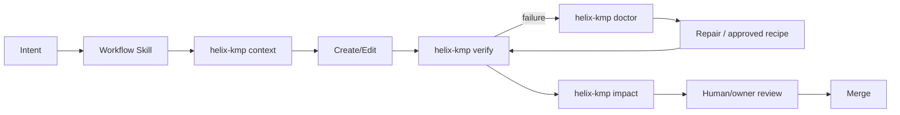

## 22.2 Stable public CLI

Public command name:

```text
helix-kmp
```

Do not publish a bare global `helix` CLI because that name is crowded and collides with existing software.

Required command family:

```text
helix-kmp graph
helix-kmp context
helix-kmp create
helix-kmp verify
helix-kmp impact
helix-kmp doctor
helix-kmp extract
helix-kmp migrate
helix-kmp gallery
```

Additional operations may be subcommands/recipes rather than proliferating top-level verbs:

- reuse;
- split API/Impl;
- merge;
- resolve cycle;
- repair illegal edge.

## 22.3 Standard CLI flags

Mutating/evolution commands should share semantics:

```text
--dry-run    calculate plan; write nothing
--explain    include rules/evidence/reasoning
--apply      perform deterministic edits
--verify     run required postconditions
--json       machine-readable report
--affected   scope work by dependency/ownership impact
--fast       inner-loop verification tier
--full       full supported-target verification tier
```

Humans, agents, and CI should use the same command contracts.

## 22.4 Command catalog

### `graph`

Purpose:

- derive repository architecture graph;
- show roles/scopes/platforms/owners/dependencies/public surface;
- detect cycles.

### `context`

Purpose:

- produce bounded task context packet for humans/agents.

Example:

```bash
helix-kmp context cricket --json
```

### `create`

Purpose:

- generate standard Feature/Screen/Cell/UI/Capability structures.

Examples:

```bash
helix-kmp create cell cricket live-score --dry-run --explain
helix-kmp create capability bookmarks --apply --verify
```

### `verify`

Purpose:

- execute architecture + test + qualification gates.

### `impact`

Purpose:

- calculate blast radius of a symbol/module/diff.

Report:

- direct/transitive modules;
- tests;
- owners;
- ABI/public consumers;
- qualification suites;
- expected vs surprising impact.

### `doctor`

Purpose:

- diagnose illegal edges and architecture pressure;
- explain rule/evidence;
- recommend approved repair/extraction/merge;
- never silently refactor by default.

Example diagnosis:

```text
Violation: feature:article imports capability:cricket-impl
Rule: Feature may depend on Capability API, never business Impl
Approved repair: use CricketQueries from cricket-api
Mechanical recipe available: yes
```

### `extract`

Purpose:

- perform evidence-approved boundary extraction.

Examples:

```bash
helix-kmp extract ui cricket score --dry-run --explain
helix-kmp extract capability cricket --apply --verify
```

### `migrate`

Purpose:

- apply architecture-kit/convention migration recipes.

```bash
helix-kmp migrate --to architecture-kit-v4 --affected --dry-run
helix-kmp migrate --to architecture-kit-v4 --affected --apply --verify
```

### `gallery`

Purpose:

- build/launch fixture review matrix.

## 22.5 Internal scripts are replaceable

The CLI is stable. Implementation may use:

- Kotlin/JVM;
- Gradle tasks;
- Kotlin PSI/Analysis API;
- OpenRewrite-style recipes;
- Python;
- shell;
- other deterministic tooling.

Recommended internal layout:

```text
tooling/helix-kmp/
  cli/
  graph/
  verify/
  context/
  impact/
  doctor/
  generators/
  recipes/
  qualification/
  gallery/
```

The implementation may be one binary, several Gradle tasks, or a set of helper scripts. If split internally, the responsibilities should stay explicit:

| Internal responsibility | Input | Deterministic output / side effect |
|---|---|---|
| graph extractor | Gradle projects/configuration, role plugins, KMP targets | normalized physical + logical dependency graph |
| source/architecture verifier | graph + Kotlin source | rule violations with stable identifiers and repair guidance |
| ABI/public-surface verifier | API modules + ABI baseline | intentional/unintentional public surface diff |
| context renderer | target + graph + budget/profile | bounded source/API/rule/test/fixture packet, JSON-capable |
| impact calculator | target/symbol/diff + graph | affected modules/tests/owners/ABI/qualification suites |
| doctor analyzer | graph/history/violations/metrics | evidence-ranked extraction/merge/repair recommendations |
| generator | requested role/profile/name | minimal conventional files + Gradle wiring + fixtures/tests as relevant |
| refactoring recipe runner | approved recipe + target | syntax-aware dry-run/apply diff followed by verification |
| qualification runner | dependency/runtime seam | repeatable target matrix and regression evidence |
| gallery indexer/launcher | fixture declarations | reviewable Cell x state matrix |

Internal filenames are intentionally **not architecture facts**. Agents should call the public CLI rather than depending directly on `scripts/foo.py` paths, unless the CLI itself is being developed.

## 22.6 Script requirements

Scripts invoked by agents/CI should be:

- deterministic for the same repository state;
- idempotent where possible;
- safe in dry-run;
- explicit about files changed;
- non-interactive in `--json` mode;
- fixture-testable;
- fail-fast with stable rule IDs;
- actionable in error messages;
- free from hidden duplicated architecture facts.

## 22.7 Graph data model

A graph node can derive:

```text
module path
role
scope
platform targets
owner
stability/qualification when relevant
actual Gradle dependencies
public API/ABI summary
```

The same graph powers:

- dependency validation;
- context packets;
- impact/affected tests;
- ownership routing;
- `doctor`;
- architecture search/index;
- migration planning;
- context metrics.

## 22.8 Context packet contract

Inputs:

```text
target scope/module/symbol
task type (optional)
context budget/profile (optional)
```

Default priority:

1. target implementation and tests in full;
2. direct dependency public APIs;
3. applicable architecture rules;
4. fixtures/acceptance examples;
5. exact verify commands;
6. on-demand links to deeper internals.

A structured packet should be able to expose sections such as:

```text
TASK TARGET
- role / scope / owner / platform

PUBLIC ENTRY POINTS
- Screen / Cell / Capability APIs relevant to the task

GRAPH SLICE
- direct dependencies and reverse dependencies relevant to the expected change

RULES
- applicable architecture rules
- protected boundaries
- relevant ADR Revisit-when conditions

SOURCE
- target implementation and tests in full

DEPENDENCY CONTEXT
- public APIs of direct dependencies, not their unrelated internals

ACCEPTANCE
- fixtures, expected states, scenario/E2E references where relevant

VERIFY
- exact commands and expected evidence
```

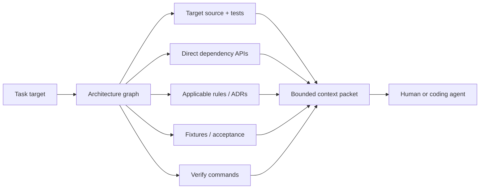

Do not automatically load:

- unrelated sibling implementations;
- all transitive data internals;
- full repository docs;
- distant platform code.

## 22.9 Context budget and investment policy

Context generation can decay in value as model/tooling quality improves, so it is lower implementation priority than deterministic verification and actionable repair messages.

Start with a cheap packet:

```text
target source/tests
direct public dependency APIs
applicable rule IDs
exact fast verify command
```

Add sophisticated ranking/token budgeting only when measured agent outcomes justify it.

Historical heuristic: keep a working set comfortably below the smallest production agent context, for example around a configurable fraction of the window.

Final rule:

- no universal token threshold is a Helix law;
- measure real task success/cost;
- use context pressure as one `doctor` signal;
- do not physically split code solely to satisfy a temporary model limit when cohesion would suffer.

## 22.10 Root `AGENTS.md`

Keep root agent instructions concise and high-value.

There is **one post-adoption/P1-complete copyable root template in Appendix A**. Do not install it during P0 unchanged, because P1 commands may not exist yet.

The P1 agent-instruction generator/no-drift checker must read the canonical stage block in Section 22.1.1 and omit unavailable commands for earlier phases.

Generation/check inputs:

- laws: Section 2;
- vocabulary: Section 7;
- dependency prohibitions/rule IDs: Section 9 policy;
- identity: Section 12;
- verification/workflow: Sections 21-22;
- protected work: Section 31.

Repository `AGENTS.md` should be generated or checked against these inputs.

## 22.11 Nested agent instructions

Nested `AGENTS.md`/equivalent files are optional **deltas**, not mandatory per-Cell ceremony.

Use only when a path has important local constraints that cannot be generated or inferred.

Avoid stale duplicated architecture manuals in every folder.

## 22.12 Workflow-oriented AI Skills

Use a few workflow Skills, not one Skill per CLI command.

Canonical family:

```text
build-feature
evolve-architecture
debug-and-repair
review-and-verify
```

Shared rules:

- call stable `helix-kmp`, not private script paths;
- use `verify --fast --affected` for the normal edit loop;
- use impact/doctor evidence before boundary movement;
- never bypass protected review;
- return deterministic evidence;
- use the same permissions as humans;
- do not copy the whole architecture into every Skill.

**Appendix B is the single copyable Skill-template source.**

### 22.12.1 Skill bundle structure

A workflow Skill may contain:

```text
SKILL.md       workflow, stop/escalate conditions, evidence contract
scripts/       deterministic helpers only when genuinely reusable
references/    concise tool/domain references loaded on demand
assets/        templates/fixtures when required by the workflow
```

Do **not** copy this entire master into every Skill. The Skill teaches the workflow and invokes `helix-kmp context` for current repository facts.

The initial package provides four Skill templates, but Skills are adapters around Helix workflows rather than the source of architecture truth.

### 22.12.2 Agent/vendor portability

Helix must not depend on one coding-agent vendor. The portable contract is:

```text
repository + Gradle graph + source
        + AGENTS.md/local deltas
        + helix-kmp CLI/JSON
        + deterministic verification
        + workflow semantics
```

An OpenAI Skill, another agent platform's workflow file, an IDE action, or a human runbook may adapt that contract without changing Helix architecture facts.

Agents receive **no special architecture permissions**: they use the same generators, verification, exception process, and ownership rules as human developers and CI.

## 22.13 Agent evidence contract

An AI-generated change should return evidence rather than "done."

At minimum where applicable:

```text
Target/owner changed
Architecture classification used
Files/modules changed
Verification command + result
Tests added/updated
Fixture/golden evidence
Impact report
Public API/ABI changes
Qualification suites touched
Exceptions/risks
```

## 22.14 Safe contribution lanes

| Lane | Typical contribution | Review expectation |
|---|---|---|
| Declarative | copy, content order, flags, design tokens, constrained schemas | normal product review |
| Acceptance | fixtures, examples, edge cases, expected screenshots/business rules | QA/product/design review |
| Bounded code | one scope/Cell/UI/Capability consumer through Skill + verify | code owner |
| Restricted | auth, payments, privacy, migrations, crypto, shared concurrency, public APIs, architecture | experienced specialist/owner |

Goal: ordinary contributions should not require Android lifecycle knowledge when the task does not cross lifecycle/platform boundaries.

---

# 23. Architecture evolution and `doctor`

## 23.1 Architecture is a graph, not a folder tree

Folders are a view. The graph is the operational model.

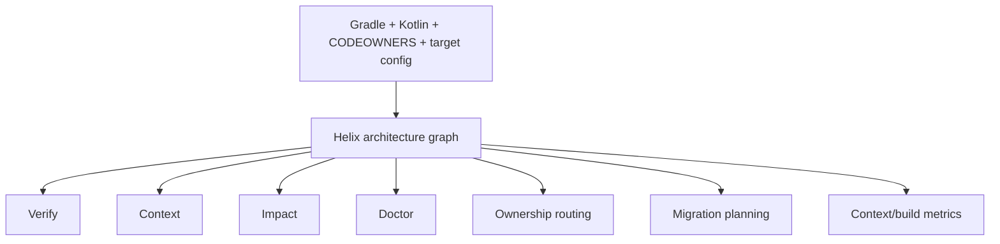

## 23.2 Objective extraction signals

`doctor` can consider:

- second independent consumer;
- second owning team;
- incoming dependencies;
- public API size/churn;
- ABI fanout;
- compile/test fanout;
- context surface;
- repeated exceptions/illegal-edge attempts;
- Git co-change;
- duplicated reuse;
- database/schema pressure.

It should show evidence and confidence.

Example:

```text
CRICKET
context surface             41,200 tokens
external capability users   4
external pure UI users      3
compile fanout              high
feature/data co-change      8%

Recommendation
- extract capability: HIGH confidence
- extract score UI: HIGH confidence
- keep Screen + Cell presentation together
```

Numbers are illustrative; thresholds are organization-configurable.

## 23.3 `doctor` recommends, humans approve

`doctor` does not silently restructure architecture.

Automated change is appropriate when:

- evidence supports the boundary move;
- a reviewed deterministic recipe exists;
- human architecture/owner approval is obtained for consequential boundary changes.

## 23.4 Architecture-kit versioning

A convention change should ship as a coordinated architecture-kit release:

```text
new generator
+ new verification rule
+ codemod recipe
+ master/derived docs update
+ qualification evidence
= architecture-kit release
```

Then:

```bash
helix-kmp migrate --to architecture-kit-v4 --affected --apply --verify
```

Prefer centrally derivable kit version or minimal metadata rather than noisy version markers in every file.

## 23.5 Refactoring recipes

Core recipe families:

```text
extract capability
extract UI
split API/Impl when justified
merge over-fragmented boundary
resolve cycle through stable API/ownership move
migrate architecture-kit version
```

Prefer syntax-aware Kotlin PSI/Analysis/OpenRewrite-style tooling over regex for semantic refactors.

## 23.6 Verification is a postcondition

A codemod is successful only when:

```text
new graph valid
public API diff intentional
required tests pass
fixtures/goldens valid or reviewed
qualification suites pass when affected
obsolete adapter/old boundary removed when no longer needed
```

## 23.7 Exception pressure is architecture evidence

Repeated exceptions against the same rule/scope may mean:

- bad implementation habits;
- missing generator support;
- a boundary that no longer fits reality.

`doctor` should distinguish these where possible.

---

# 24. ADR and qualification governance

## 24.1 ADR template

Every consequential decision records:

```text
Decision
Context / problem
Why
Alternatives considered
Consequences / costs
Qualification evidence
Revisit when
Migration/escape path
```

## 24.2 `Revisit when` is mandatory for consequential bets

Architecture decisions are conditional bets, not scripture.

A useful review question is:

> **Has any ADR revisit condition become true?**

## 24.3 Qualification states

Use a small vocabulary:

```text
qualified
qualified-with-warning
accepted-experimental
unsupported
```

Optional additional state:

```text
under-evaluation
```

Do not let agents treat `accepted-experimental` as equivalent to stable.

## 24.4 Dependency upgrades are architecture-adjacent changes

Architecture-critical library upgrades require:

- version pin change;
- qualification suite;
- impact check;
- updated status/evidence;
- ADR revisit review if behavior changed materially.

## 24.5 Framework watch

Recommended operational practice: maintain a scheduled architecture-framework watch for meaningful changes in:

- Navigation 3;
- Compose Multiplatform;
- Decompose;
- Circuit;
- third-party snapshot/resource libraries (Store5 and successors) against the owned runtime;
- SQLDelight;
- Koin/Koin compiler;
- observability/KMP tooling;
- relevant architecture/codemod tooling.

Notify only when a change is substantial enough to affect ranking, qualification, or a recorded ADR condition. Include impact and a POC/migration recommendation rather than raw release notes.

### Historical operating note

During the architecture-design discussion, a **daily 09:00 condition-watch automation** named `Architecture Framework Watch` was created for this purpose. Its intent was to check the frameworks above and notify only when a development was substantial enough to reconsider the ranking/baseline, with the expected impact and a POC or migration recommendation.

The exact schedule and existence of that automation are **not Helix architecture requirements**. They are recorded only as provenance for the framework-watch practice; each team may choose an appropriate cadence/tool.

---

# 25. Current ADR catalog

## ADR-01 - Specialized ownership rather than one application runtime

**Decision:** navigation, presentation instances, resources, durability, and shared expensive resources have specialized owners.

**Why:** they have different identity/lifetime semantics; a universal store/runtime increases coupling.

**Alternatives:** global MVI/app store, universal component runtime as the only owner.

**Revisit when:** product topology becomes dominated by nested autonomous component trees and the keyed helper becomes a general component runtime.

## ADR-02 - ViewModel UDF for stateful presentation

**Decision:** State + Action default; UiCommand/Output opt-in; ViewModel owns stateful Screen/Cell presentation.

**Why:** familiar, testable, already qualified with keyed ownership, avoids a second runtime.

**Alternatives:** Circuit presenter, Molecule DIY, Decompose component, global reducer.

**Revisit when:** presentation ceremony becomes a measured dominant tax and a mature alternative materially removes it without weakening ownership.

## ADR-03 - Feature modules with logical Cells, not module-per-Cell

**Decision:** Cells live inside owning Feature by default.

**Why:** module-per-Cell overpays build/IDE/reading cost.

**Revisit when:** consumer/team/context/ABI/build/test fanout evidence says a physical wall reduces blast radius.

## ADR-04 - Capability API hides resource/transport implementation

**Decision:** grouped Queries + intent Commands + stable models are presentation-facing contract.

**Why:** product vocabulary remains stable across Snapshot runtimes, SQLDelight, REST, WebSocket, and future replacements.

**Revisit when:** a transport-specific model becomes the true stable product contract and hiding it creates only duplication.

## ADR-05 - Snapshot orchestration primitive

**Decision:** superseded by ADR-43, which keeps the value in the database and reduces the runtime
to a domain-blind `SyncCoordinator`.

**Status:** the Store5 decision was superseded 2026-09-04 by an owned `SnapshotResource` runtime;
that runtime was superseded 2026-09-05 by ADR-43.

**Why superseded:** the representative Posts implementation required more adaptation and lifecycle
glue while the disabled library cache added no required behavior beyond refresh joining and a
source-of-truth barrier. The owned value-tracking replacement then reproduced the same second-owner
problem in project code; see ADR-43.

**Revisit when:** see ADR-43.

## ADR-06 - SQLDelight for durable relational state

**Decision:** current durable relational store; one DB default not invariant.

**Revisit when:** target support/performance/tooling or migration/invalidation/ownership pressure justifies split/replacement.

## ADR-07 - Navigation 3 + keyed embedded presentation owner

**Decision:** Navigation 3 for Screens; narrow `StatefulLazyItem`-style keyed owner for embedded smart Cells.

**Revisit when:** helper grows into component runtime, recurring lifecycle bugs, first-party replacement, or mature alternative deletes meaningful custom infrastructure.

## ADR-08 - Registry optional by surface class

**Decision:** registry for independently configurable composition; static Compose for static surfaces.

**Revisit when:** repeated retrofit pressure shows dynamic composition is the norm.

## ADR-09 - UiCommand allowed but fenced

**Decision:** transient local UI instruction only; correctness independent of delivery.

**Revisit when:** repeated audits show durable/domain state is still smuggled through despite enforcement.

## ADR-10 - REST/Snapshot runtime/SQLDelight are replaceable choices

**Decision:** REST-oriented backend now; no speculative GraphQL infrastructure.

**Revisit when:** backend/product economics adopt another transport/resource model.

## ADR-11 - Graph-first control plane

**Decision:** derive architecture facts from repository/build/source/ownership systems; no per-module YAML/custom dependency DSL.

**Revisit when:** a material fact cannot be expressed/derived and a small central override is insufficient.

## ADR-12 - Stable `helix-kmp` CLI with replaceable scripts

**Decision:** humans/agents/CI share one public command vocabulary.

**Revisit when:** CLI becomes a bottleneck or standard tooling provides the same workflows with lower owned cost.

## ADR-13 - Workflow AI Skills + graph-derived context

**Decision:** a few workflow Skills and focused context packets; concise root instructions; nested deltas only when necessary.

**Revisit when:** whole-repo comprehension becomes reliably superior at equal cost/accuracy or context tooling costs more than it saves.

## ADR-14 - Refresh orchestration has domain-blind QoS

**Decision:** external triggers + generic scheduling/backpressure common; freshness/product policy capability-owned.

**Revisit when:** scheduler repeatedly requires product-specific business rules.

## ADR-15 - Goldens are visual rail, not safety model

**Decision:** visual evidence is additive to independent correctness rails.

**Revisit when:** rendering churn makes selected golden mechanism too noisy.

## ADR-16 - Compose Multiplatform Web qualified to product needs

**Decision:** use current shared Web/Wasm target with permanent navigation/storage regressions.

**Revisit when:** Web requires SEO/accessibility/DOM/product capabilities that the shared Compose approach cannot reasonably provide.

## ADR-17 - Registry/SDUI is a dial, not global default

**Decision:** use dynamic composition where economics require it; do not server-drive everything.

**Revisit when:** backend-controlled composition/personalization/experimentation dominates product delivery.

## ADR-18 - Cell is a logical primitive, not a base class/module

**Decision:** Cell is a vocabulary/ownership concept implemented with ordinary Kotlin/Compose/ViewModel structures.

**Why:** preserves reuse/identity benefits without creating a private framework hierarchy.

**Revisit when:** a standard first-party abstraction emerges that exactly represents the concept and reduces custom terminology/boilerplate.

## ADR-19 - Cell file structure is complexity-driven

**Decision:** no fixed seven-file ceremony.

**Why:** generator removes writing cost but not reading cost.

**Revisit when:** empirical feature patterns justify a smaller universal skeleton or a different grouping.

## ADR-20 - Grouped Query interfaces, intent Commands

**Decision:** grouped read APIs, separate intent-shaped mutations.

**Why:** avoids trivial use-case class explosion while preserving product semantics for writes.

**Revisit when:** grouped interfaces become overly broad/unstable or per-operation contracts measurably improve reuse/testing.

## ADR-21 - Physical database topology is evidence-driven

**Decision:** one DB is a starting convenience, not a permanent ownership boundary.

**Revisit when:** migration/invalidation/performance/team isolation evidence fires.

## ADR-22 - Early real-Cell ergonomics are measured

**Decision:** Baseline v1 remains design-frozen, but first production Cells collect ceremony/context/debug/build evidence.

**Why:** POCs prove mechanics, not five-year ergonomics.

**Revisit when:** measured evidence shows a baseline default creates recurring reading/implementation tax.

---

## ADR-23 - Koin with constructor injection and graph/compiler validation

**Decision:** keep Koin as the DI mechanism while qualified; composition belongs at App/implementation roots and business/data code avoids service-locator access.

**Why:** it is already integrated/familiar and current compiler/graph validation provides useful safety without requiring a DI migration solely for ideology.

**Alternatives explored:** Metro, kotlin-inject, Dagger/Anvil-style compile-time DI.

**Revisit when:** exact-version graph/compiler validation is unreliable, upgrade friction becomes chronic, or an alternative materially removes construction/verification complexity across required KMP targets.

## ADR-24 - Semantic observability seams, not vendor APIs

**Decision:** `FeatureObserver` and `ProductAnalytics` are stable application-facing seams; Kermit is the default neutral logging path and OpenTelemetry/vendor adapters are optional/qualified.

**Why:** target support differs, especially Web/Wasm, and operational telemetry should not become product-code vendor coupling.

**Revisit when:** one vendor-neutral stack has equal required-target support and clearly deletes adapter/maintenance cost.

## ADR-25 - Ktor is a generic HTTP mechanism; product endpoints stay in Capability Impl

**Decision:** generic HTTP configuration/client machinery may live in Foundation, while product endpoints, DTOs, mapping, auth/business semantics, and resource behavior live in owning Capability implementation.

**Why:** transport mechanism is reusable; product API shape is not generic infrastructure.

**Revisit when:** a different transport stack materially replaces Ktor or backend architecture changes; Capability API remains stable.

## ADR-26 - Durable outbox only for intent that must survive

**Decision:** use direct Commands for ordinary writes; use optimistic state when product semantics justify it; introduce a durable outbox only when user intent must survive offline/process death/ambiguous delivery.

**Why:** an outbox gives idempotent durable intent but is too much machinery for every mutation.

**Revisit when:** offline-first command semantics become universal enough that common command infrastructure deletes rather than adds complexity.

## ADR-27 - Scope is logical; architecture metadata is derived

**Decision:** `scope` is a logical graph/context grouping, not a new Gradle parent/aggregator; role/dependency/platform/owner/public-surface facts come from operational sources rather than per-module YAML.

**Why:** duplicated metadata drifts and makes graph/context/CI disagree.

**Alternatives:** `:scope:*`/`:capsule:*` aggregators, per-module architecture descriptors, custom dependency DSL.

**Revisit when:** a required architecture fact genuinely cannot be derived or centrally represented without harmful ambiguity.

## ADR-28 - AI workflows are vendor-portable adapters over the same control plane

**Decision:** use a few workflow Skills and concise agent instructions, but keep repository graph, `helix-kmp`, JSON outputs, deterministic verification, and ownership rules as the portable contract.

**Why:** architecture must work for humans and multiple agent systems; Skills should not become a second source of truth.

**Revisit when:** a standardized agent protocol makes separate Skill adapters redundant, while retaining the same repository/control-plane semantics.

## ADR-29 - Markdown master source, derived HTML and audience documents

**Decision:** this exhaustive Markdown master is the reasoning/documentation source of truth; human-facing technical/management/QA/contribution pages are generated/derived, with HTML as the main reading surface and PDF/DOCX as optional snapshots.

**Why:** Markdown is diffable, searchable, agent-friendly, versioned with code, and can drive multiple formats without independent copies drifting.

**Revisit when:** another source format provides equal diffability/automation/agent ergonomics and materially improves maintenance.

## ADR-30 - Starter conversion is a one-time adoption workflow, not a permanent migration subsystem

**Decision:** for the lightly configured starter repository, inspect/keep/reshape/replace directly, install the Helix foundation and reference slice, then retire the adoption playbook.

**Why:** large-system LEGACY/MIGRATING taxonomies and strangler infrastructure would be disproportionate to the starter's size.

**Revisit when:** the repository becomes a genuinely large legacy migration before adoption completes.

## ADR-31 - Synchronized reads expose one validatable ResourceObservation contract

**Decision:** remotely synchronized Capability reads use the single `ResourceObservation<T : Any>` contract from `:foundation:resource` (`foundation_api`) when value + refresh/failure semantics matter; simple local reads may remain `Flow<T>`. Constructor invariants reject structurally illegal status combinations.

**Why:** a plain domain-value flow cannot consistently express loading, refresh with a retained value, cached-offline, or failed refresh, while per-Capability copies would immediately drift.

**Revisit when:** a simpler standard resource primitive provides the same transport-neutral semantics and legal-state guarantees.

## ADR-32 - App owns application runtime coroutine parent

**Decision:** App creates/cancels the parent in-process runtime scope; Capability resource/coordinator owners create child jobs. Shared resources never borrow ViewModel scope and never use `GlobalScope`.

**Why:** Resource lifetime and presentation lifetime are intentionally independent.

**Revisit when:** a target-complete standard runtime provides equivalent structured application/resource scope ownership.

## ADR-33 - FeatureInstanceKey uses typed host placement

**Decision:** presentation identity is constructed once from surface + Cell type + a `CellPlacementId` owned by the host. `ResourceKey`/domain IDs cannot be passed directly to the factory, and debug hosts fail on duplicate active instance keys.

**Why:** ResourceKey/index/string-convention identities collide or leak state under duplicate placements and reorder.

**Revisit when:** a standard presentation runtime supplies equivalent structured instance identity and duplicate protection.

## ADR-34 - Identity API owns correctness-bearing session state; Foundation network owns auth mechanics

**Decision:** Identity owns session/token refresh/logout semantics. `:capability:identity-api` exposes observable `SessionState` and the optional typed `IdentityEvent.SessionEnded`. Foundation network owns generic bearer injection/401 retry behind an Identity-supplied credential contract. Navigation/cleanup correctness follows session truth or explicit orchestration, never transient event delivery alone.

**Why:** authenticated transport is cross-cutting but session truth still needs one product owner and must not depend on an event collector being active.

**Revisit when:** backend/platform authentication changes materially.

## ADR-35 - Verification has fast and full tiers

**Decision:** humans/agents iterate with `helix-kmp verify --fast --affected`; full Android/iOS/Desktop/Web matrix is CI/release/qualification.

**Why:** verification latency is delivery architecture.

**Revisit when:** full-matrix technology becomes fast enough to collapse tiers without slowing iteration.

## ADR-36 - Standard primitive first; bespoke primitive requires complete reference

**Decision:** prefer standard KMP/Compose/Kotlin mechanisms. Private Helix primitives require unmet need, complete executable reference, regression, diagnostics, and deletion condition.

**Why:** private primitives impose learning/context/maintenance cost.

**Revisit when:** ecosystem primitives replace the owned mechanism or measured custom value remains clearly higher.

## ADR-37 - Dynamic registry assembly belongs at App composition

**Decision:** static hierarchical Feature composition may use a child public entry; registry-driven hosts depend on generic registry contracts while App assembles concrete registrations.

**Why:** dynamic Home/Discover must not become the compile-time root of every registered Feature.

**Revisit when:** composition becomes server-driven enough to require another typed composition protocol.

## ADR-38 - Dependency role policy is default-deny and machine-decidable

**Decision:** role dependency legality and stable rule IDs live in Section 9's machine-readable policy. Unlisted pairs are denied. Physical `:foundation:*` modules are classified as `foundation_api` or `foundation_runtime`, and Feature -> Feature composition is conditionally allowed only through a machine-checkable child `.api` public presentation surface.

**Why:** allow+deny gaps, prose predicates, or broad undifferentiated Foundation access create ambiguous validator behavior and violate one-fact-one-source.

**Revisit when:** tooling requires moving the canonical policy to another authoritative machine-readable source while preserving the same decidability/no-drift guarantees.

## ADR-39 - Product configuration/design/localization/background work have explicit owners

**Decision:** typed flags/experiments are a product Capability; design tokens/theme are UI/design-system; localization mechanism is UI/localization with cohesive Feature-local strings; durable outbox is Capability-owned while background execution is best-effort Platform machinery.

**Why:** otherwise these cross-cutting concerns become unowned globals.

**Revisit when:** product/platform structure materially changes these boundaries.

## ADR-40 - Cross-module CellSpec is open, not sealed

**Decision:** `CellSpec` is a plain interface in `:foundation:presentation`; concrete specs are Feature-owned.

**Why:** Kotlin sealed direct subtypes must remain in the declaring module/package, which conflicts with independently compiled Features implementing a shared registry contract.

**Revisit when:** registry ownership moves into one compilation module or a first-party typed registry eliminates the contract.

## ADR-41 - Dependency pins are repository facts, not transcribed upstream-latest prose

**Decision:** exact current pins come from repository version catalogs/lockfiles; qualification comes from project evidence; this master records decisions, historical POC provenance, status, and upstream source URLs without copying fast-decaying "latest stable/beta/alpha" numbers.

**Why:** upstream release numbers can become stale within days and should not create a second version authority.

**Revisit when:** dependency/qualification tooling can inject immutable released snapshots into derived docs automatically without manual drift.

## ADR-42 - Control-plane staging has one canonical machine-readable block

**Decision:** P0/P1/P2 availability is defined only in Section 22.1.1. P0 precedes the first real Cell, P1 is required before adoption completion, and P2 is evidence-driven. Root agent instructions are phase-aware; Appendix A is the P1-complete/post-adoption template.

**Why:** duplicate staging lists can tell agents to run commands that are not implemented.

**Revisit when:** the control plane reaches a mature steady state where phases no longer provide useful adoption semantics.

## ADR-43 - Sync coordination is domain-blind and the database owns the value

**Decision:** `:foundation:resource-runtime` ships `SyncCoordinator<Key>` plus the small helpers
that connect it to a Capability (`observations`, `toResourceProblem`, `commit`); it owns no value.
It starts or joins one worker per key, skips keys attempted within `minInterval`, counts observers
around a Capability-supplied upstream flow, retries observed keys whose last attempt failed offline
whenever its `retryTriggers` flow emits, and exposes a per-key `SyncStatus` ledger bounded by
`maxEntries`. It never reads, caches, compares, or re-reads values.
Capability implementations observe SQLDelight directly, persist their own "synchronized at least
once" marker in the same transaction as the rows, apply that marker to the value flow, and hand the
flow to `observations`, which applies the contract's `SyncStatus.toOperation` mapping.
`ResourceFreshness` is deleted from the contract and `SyncStatus` is added. Supersedes ADR-05.

**Why:** the owned `SnapshotResource` runtime that replaced Store5 on 2026-09-04 tracked a per-key
confirmed value and derived `FRESH`/`STALE` by comparing every durable emission with a completion
re-read. Its release-gate review found that this made the runtime the second owner of the value: it
needed invalidation generations, self-heal syncs, structural equality on every emission, and re-read
gates to stay consistent with the database, and a detail write to a shared table could still change
the feed's freshness without any feed sync. Freshness derived from in-memory comparison is not a
durable fact, and no consumer used it beyond a boolean the Feature has since dropped. Removing the
value from the runtime removes that class of consistency bug and shrinks the runtime to a
mutex-guarded map with a state table.

**Alternatives considered:**

- Keep the owned value ledger and land the remaining repairs. Rejected: each repair added state
  that duplicated what SQLDelight already knows, and the correctness argument rested on
  interleavings that only a contention test could exercise.
- Revert to the Store5 adapter as of commit 0240602. Rejected: the reasons in ADR-05 still hold,
  and its disabled cache still made the library the second value owner.

**Revisit when:** a Capability needs a domain-blind age or staleness policy that cannot live in its
own rows, or a qualified third-party primitive provides per-key joining, due-checking, observer
counting, and status without owning the value.

---

# 26. Qualification snapshot and evidence ledger

This section separates project POC evidence from public upstream release facts.

## 26.1 Project POC outcomes

| Area | Internal observed result | Current decision |
|---|---|---|
| keyed smart-item ownership | offscreen composition disposal retained ViewModel/state; logical removal destroyed owner immediately | adopt one narrow reusable keyed owner |
| Navigation 3 | required back stack, deep-link/URL integration under project POC, entry-scoped VM destruction passed | selected Screen runtime |
| Decompose | viable broader component runtime | archive as evaluated alternative; do not mix by default |
| SQLDelight Web/Wasm | 2.2.1 actual web-worker path passed headless-browser qualification | approved; rerun on upgrades |
| Koin compiler | application graph verification passed; earlier exact Kotlin combo produced compatibility warning | keep with qualification warning until exact-upgrade suite passes |
| observability | semantic FeatureObserver worked with Kermit and optional OTel adapter; required Wasm OTel path absent in selected POC | Kermit default; adapter-neutral |
| historical Store5 Snapshot POC | cache-first, refresh, offline, SQLDelight SoT passed | superseded 2026-09-04 by the owned runtime after the value comparison fired |
| owned sync coordinator | per-key joining, due-checking, observer counting, status ledger, eviction, caller cancellation, reconnect, and SQLDelight integration passed | current narrow project-owned runtime; the value-tracking `SnapshotResource` predecessor was superseded 2026-09-05 (ADR-43) |
| Snapshot/live integration | REST + SQLDelight + live updates with two observers passed | live keyed coordinator + shared resource; the sync coordinator is not the UI lifecycle layer |
| durable mutation | local-first bookmark + offline retry passed | explicit Commands; outbox only when required |
| identity | separate FeatureInstanceKey/ResourceKey behavior validated | retain three-identity model |

## 26.2 Upstream verification policy and source ledger

Fast-moving upstream "latest version" numbers are **not master-source truth**.

Operational authority:

```text
exact dependency pin          -> repository version catalog / lockfiles
project qualification status  -> qualification test evidence
upstream capability/source     -> URLs in Section 38
architecture decision          -> this master
```

The master may retain historical POC versions where they explain evidence, but it must not transcribe "current latest stable/beta/alpha" as if that were durable architecture.

### Navigation 3 qualification source

Use the repository pin as the exact version authority. The project POC qualified the required Nav3 ownership/back-stack behavior. Upgrades rerun the Nav3 + browser/direct/deep-link suite.

### Compose Multiplatform Navigation 3

Upstream KMP documentation is the source for supported targets/browser integration. The repository pin plus permanent browser-history regression suite determine project qualification.

### Compose Runtime `retain` / retained values

Upstream Compose Runtime documentation confirms the retain/retained-values APIs exist, but API existence is not enough to replace the keyed Cell owner.

Immediate project qualification on the **repository-pinned** Compose Multiplatform/runtime version:

```text
Android + iOS + Desktop + Web/Wasm
  1. compose keyed Cell
  2. mutate presentation state/ViewModel
  3. leave composition due to scrolling while logical item remains
  4. return and prove the same presentation owner/state
  5. logically remove item and prove immediate retirement
  6. re-add as new placement and prove no state leak
  7. reorder
  8. host the same ResourceKey in two distinct placements
```

Decision:

- lifecycle 2.11.0 `ViewModelStoreProvider` satisfies the keyed store/ref-count contract and now
  backs the reduced `StatefulLazyItem` helper;
- Compose `retain` remains a separate candidate only if it can delete more infrastructure while
  preserving the exact four-target suite;
- minimize private keyed-runtime coupling around the first-party provider.

### SQLDelight

The repository pin is authoritative. The historical project POC qualified the asynchronous Web Worker path; upgrades rerun that target-specific suite.

### Sync coordinator runtime

The owned coordinator is qualified by permanent state-table, cancellation, eviction, observer,
reconnect, and Capability integration tests. The historical Store5 pin was removed when ADR-05 was
superseded on 2026-09-04; the value-tracking `SnapshotResource` was removed under ADR-43 on
2026-09-05.

### Koin / compiler validation

The repository's Kotlin + Koin + compiler-plugin pins are authoritative. Upstream docs/source are evidence only. Rerun the exact KMP graph/build/compiler suite before changing qualification.

For canonical ViewModel snippets, verify against the source/docs for the pinned Koin Compose ViewModel artifact. The reviewed common source exposes `parameters` as `ParametersDefinition?`, hence the lambda form used in Section 30.4.

### OpenTelemetry Kotlin

Do not transcribe upstream "current" versions here. Project support remains adapter/target-qualified; Features depend only on semantic observability seams.

## 26.3 Current qualification register

| Technology/mechanism | Status | Note |
|---|---|---|
| Navigation 3 | qualified | exact repository pin from version catalog; project runtime behavior qualified |
| Nav3 CMP browser history | qualified-with-warning | exact repository pin + permanent Back/Forward/URL/direct/refresh/deep-link suite |
| keyed `StatefulLazyItem` owner | qualified | backed by lifecycle 2.11.0 `ViewModelStoreProvider`; `rememberViewportKeys` supplies Decompose `ChildItems`-style destroy-beyond-buffer |
| Compose `retain` / RetainedValuesStore replacement | under-evaluation | evaluate exact repository pin on four-target lazy/keyed/logical-removal suite |
| SQLDelight | qualified | exact repository pin + required-target/Web Worker regression |
| owned Snapshot resource runtime | qualified | per-key ledger and SQLDelight integration covered by permanent regression tests |
| Koin compiler/graph validation | qualified-with-warning | exact repository Kotlin/Koin/compiler pins must remain regression-qualified |
| Kermit | selected default adapter | broad neutral logging path |
| OpenTelemetry Kotlin | optional/target-dependent | adapter only; never Feature contract |
| Circuit | evaluated alternative | no default adoption |
| Decompose | evaluated alternative | escape hatch for general component-tree topology |
| GraphQL/Apollo | deferred/not currently applicable | backend not expected to support near term |

---

# 27. Known costs, risks, and honest counterpoints

## 27.1 Upfront platform/control-plane cost

Helix invests in:

- build logic;
- architecture tests;
- generators;
- CLI;
- Skills/context;
- runtime diagnostics;
- qualification suites;
- codemods.

This is real work. The rationale is to pay repeated architecture decision/debug/migration cost once at the platform seam rather than in each Feature.

## 27.2 Bespoke vocabulary/tooling cost

Every contributor must learn:

- Feature;
- Screen;
- Cell;
- Capability;
- Resource;
- three identities;
- a private CLI.

Mitigation:

- keep vocabulary small;
- use standard platform primitives under it;
- generate workflows;
- write audience-specific concise docs;
- avoid thematic taxonomy growth.

## 27.3 AI capability may reduce context pressure

Mitigation:

- context optimization is not a law;
- low blast radius/ownership remain independent benefits;
- simplify context tooling if its value decays.

## 27.4 Generator does not remove reading cost

Mitigation:

- no fixed file ceremony;
- measure real feature readability;
- merge files/boundaries when cohesion improves.

## 27.5 Single DB can become a coordination hotspot

Mitigation:

- logical capability ownership;
- physical topology is reversible;
- measure migration/invalidation/co-change pressure.

## 27.6 Sync coordinator is owned infrastructure

Mitigation:

- narrow and hidden behind Capability Impl;
- domain-blind: coordinates work and status, never values;
- process-bounded per-key ledger with eviction;
- permanent state-table, cancellation, eviction, observer, and reconnect qualification suite;
- replacement remains possible without changing consumers.

## 27.7 Custom keyed owner is owned runtime infrastructure

Mitigation:

- narrow scope;
- strong regression tests;
- delete it if first-party primitive matches semantics;
- reconsider Decompose if it grows into a component runtime.

## 27.8 Web/Wasm ecosystem maturity

Mitigation:

- explicit qualification suites;
- vendor-neutral boundaries;
- revisit Compose Web if product requirements diverge.

## 27.9 Golden-test rot

Mitigation:

- goldens are narrow visual evidence only;
- separate framework churn;
- fixtures remain useful even if the golden tool changes.

## 27.10 Verification latency can dominate agent/human loops

Mitigation:

- fast/full tiers;
- affected slicing;
- measure p50/p95 fast verification;
- optimize rule/DI/unit checks for inner-loop latency;
- reserve full matrix for CI/release/qualification.

## 27.11 Bespoke primitives can become hidden framework debt

Mitigation:

- Standard Primitive First;
- complete Cricket/reference usage;
- stable diagnostics;
- regression suite;
- explicit delete/revisit condition;
- qualify Compose `retain` and other first-party replacements before private coupling expands.

## 27.12 Documentation can become stale

Agents may trust repository instructions too strongly.

Mitigation:

- master source owns rationale;
- graph/source code owns operational facts;
- generated docs/context where possible;
- root instructions concise;
- nested deltas only when necessary;
- architecture-kit migrations update tools/docs together.

---

# 28. Naming and public identity

## 28.1 Final naming stack

```text
Architecture:
    Helix KMP

Descriptor:
    a modular ownership architecture for Kotlin Multiplatform

Optional descriptor:
    a modular ownership architecture for AI-first Kotlin Multiplatform applications

Frozen spec:
    Helix KMP Baseline v1

Internal shorthand:
    Helix

Compliance:
    Helix-compliant

Public CLI:
    helix-kmp
```

## 28.2 Public naming rule

> Use **Helix KMP** for public-facing names, documentation, repositories, artifacts, plugins, and tooling. **Helix** may be conversational/internal shorthand but should not be published as an unqualified global software brand or CLI.

Use organization-qualified package/artifact namespaces.

## 28.3 Why Helix KMP was chosen

Semantically, Helix represented:

- intertwined Application Plane + Control Plane;
- ownership plus evolution;
- stable structural rails with replaceable implementation;
- continuous architecture adaptation rather than a static folder taxonomy.

It represented the design more strongly than neutral arrangement-only names.

## 28.4 Public collision screening

Pre-clearance web screening found material uses of the unqualified name **Helix** in software. The most relevant signals included:

- **Sitecore Helix**, an established modular software architecture whose public vocabulary includes Project / Feature / Foundation; this was the most material architecture-name collision;
- an active **Helix Framework** in the Spring/Gradle ecosystem with its own Helix CLI;
- **Apache Helix** artifacts such as `org.apache.helix` / `helix-core`;
- other Helix developer tooling such as HelixML and multiple unrelated GitHub projects;
- multiple global `helix` command-line tools already using verbs such as `create`, `doctor`, `init`, or `run`;
- package-name crowding in Maven/JVM, PyPI, npm, and generic software domains;
- software-related HELIX trademark/brand signals including the Perforce HELIX family, Applied Intuition HELIX, BMC HELIX, and related records including India-facing signals.

This is why the final public CLI is **`helix-kmp`**, not bare `helix`, and why public artifacts/packages should use organization-qualified namespaces.

Exact searches for forms such as:

```text
"Helix KMP"
helix-kmp
helixkmp
"Helix KMP Architecture"
```

did not surface an established exact architecture/framework/package identity during the original screening. That was encouraging but is **pre-clearance only**, not legal/trademark clearance.

If this becomes a public/commercial brand, formal trademark/domain/package clearance is still required.

## 28.5 Names explored

Historical candidates included:

- **Axifold** - relatively clean but meaning felt opaque;
- **Invarail** - architecture-friendly semantics but difficult pronunciation;
- **Boundrail** - descriptive but unexciting;
- **Vinyas** - viable and more publicly ownable; the word was understood as arrangement/design/structure. Screening found no major established software-architecture collision, but did find smaller design/engineering uses, `vinyas.dev`, and an old India Class 9 VINYAS software/design-systems application reported as abandoned;
- **Helix KMP** - strongest architecture representation, chosen with a qualified public name.

In the qualitative comparison, Helix was judged to represent the architecture more strongly (roughly **9.5/10** for semantic representation versus **8.5/10** for Vinyas). Those were discussion heuristics, not trademark/market scores. Vinyas was cleaner for ownability; Helix better expressed the intertwined **Application Plane + Control Plane** and **Enforced Evolution** idea.

Other names were eliminated due active collisions or weaker fit, including examples such as Tessera, Trellis, Keel, Axiom, Niyam, Sutura, Modara, Modulyn, Invarix, Ordin/Ordinex, Scopeward, Stateward, RuleMesh, Ownara, Structara, Boundset, Ownbound, Propria, Samanvay, and Sutra.

---

# 29. One-time adoption model for the existing KMP starter

## 29.0 How the adoption-document decision evolved

The documentation discussion briefly proposed a **New Project Implementation Playbook** intended to bootstrap an empty repository. That was corrected twice as the actual repository context became clearer:

1. it is **not** an empty greenfield project;
2. it is also **not** a large mature legacy migration;
3. it is a lightly configured KMP starter with only a few things already present.

Therefore the greenfield playbook and a heavy `LEGACY / MIGRATING / HELIX` strangler-migration model were both rejected for this situation.

The final one-time document is the **Helix KMP Adoption Playbook**:

> Convert an existing lightly configured KMP starter into a complete Helix KMP application foundation by inspecting first, preserving compatible setup, reshaping ownership, installing the minimum rails, converting the small amount of starter code, building one complete reference slice, verifying all supported targets, and then retiring the playbook.

Documentation packaging decision:

- the Adoption Playbook is **separate from the long-lived documentation ZIP/site**;
- it is self-sufficient during conversion;
- once adoption is complete, normal feature development uses the long-lived Implementation Guide/control-plane workflows and the Adoption Playbook is retired.

This section is source material for the separate disposable **Helix KMP Adoption Playbook**. It is not meant to remain a routine developer workflow after adoption.

## 29.1 Repository situation

The starting repository is:

- not empty;
- not a large legacy production app;
- a small/lightly configured KMP starter with only a few pieces already present.

Therefore use neither a greenfield rebuild nor a large-enterprise strangler migration.

## 29.2 Adoption principle

> **Inspect first, keep compatible setup, reshape ownership, replace only what conflicts with Helix.**

Avoid:

- delete/recreate everything;
- permanent LEGACY/MIGRATING/HELIX taxonomies;
- elaborate debt baselines;
- multi-quarter migration dashboards.

## 29.3 Inventory

Record:

- KMP targets;
- Kotlin/Compose/Gradle/AGP/JDK versions;
- current modules;
- navigation;
- DI;
- network;
- DB;
- screens/ViewModels;
- repositories/use cases;
- WebSockets;
- tests;
- build logic.

Classify each existing element:

```text
KEEP
MODIFY
REPLACE
REMOVE
UNKNOWN
```

## 29.4 Keep/modify/replace defaults

| Starter element | Default |
|---|---|
| working Compose Multiplatform | KEEP |
| target setup | KEEP if product-aligned |
| version catalog | KEEP |
| Ktor | KEEP |
| Kotlin serialization | KEEP |
| SQLDelight | KEEP if working; reshape ownership |
| compatible Koin | KEEP/reshape |
| qualified Nav3 | KEEP |
| other navigation | evaluate/replace only as needed |
| simple sample screen | convert into reference Feature/Screen/Cell |
| Screen VM owning unrelated resources | REFACTOR |
| generic `BaseViewModel` | remove unless technically required |
| generic `Repository<T>` framework | remove unless real product semantics |
| `core/common/utils` junk drawer | split by coherent responsibility |
| pure shared Composable | keep local or move to UI when truly reused |
| HTTP DTO exposed to UI | hide behind Capability |
| global WebSocket manager | replace with keyed capability resource ownership |

## 29.5 Adoption phases

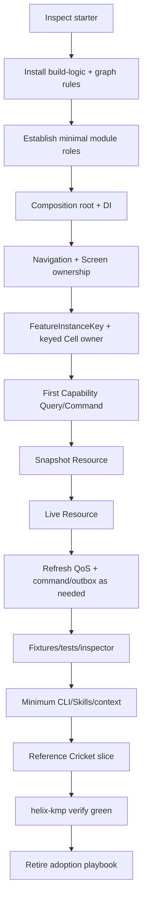

## 29.6 Control-plane minimum during adoption

Section **22.1.1 is the only canonical staging definition**.

Adoption sequence:

```text
P0 before first real Cell
  -> build/reference Cell and first vertical slice
  -> implement P1 thin commands + no-drift agent instructions
  -> only then declare Helix adoption complete
```

Do not maintain a second "establish early / mature later" list here.

## 29.7 Adoption completion

The repository is ready for normal Feature development when:

```text
all required targets build
DI graph verifies
module/dependency rules pass
typed RouteKey works
keyed Cell owner regression passes
one real Cell works
one grouped Capability Query works
one Snapshot Resource works
one Live Resource shares correctly
refresh trigger/freshness split works
fixtures/tests exist
Resource Inspector hooks exist
P0 + P1 control-plane gates from Section 22.1.1 are complete
root agent instructions mention only implemented commands and pass no-drift check
standard helix-kmp verify --fast is green
required full/target qualification gates are green
starter patterns conflicting with Helix are removed
```

After this point, use the normal Implementation Guide/Skills rather than the adoption runbook.

---

# 30. Canonical Cricket reference slice

Cricket is the reference because it exercises the difficult parts without inventing an artificial demo.

## 30.1 Module graph

```text
:feature:home
:feature:cricket
:capability:cricket-api
:capability:cricket-impl
:storage:database
:foundation:network
:foundation:observability
:testkit:common
```

Optional pure visual extraction only if independently reused:

```text
:ui:cricket-score
```

## 30.2 Feed model

Simple Article item remains simple:

```kotlin
sealed interface FeedItem {
    val placementId: CellPlacementId

    data class Article(
        override val placementId: CellPlacementId,
        val model: ArticleCardModel,
    ) : FeedItem

    data class Cricket(
        override val placementId: CellPlacementId,
        val matchId: MatchId,
    ) : FeedItem
}
```

Rendering:

```kotlin
items(items = state.items, key = { it.placementId.value }) { item ->
    when (item) {
        is FeedItem.Article -> ArticleCard(item.model)

        is FeedItem.Cricket -> {
            val instanceKey = FeatureInstanceKey.forPlacement(
                surface = "home-feed",
                cellType = "live-score",
                placement = item.placementId,
            )

            StatefulLazyItem(
                key = instanceKey,
            ) { ownedInstanceKey ->
                LiveScoreCell(
                    matchId = item.matchId,
                    instanceKey = ownedInstanceKey,
                    onOutput = ::handleCricketOutput,
                )
            }
        }
    }
}
```

The host constructs the key once. The keyed helper passes that exact identity to its content.

Minimum semantic helper contract:

```kotlin
@Composable
fun StatefulLazyItem(
    key: FeatureInstanceKey,
    content: @Composable (FeatureInstanceKey) -> Unit,
)
```

The helper implementation may be reduced/deleted if Compose `retain` qualifies; identity handoff remains normative.

## 30.3 Capability API

```kotlin
interface CricketQueries {
    fun liveScore(matchId: MatchId): Flow<ResourceObservation<LiveScore>>
    fun match(matchId: MatchId): Flow<ResourceObservation<Match>>
}

fun interface FollowTeam {
    suspend operator fun invoke(teamId: TeamId)
}
```

## 30.4 Canonical Cell + ViewModel acquisition

Koin Compose is allowed at a **Feature Screen/Cell composition entry** to acquire that presentation owner's ViewModel. It remains forbidden in pure `:ui:*`.

The keyed host installs the keyed `ViewModelStoreOwner` for its subtree; `koinViewModel()` resolves against that current owner.

```kotlin
@Composable
fun LiveScoreCell(
    matchId: MatchId,
    instanceKey: FeatureInstanceKey,
    onOutput: (LiveScoreOutput) -> Unit,
) {
    val viewModel: LiveScoreViewModel = koinViewModel(
        key = instanceKey.value,
        parameters = { parametersOf(matchId, instanceKey) },
    )

    val state by viewModel.state.collectAsStateWithLifecycle()
    val currentOnOutput by rememberUpdatedState(onOutput)
    val lifecycleOwner = LocalLifecycleOwner.current

    LiveScoreUi(
        state = state,
        onAction = viewModel::onAction,
    )

    LaunchedEffect(viewModel, lifecycleOwner) {
        lifecycleOwner.repeatOnLifecycle(Lifecycle.State.STARTED) {
            viewModel.outputs.collect { output ->
                currentOnOutput(output)
            }
        }
    }
}
```

Why these details are canonical:

- current Koin Compose ViewModel resolution accepts a `ParametersDefinition`, so the parameter expression is a lambda;
- `collectAsStateWithLifecycle()` is available in common lifecycle-compose APIs and stops unnecessary StateFlow collection when the presentation lifecycle is inactive;
- `rememberUpdatedState` prevents callback identity churn from restarting the Output collector;
- the effect is keyed to the ViewModel/lifecycle owner, not to an unstable bound callback reference;
- a Cell fills width and wraps height; it never uses `fillMaxSize()` or owns vertical scrolling. The host supplies scrolling through `modifier` and insets through `contentPadding`, applied inside the Cell so content can scroll under translucent bars;
- surface-level element state such as `SnackbarHostState` is hoisted as a nullable parameter with a self-hosting default;
- the Cell checks that the resolved ViewModel's id equals the `id` parameter and fails fast otherwise: the ViewModel is keyed by `instanceKey` alone, so a host that reuses one placement key for a different id would otherwise keep rendering the stale instance.

Koin definition:

```kotlin
viewModel { params ->
    val matchId: MatchId = params.get()
    val instanceKey: FeatureInstanceKey = params.get()

    LiveScoreViewModel(
        matchId = matchId,
        instanceKey = instanceKey,
        queries = get(),
        followTeam = get(),
        trace = get<FeatureTraceFactory>().create(
            feature = "cricket/live-score",
            instanceKey = instanceKey,
        ),
    )
}
```

The ViewModel maps synchronized resource observations into product-specific State.

A minimal reference State/mapping is intentionally shown so agents do not invent incompatible loading/offline semantics:

```kotlin
data class LiveScoreState(
    val score: LiveScore? = null,
    val isInitialLoading: Boolean = false,
    val isRefreshing: Boolean = false,
    val problem: LiveScoreProblemUi? = null,
) {
    companion object {
        val initial = LiveScoreState(isInitialLoading = true)
    }
}

enum class LiveScoreProblemUi {
    OFFLINE,
    ACCESS,
    RETRYABLE,
    FAILED,
}

private fun ResourceObservation<LiveScore>.toLiveScoreState(): LiveScoreState {
    val failure = operation as? ResourceOperation.Failed

    return LiveScoreState(
        score = value,
        isInitialLoading = value == null && operation is ResourceOperation.Refreshing,
        isRefreshing = value != null && operation is ResourceOperation.Refreshing,
        problem = failure?.problem?.let { problem ->
            when {
                problem.category == ResourceProblemCategory.OFFLINE ->
                    LiveScoreProblemUi.OFFLINE
                problem.category == ResourceProblemCategory.ACCESS ->
                    LiveScoreProblemUi.ACCESS
                problem.retryable ->
                    LiveScoreProblemUi.RETRYABLE
                else ->
                    LiveScoreProblemUi.FAILED
            }
        },
    )
}
```

The resource envelope is generic; `LiveScoreState` remains product/presentation-specific.

```kotlin
class LiveScoreViewModel(
    matchId: MatchId,
    private val instanceKey: FeatureInstanceKey,
    private val queries: CricketQueries,
    private val followTeam: FollowTeam,
    private val trace: FeatureTrace,
) : ViewModel() {

    val state: StateFlow<LiveScoreState> =
        queries.liveScore(matchId)
            .map { it.toLiveScoreState() }
            .stateIn(
                scope = viewModelScope,
                started = SharingStarted.WhileSubscribed(5_000),
                initialValue = LiveScoreState.initial,
            )

    private val _outputs = MutableSharedFlow<LiveScoreOutput>()
    val outputs: SharedFlow<LiveScoreOutput> = _outputs.asSharedFlow()

    fun onAction(action: LiveScoreAction) {
        trace.action(action::class.simpleName ?: "unknown")
        // auth/product guards, commands, local presentation changes, output
    }

    override fun onCleared() {
        trace.close()
    }
}
```

Rules demonstrated by this reference:

- `matchId` selects the Resource; `FeatureInstanceKey` identifies the presentation instance.
- Koin resolution is contained at the Feature composition/DI boundary.
- business/data classes use constructor injection and do not call global Koin access.
- `LiveScoreUi(state, onAction)` is pure rendering and independently testable.
- Output is semantic owner communication while this presentation is active; resource/business correctness does not depend on Output delivery.
- generator output must provide an equally complete executable reference for any new bespoke primitive it introduces.

## 30.5 Ownership

```text
LiveScoreViewModel
  owns local presentation State/Action

Cricket Capability Impl
  owns match Snapshot/Live resource keyed by MatchId
  owns REST refresh policy/SyncCoordinator/SQLDelight mapping
  owns keyed WebSocket coordinator

StatefulLazyItem
  owns FeatureInstanceKey + ViewModelStore lifecycle

App
  owns RouteKey/Nav3 back stack
  assembles Koin graph
  creates DB/platform implementations
```

## 30.6 Same match, multiple instances

```text
Home Cell
  FeatureInstanceKey = home-feed/live-score/slot-12
  ResourceKey        = match-123
  expanded           = false

Article Cell
  FeatureInstanceKey = article-99/live-score/related-slot-1
  ResourceKey        = match-123
  expanded           = true
```

Both call:

```text
CricketQueries.liveScore(match-123)
```

Capability shares:

```text
one Match resource
one durable SourceOfTruth
one keyed live connection per policy
```

## 30.7 End-to-end refresh path

```text
Tap Refresh
 -> Action.Refresh
 -> LiveScoreViewModel
 -> explicit capability refresh/command path
 -> MatchSync.sync(matchId, RefreshQos.visible())
 -> REST
 -> SQLDelight/resource writer
 -> CricketQueries flow emits
 -> ViewModel derives State
 -> Compose renders
```

## 30.8 End-to-end live path

```text
Cell A + Cell B
 -> CricketQueries.liveScore(match-123)
 -> LiveScoreResource(match-123)
 -> subscriber-aware coordinator
 -> one WebSocket subscription
 -> resource writer
 -> SQLDelight/resource state
 -> both observers update
```

## 30.9 End-to-end command path

```text
Action.FollowTeam
 -> LiveScoreViewModel
 -> FollowTeam(team-7)
 -> command implementation
 -> API/local transaction
 -> update/invalidate affected resources
 -> observers re-render
```

## 30.10 Reference fixtures

Relevant fixture set can include:

```text
Loading
Upcoming
Live
Innings break
Completed
Offline/stale
Error/retry
Subscription required
Long team names
Compact
Expanded
Large font
Dark mode
```

---

# 31. Contribution without Android expertise

## 31.1 Explicit goal

A contributor should not need to understand Android lifecycle, Nav3 internals, SQLDelight drivers, or Snapshot runtime internals for a task that does not cross those seams.

## 31.2 Normal bounded workflow

```text
product request
 -> identify Feature/Cell/Capability
 -> build-feature Skill
 -> helix-kmp context
 -> edit/generate bounded code
 -> update fixture/test
 -> helix-kmp verify --fast --affected
 -> helix-kmp impact
 -> review evidence
```

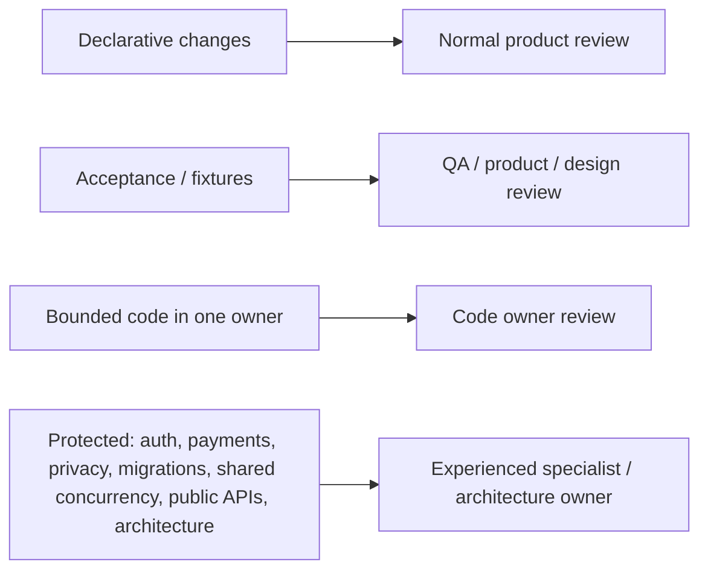

## 31.3 Where changes belong

### Change how it looks

- local Feature UI or `:ui:*` if independently reusable.

### Change what product data is displayed

- Feature/Cell presentation mapping;
- Capability Query if product read contract changes.

### Change business behavior

- Capability Command/Query semantics.

### Change cache/network/socket behavior

- Capability implementation/resource owner.

### Change navigation/lifecycle/platform behavior

- protected runtime/platform area; mobile/platform specialist review.

## 31.4 Protected areas

Require explicit experienced review for:

- auth/session;
- payments;
- privacy/security;
- cryptography;
- irreversible DB migrations;
- shared concurrency/resource lifecycle;
- public Capability APIs;
- architecture/control-plane rule changes.

---

# 32. QA operating model

## 32.1 QA mental model

QA should be able to identify:

```text
Screen/Cell instance
ResourceKey
current fixture/state
refresh/freshness state
live connection/subscriber state
last Action/Output
```

without reading mobile internals.

## 32.2 Normal QA workflow

1. reproduce using fixture gallery where possible;
2. identify Cell/Screen and state;
3. test offline/refresh/reconnect where relevant;
4. capture inspector/flight-recorder summary;
5. attach expected vs actual screenshot/behavior;
6. report RouteKey/FeatureInstanceKey/ResourceKey when available.

## 32.3 High-value scenarios

For stateful Cells:

- Loading/content/error/offline;
- same Cell twice;
- move/reuse across surfaces;
- scroll off/on;
- logical removal;
- process restart;
- large font/dark/compact/expanded;
- kill switch/registry inclusion;
- live reconnect;
- resource shared by multiple observers.

## 32.4 Better bug report example

```text
Surface: Home
Cell: LiveScoreCell
FeatureInstanceKey: home-feed/live-score/slot-12
ResourceKey: match-123
Observed: Cell shows stale score after socket reconnect
Inspector: subscribers=2, socket=connected, last REST refresh=31s,
           last socket sequence did not advance after reconnect
Expected: both Home and Article instances converge to latest score
```

This is far more actionable than "score widget sometimes stale."

---

# 33. Management outcomes and metrics

Management should track outcomes rather than module counts.

## 33.1 Delivery metrics

- time from product intent to verified change;
- review turnaround;
- percentage of routine work completed without platform specialist;
- AI-agent retry/repair loops;
- context loaded per bounded task.

## 33.2 Blast-radius metrics

- files/modules/owners affected by local changes;
- compile/test fanout;
- ABI consumers affected;
- surprising impact reports.

## 33.3 Architecture health

- number/age of exceptions;
- repeated illegal edge attempts;
- duplicate live resource/socket implementations;
- public API growth/churn;
- module co-change patterns;
- over-fragmented modules that always change together.

## 33.4 Debug/quality metrics

- mean time to identify state/resource owner;
- mean time to diagnose duplicated/stale resource;
- fixture coverage of important product states;
- qualification-suite failures caught before upgrade rollout.

## 33.5 Reuse metrics

Measure meaningful reuse separately:

- Cell reuse across surfaces;
- pure UI reuse;
- Capability consumers.

Do not optimize for the raw number of shared modules.

---

# 34. Documentation derivation rules

This master is intentionally dense. Derived docs should be audience-shaped.

Every published derived document must be **self-sufficient for its declared purpose and audience**: it must not require this chat thread, old review artifacts, or undocumented oral history. It may link to deeper derived pages for optional detail, but all facts needed to execute its stated job must be restated from this master. Derived documents never cite the conversation as authority.

## 34.1 Canonical derived technical documents

### Architecture Specification

Derive from:

- Sections 1-18;
- normative rules in 21-25;
- qualification summary only, not full history.

Omit most historical alternatives except concise `Why` notes.

### Implementation Guide

Derive from:

- 7-18;
- 30;
- operational parts of 22;
- checklists.

Focus on "what do I do?" not architecture history.

### Rules & Dependency Matrix

Derive from:

- 8-10;
- 21;
- identity/resource restrictions.

Should be compact and machine-oriented.

### Resource & Data Architecture

Derive from:

- 13-18;
- relevant ADRs/known costs.

### Runtime & Ownership Model

Derive from:

- 11-12;
- qualification notes for Nav3/keyed host/Web.

### Golden Path & Control Plane

Derive from:

- 21-24.

### Testing, Fixtures & Observability

Derive from:

- 19-20;
- QA parts of 32.

### ADR & Qualification Register

Derive from:

- 24-28;
- current verified upstream snapshot.

## 34.2 Management / low-tech docs

The full low-tech/cross-functional document family agreed during the documentation design is:

| Derived document | Primary audience | Core job |
|---|---|---|
| **Helix KMP: Executive Overview** | engineering/product leadership, managers, architects | explain the business/engineering problem, investment, outcomes, risks, and success measures |
| **Why Helix KMP: Principles, Trade-offs & Design Philosophy** | everyone | explain ownership, low blast radius, cohesion/coupling, modular reuse, AI/context efficiency, simple defaults, and conscious costs without Kotlin detail |
| **Helix KMP Technology Choices: Why This, Why Not That** | managers, architects, web/backend/mobile engineers | record why current libraries/mechanisms were chosen, alternatives explored, risks, and `Revisit when` conditions |
| **How Software Gets Built in Helix KMP** | PM, QA, design, cross-stack engineers | follow a change from requirement through context/generation/code/fixtures/tests/review/release |
| **Contributing Without Mobile Expertise** | backend/web/data/QA/AI-assisted contributors | show exactly what can be changed safely without Android lifecycle/Gradle/Compose-internals knowledge |
| **Helix KMP Quality & Test Automation Philosophy** | QA, developers, managers | explain layered verification, what each test rail proves, and why goldens are not correctness |
| **QA Guide to Helix KMP** | manual QA and automation QA | show fixture-gallery, resource-inspector, lifecycle/offline/live-resource scenarios, and actionable bug evidence |
| **Safe Change & Blast-Radius Guide** | managers, QA, all engineers | explain expected impact, `impact`/affected verification, surprising fanout, and architecture-health signals |
| **Helix KMP for Backend & Web Engineers** | non-mobile software engineers | map familiar frontend/backend concepts to Cell/Capability/Resource without teaching Android first |
| **Helix KMP Glossary & Mental Model** | everyone | short visual `is / is not` reference for all canonical vocabulary and identities |
| **Architecture Evolution: How Helix Changes Without Rewrites** | leadership, architects, senior engineers | explain `Revisit when`, qualification, doctor, codemods, replacement of libraries, extraction/merge, and retreat paths |
| **Helix KMP Contribution & Ownership Policy** | leads, managers, contributors | define contribution lanes, CODEOWNERS/review zones, exceptions, protected work, and agent/human permission parity |

These are **derived views**, not additional architecture authorities.

Main readability rule:

> Lead with outcome, bullets, diagram, and measures. Put technical detail behind optional `<details>` sections or link to technical docs.

### Executive Overview

Use:

- 1-4;
- 33;
- 27 costs in plain language.

Avoid code/library detail in main path.

### Why Helix KMP

Use:

- four laws;
- design qualities;
- problem diagnosis;
- simplified history/alternatives;
- why AI changes weighting.

### Technology Choices: Why This / Why Not That

Use:

- 18;
- 25-28;
- historical alternatives.

Format as:

```text
choice | why now | risk | why not alternative | revisit when
```

### How Software Gets Built

Use:

- control-plane workflow diagram;
- contribution lanes;
- one simple reference change.

### Safe Change & Blast Radius

Use:

- 3.1;
- impact/doctor;
- metrics.

### Architecture Evolution

Use:

- `Revisit when`;
- doctor/codemods;
- replaceable technology.

## 34.3 QA docs

Primary derived pages are **Helix KMP Quality & Test Automation Philosophy** and **QA Guide to Helix KMP**.

Use:

- 19-20;
- 32;
- selected resource/runtime diagrams.

Keep framework names secondary. Lead with observable states and workflows.

## 34.4 Non-mobile contribution docs

Primary derived pages are **Contributing Without Mobile Expertise**, **Helix KMP for Backend & Web Engineers**, **Helix KMP Glossary & Mental Model**, and **Helix KMP Contribution & Ownership Policy**.

Use:

- 31;
- Skills/context/CLI;
- vocabulary/reuse decision tree;
- protected zones.

Do not teach Android lifecycle unless the contribution lane requires it.

## 34.5 Adoption Playbook

Derive from:

- 29;
- full embedded normative contracts from 2, 7-25;
- current qualification snapshot;
- reference Cricket slice;
- adoption completion checklist.

The adoption document is intentionally self-contained and disposable after conversion.

## 34.6 HTML docs site

Markdown remains source. HTML is the primary human reading surface because it supports:

- navigation;
- search;
- anchors/deep links;
- diagrams;
- responsive layout;
- collapsible optional detail;
- links from CLI error codes.

PDF/DOCX are generated snapshots for formal circulation/sign-off only.

## 34.7 Readability rules for derived non-technical docs

- begin with a 60-90 second summary;
- use short bullets;
- use one simple workflow/graph early;
- define Cell/Capability in plain language;
- avoid long code blocks;
- hide technical implementation in optional details;
- distinguish benefits from costs;
- include measurable outcomes;
- do not present library choices as architecture laws.

---

# 35. Architecture red flags

Treat these as likely signs of ownership/boundary drift.

```text
Screen ViewModel opens/owns WebSocket for shared resource
Feature imports capability-impl
Capability impl imports another business impl
UI module resolves Koin ViewModel
UI module imports navigation
Cell imports another Cell implementation
Cell has no stable FeatureInstanceKey despite multiple instances
Resource identity is a LazyList index
RouteKey reused as ResourceKey
UiCommand carries full domain object/resource snapshot
Snapshot runtime/SQLDelight types appear in Feature API
HomeRepository aggregates unrelated domains only for one screen
Global RefreshManager owns Cricket/Article-specific TTL rules
Global EventBus used to avoid dependency design
Per-module YAML duplicates Gradle/role/owner facts
Module-per-Cell generated regardless of need
Generic BaseViewModel forces unused concepts
One physical DB treated as permanent business boundary
Goldens updated to make a behavioral test failure disappear
Architecture rule disabled because generator/tooling lacks repair path
Nested AGENTS/CLAUDE file copied into every Cell with stale duplicated rules
```

---

# 36. Non-goals

Helix does not aim to:

- give every Composable a ViewModel/Cell/module;
- create feature/domain/data/API/impl modules for every idea on day one;
- use one global MVI store;
- use one global EventBus;
- make all screens registry/SDUI-driven;
- force a universal Loading/Content/Error/Hidden state;
- require Circuit/Decompose/custom presenter runtime;
- require GraphQL;
- expose database/vendor types to presentation;
- predict every future extraction boundary;
- replace product/architecture judgment with automatic splitting;
- optimize only for today's AI context window;
- create a private biological taxonomy;
- make DOCX/PDF the live source of truth.

---

# 37. External architecture and ecosystem influences explored

These influenced reasoning but are not dependencies or requirements.

## 37.1 Slack Circuit

Influence:

- presenter/state production model;
- SubCircuit/embedded composition ideas;
- code generation/golden paths.

Not selected as default runtime because current ViewModel + qualified keyed owner meets requirements with lower framework commitment.

## 37.2 Square Workflow

Influence:

- typed parent/child composition;
- explicit state machines;
- identity/lifecycle thinking.

Not selected because its ceremony/runtime model is heavier than the common product path needs.

## 37.3 Decompose

Influence:

- component identity;
- child lifecycle;
- state retention;
- navigation models;
- alternative if product topology becomes component-tree dominated.

## 37.4 Uber RIBs / Airbnb Trio/Ghost / Spotify Hubs / Yelp Bento/CHAOS / DoorDash Mosaic / Zalando AppCraft

Influence:

- autonomous/product-aligned component boundaries;
- screen composition;
- plugin/section models;
- server-driven composition as a product-economics dial;
- importance of scale-specific tooling.

Helix does not copy any one framework. It adopts the repeated ownership lessons while keeping a KMP-native/simple baseline.

## 37.5 Clean Architecture

Retained value:

- dependency direction;
- product semantics separated from mechanisms.

Rejected failure mode:

- scattering one cohesive feature across many layer folders/modules merely to satisfy taxonomy.

## 37.6 CQRS

Retained lightly:

- Query vs Command semantics;
- intent-shaped mutations.

Rejected:

- separate buses/databases/enterprise machinery for every client interaction.

## 37.7 Actor-model ownership

Retained as a rule:

- one authoritative owner serializes expensive mutable shared resources.

No requirement to implement actors everywhere.

## 37.8 Backstage / internal developer platforms

Influence:

- templates/golden paths;
- platform creates a valid skeleton;
- developer supplies intent rather than reconstructing architecture.

## 37.9 OpenRewrite / structured codemods

Influence:

- versioned recipes;
- deterministic migrations;
- architecture evolution as executable transformation instead of wiki instructions.

## 37.10 Nx-style graph thinking

Influence:

- architecture as graph with derived multidimensional attributes;
- affected verification;
- impact/context services.

Helix avoids mandatory duplicate tag/YAML metadata when Gradle/source/ownership already contain the facts.

---

# 38. Public reference URLs used for qualification/reasoning

These URLs are evidence references, not architectural dependencies.

- AndroidX Navigation 3 releases: `https://developer.android.com/jetpack/androidx/releases/navigation3`
- AndroidX stable channel: `https://developer.android.com/jetpack/androidx/versions/stable-channel`
- Compose Multiplatform Navigation 3: `https://kotlinlang.org/docs/multiplatform/compose-navigation-3.html`
- Compose Multiplatform 1.10 announcement: `https://blog.jetbrains.com/kotlin/2026/01/compose-multiplatform-1-10-0/`
- AndroidX Compose Runtime releases / retain history: `https://developer.android.com/jetpack/androidx/releases/compose-runtime`
- AndroidX Compose Runtime retain API / RetainedValuesStore: `https://developer.android.com/reference/kotlin/androidx/compose/runtime/retain/package-summary`
- SQLDelight 2.2.1 Web Worker driver: `https://sqldelight.github.io/sqldelight/2.2.1/js_sqlite/`
- Mobile Native Foundation Store releases: `https://github.com/MobileNativeFoundation/Store/releases`
- Koin compiler plugin: `https://github.com/InsertKoinIO/koin-compiler-plugin`
- Koin Compose ViewModel docs: `https://insert-koin.io/docs/reference/koin-compose/compose-viewmodel/`
- Koin common `koinViewModel` source: `https://github.com/InsertKoinIO/koin/blob/main/projects/compose/koin-compose-viewmodel/src/commonMain/kotlin/org/koin/compose/viewmodel/ViewModel.kt`
- AndroidX Lifecycle Compose API (`collectAsStateWithLifecycle`): `https://developer.android.com/reference/kotlin/androidx/lifecycle/compose/package-summary`
- OpenTelemetry Kotlin: `https://opentelemetry.io/docs/languages/kotlin/`
- Apollo Kotlin platform matrix (historical GraphQL evaluation): `https://github.com/apollographql/apollo-kotlin/blob/main/docs/source/index.mdx`
- Apollo normalized cache docs: `https://www.apollographql.com/docs/kotlin/caching/normalized-cache`
- Decompose: `https://arkivanov.github.io/Decompose/`
- Slack Circuit: `https://slackhq.github.io/circuit/`
- historical Store5 POC docs: `https://store.mobilenativefoundation.org/`
- Android offline-first data layer guidance (local-first reads, sync as one suspend function, refresh in an external scope): `https://developer.android.com/topic/architecture/data-layer/offline-first`
- Konsist: `https://docs.konsist.lemonappdev.com/`
- OpenRewrite: `https://docs.openrewrite.org/`
- Android modularization guidance: `https://developer.android.com/topic/modularization`
- Sitecore Helix naming/collision context: `https://helix.sitecore.com/`

---

# 39. Final compact mental model

```text
PUBLIC ARCHITECTURE
-------------------
Helix KMP
  four laws:
    Explicit Ownership
    Product-Facing Boundaries
    Independent Lifetimes
    Enforced Evolution

PRESENTATION
------------
Feature
  owns Screens + Cells

Screen
  navigable owner

Cell
  independently hostable stateful presentation
  NOT a base class
  NOT a Gradle module

UI
  immutable model + callbacks
  stateless reusable rendering

PRESENTATION CONTRACT
---------------------
State       mandatory
Action      mandatory for stateful owner
UiCommand   optional transient local UI instruction
Output      optional semantic message to owner

IDENTITY
--------
RouteKey          navigation
FeatureInstanceKey presentation instance
ResourceKey       shared business resource

BUSINESS / DATA
---------------
Capability API
  grouped Queries
  intent Commands
  stable models

Capability Impl
  Snapshot resource runtime / repository / REST / SQLDelight / WebSocket
  refresh/resource semantics

Resources
  Snapshot
  Live
  Projection

SYNCHRONIZED READ CONTRACT
--------------------------
ResourceObservation<T>
  value + operation
  mapped by ViewModel into product-specific State

RUNTIME SCOPE
-------------
App runtime parent scope
  -> Capability-owned child jobs
  -> never ViewModel scope for shared resources
  -> never GlobalScope

SESSION / AUTH
--------------
Identity owns session + refresh + logout
Foundation network owns generic bearer/401 mechanics

REFRESH
-------
Common layer:
  external triggers + generic QoS/backpressure

Capability:
  freshness + retry + invalidation + forced/needed semantics

VERIFICATION
------------
verify --fast --affected   human/agent inner loop
verify --full              target-complete CI/release/qualification

CONTROL PLANE
-------------
helix-kmp
  graph
  context
  create
  verify
  impact
  doctor
  extract
  migrate
  gallery

AI Skills
  build-feature
  evolve-architecture
  debug-and-repair
  review-and-verify

ONE FACT -> ONE SOURCE
----------------------
role          convention plugin/path
deps          Gradle graph
scope         naming/rare central override
owner         CODEOWNERS
public API    Kotlin + ABI
qualification central register
exceptions    expiring registry
index/context generated graph output
```

---

# 40. Master maintenance checklist

Before publishing a new master edition:

```text
[ ] Four laws unchanged or explicitly ADR-updated
[ ] Vocabulary has no accidental duplicate/competing terms
[ ] Cell still clearly not a base class/module
[ ] Canonical machine-readable dependency policy matches build validator and generated docs
[ ] Enforcement uses strongest practical mechanism before structural tests
[ ] Query/Command/ResourceObservation rules match generators/reference slice
[ ] FeatureInstanceKey construction matches keyed-host/registry code
[ ] Runtime identity + application/capability coroutine scope semantics match regressions
[ ] Auth/session/network ownership matches Identity + Foundation implementations
[ ] Refresh QoS/freshness ownership remains split correctly
[ ] Qualification table reflects exact project POCs
[ ] Exact dependency pins are read from repository operational sources, not duplicated as "latest upstream" prose
[ ] Upstream capability/source URLs were rechecked for qualification-sensitive changes
[ ] P0/P1/P2 stage block is the only staging authority and agent instructions match implemented command availability
[ ] ADR Revisit when conditions reviewed
[ ] CLI command/flag contract matches tooling, including fast/full verification tiers
[ ] AI Skills/root agent template match current workflow
[ ] Context packet contract matches graph tooling and has not outrun measured value
[ ] Doctor/extraction/migration recipes match architecture-kit
[ ] Management metrics include verification latency and contribution lanes reflect operating model
[ ] Naming/public brand rule unchanged or legally re-cleared
[ ] Derived documentation regenerated from this master
[ ] HTML site rebuilt and local links/search validated
```

---

# 41. Closing architecture statement

Helix KMP is not a collection of preferred libraries and it is not a Cell framework.

Its durable claim is:

> **Keep product behavior cohesive, keep unrelated areas loosely coupled, give every state/resource/lifetime an explicit owner, expose stable product-facing boundaries, and automate the creation, verification, diagnosis, and evolution of those boundaries so ordinary changes remain small and understandable for humans and AI agents.**

The architecture should be willing to simplify itself when evidence shows a mechanism no longer pays for its cost. The four laws and the boundary test are more durable than any current framework, module count, AI context size, or persistence technology.

---

# Appendix A. Full root AGENTS.md template

**Post-adoption/P1-complete copyable template.** Its law/vocabulary/prohibition fragments are specified from canonical sections and Section 9 policy. Once the P1 generator/no-drift checker exists, repository `AGENTS.md` must be produced or checked from those sources. During P0, use phase-aware instructions that omit unavailable P1 commands.

```markdown
# Helix KMP Agent Instructions

## Architecture

This repository follows **Helix KMP**.

Four laws:

1. Explicit Ownership
2. Product-Facing Boundaries
3. Independent Lifetimes
4. Enforced Evolution

Ownership card:

One state       -> one owner
One resource    -> one owner
One instance    -> one identity
One arch fact   -> one source of truth

## Canonical vocabulary

- Feature = product presentation scope.
- Screen = navigable presentation destination.
- Cell = independently hostable stateful presentation unit owned by a Feature; not a base class or Gradle module.
- UI = stateless reusable rendering.
- Capability = reusable business/product Queries + Commands + stable models.
- Resource = Snapshot, Live, or Projection owned below presentation.

## Required workflow

Prefer workflow Skills and the public CLI over hand-created architecture wiring.

helix-kmp context <target>
helix-kmp create ... --dry-run --explain
helix-kmp verify --fast --affected
helix-kmp impact <target>

If a rule fails:

helix-kmp doctor <scope> --explain

Do not bypass the rule by importing implementation types or adding a global manager/service locator.

## High-value prohibitions

- Feature -> Capability Impl: forbidden.
- Capability Impl -> another business Capability Impl: forbidden.
- UI -> ViewModel/Koin/navigation/Capability/repository: forbidden.
- Capability API -> Compose/network/DB/resource runtime/impl: forbidden.
- Peer Cell implementation -> peer Cell implementation: forbidden.
- UiCommand must not carry correctness-bearing domain/resource state.
- RouteKey != FeatureInstanceKey != ResourceKey.

## Protected work

Escalate for explicit experienced review when changing auth, payments, privacy/security, irreversible migrations, concurrency/shared-resource lifecycle infrastructure, public capability APIs, or architecture/control-plane rules.

## Verification

The change is not complete until the repository's standard Helix verification command is green and required behavioral/visual/impact evidence is available.
```

---

# Appendix B. Full workflow Skill templates

**Single copyable Skill-template specification.** Section 22 defines the shared contract. Once the architecture-kit generator/checker exists, these bodies must be generated/no-drift checked rather than independently edited.

## B.1 `build-feature`

```markdown
# build-feature

Use this workflow for normal product implementation inside an existing Helix boundary or when creating a Screen/Cell/UI/Capability consumer.

1. Classify the lightest shape: simple UI, Cell, Screen, or complex workflow.
2. Run `helix-kmp context <target>`.
3. If creating a unit, run `helix-kmp create ... --dry-run --explain` before applying.
4. Keep presentation dependent on Capability APIs/product models only.
5. Add/update fixtures and owner-boundary tests.
6. Run `helix-kmp verify --fast --affected`.
7. Run `helix-kmp impact <target>` for non-trivial changes.
8. Return evidence: owner changed, tests/checks, visual fixture evidence if applicable, impact summary, exceptions/risk.

Stop and use `evolve-architecture` or ask an architecture owner if the task needs a new module role, Feature -> Impl dependency, peer Cell coupling, public API widening solely for convenience, or broad boundary movement.
```

## B.2 `evolve-architecture`

```markdown
# evolve-architecture

Use this workflow when reuse/ownership/build/context evidence suggests extracting, merging, splitting, or migrating an architecture boundary.

1. Run `helix-kmp graph` and `helix-kmp impact <scope>`.
2. Run `helix-kmp doctor <scope> --explain --json`.
3. Check relevant ADR `Revisit when` conditions.
4. Prefer an approved deterministic recipe.
5. Run `helix-kmp extract|migrate ... --dry-run --explain`.
6. Obtain human approval for the architecture boundary change.
7. Apply the recipe with `--verify`.
8. Ensure generator/rules/master/derived docs/architecture-kit version are updated if the convention itself changed.

Report consumers, ownership, ABI/build/test fanout, context surface, co-change/exception pressure, and expected blast-radius improvement.
```

## B.3 `debug-and-repair`

```markdown
# debug-and-repair

Use for lifecycle/state loss, duplicated live resources, refresh issues, DI failures, architecture violations, and difficult runtime ownership bugs.

1. Identify RouteKey, FeatureInstanceKey, and ResourceKey involved.
2. Capture Resource Inspector / flight-recorder evidence where available.
3. Run `helix-kmp context <target>` and `helix-kmp doctor <scope> --explain`.
4. Trace Action -> ViewModel -> Capability -> resource -> HTTP/DB/socket -> emission -> State.
5. Repair the smallest owner/boundary that is wrong.
6. Add a regression test at that owner seam.
7. Run `helix-kmp verify --fast --affected` and impact analysis.

Never fix a lifecycle/resource bug by moving shared truth into a Screen ViewModel, opening a socket per Cell, or weakening an architecture rule.
```

## B.4 `review-and-verify`

```markdown
# review-and-verify

Use to review a proposed change, generate evidence, or prepare CI/release verification.

1. Run `helix-kmp impact <target-or-diff> --json` where supported.
2. Run `helix-kmp verify --fast --affected`; run `helix-kmp verify --full` for platform/runtime/qualification seams or release-level review.
3. Inspect architecture graph changes and public ABI changes.
4. Check fixtures/goldens for UI changes and behavioral/resource tests independently.
5. Check qualification suites when a version-sensitive seam is touched.
6. Check exception registry additions/expiry.
7. Summarize expected vs actual blast radius and required owners.

A green visual diff cannot override a behavioral/architecture failure. A green unit test cannot justify an illegal dependency edge.
```

---

# Appendix C. Detailed public CLI workflow examples

## C.1 Add a Cell

```bash
helix-kmp context cricket --json
helix-kmp create cell cricket live-score --dry-run --explain
helix-kmp create cell cricket live-score --apply --verify
helix-kmp impact cricket/live-score
```

## C.2 Diagnose an illegal edge

```bash
helix-kmp verify --fast --affected --json
helix-kmp doctor article --explain
```

## C.3 Extract reusable UI

```bash
helix-kmp extract ui cricket score --dry-run --explain
helix-kmp extract ui cricket score --apply --verify
```

Recipe moves:

- immutable rendering model;
- stateless Composable;
- visual resources.

Recipe must not move:

- ViewModel;
- navigation;
- Koin;
- Capability/resource logic.

## C.4 Extract Capability

```bash
helix-kmp doctor cricket --explain --json
helix-kmp extract capability cricket --dry-run --explain
helix-kmp extract capability cricket --apply --verify
```

## C.5 Architecture-kit migration

```bash
helix-kmp migrate --to architecture-kit-v4 --affected --dry-run --explain
helix-kmp migrate --to architecture-kit-v4 --affected --apply --verify
```

## C.6 Review

```bash
helix-kmp impact --diff origin/main...HEAD --json
helix-kmp verify --fast --affected
helix-kmp gallery
```

---

# Appendix D. Decision matrix: why this and why not that

| Area | Current/final choice | Why | Why not main alternative now | Revisit when |
|---|---|---|---|---|
| architecture unit | Feature + Screen + logical Cell | matches ownership/reuse without module explosion | Screen-only ownership recreates God ViewModel; module-per-Cell too costly | Cells rarely autonomous or ceremony dominates |
| global state model | specialized owners by lifetime/identity | prevents one accidental common owner | universal Redux/MVI store raises coupling and still needs resource/runtime ownership | product state truly converges on one lifetime/identity model |
| presentation owner | ViewModel + UDF | familiar and qualified | Circuit/Molecule adds runtime commitment | measured ceremony dominates useful logic |
| navigation | Navigation 3 | required routing/lifecycle passed, smaller runtime | Decompose broader than needed | nested component-tree topology or helper growth |
| smart embedded lifetime | narrow keyed owner | solves exact lazy Cell gap | full component runtime unnecessary today | first-party replacement or recurring bugs |
| read contracts | grouped Capability Queries | avoids use-case-class explosion | one `ObserveX` class per trivial read too verbose | grouped API becomes unstable/broad |
| writes | intent Commands | semantic and testable | generic CRUD loses product intent | real domain semantics demand different contract |
| Snapshot resource | owned `SyncCoordinator` with a database-owned value | per-key joining, due-checking, observer counting, status, cancellation, and SQLDelight integration qualified | third-party adapter added more glue; an owned value ledger duplicated the database | diagnostics, correctness, target support, or policy pressure favors a replacement |
| Live resource | keyed Capability coordinator + shared state | one resource/connection across observers | Cell/ViewModel socket ownership duplicates resources | another resource runtime fully replaces owned code |
| durable state | SQLDelight | four-target relational path qualified | transport cache alone does not meet durable needs | target/performance/tooling pressure |
| DB topology | one physical DB initially | simplest starting operations | DB-per-capability premature fragmentation | migration/invalidation/isolation pressure |
| refresh | common triggers/QoS + capability freshness | prevents herd without global domain brain | global coordinator duplicates resource framework | scheduler needs repeated product rules |
| batching | BatchHydrator feeds resource owners | optimization invisible to presentation | HomeRepository/observable hydrator becomes new state owner | backend data shape changes |
| DI | Koin + graph/compiler validation | familiar KMP integration | Metro/kotlin-inject switch not worth churn yet | validation unreliable or alternative materially simpler |
| observability | semantic APIs + Kermit/adapters | target/vendor independence | direct OTel/vendor API couples product code | one neutral target-complete option clearly simpler |
| composition | registry by surface need | preserves simple static screens | registry everywhere adds indirection | dynamic surfaces become dominant |
| SDUI | deferred dial | current product does not require global server ownership | full SDUI adds client/server/debug/test complexity | backend-controlled composition dominates |
| GraphQL | not now; future Capability Impl option | backend REST reality | speculative infrastructure; durable Wasm cache gap in Apollo SQLite | backend actually adopts GraphQL |
| module metadata | derive from graph/source | avoids drift | per-module YAML/custom DSL duplicates facts | derivation truly cannot express required fact |
| AI docs | few Skills + generated context | low ceremony, bounded tasks | per-Cell CLAUDE files become stale/reading cost | local deltas prove repeatedly necessary |
| AI vendor model | portable graph/CLI/verification + adapter Skills | same architecture/safety for humans and different agents | vendor-specific prompts as architecture source create lock-in/drift | an industry standard replaces adapters without losing deterministic seams |
| testing | layered rails + fixtures | each test proves a narrow property | goldens/E2E alone are incomplete | tooling noise invalidates a specific rail |

---

# Appendix E. Historical ideas explicitly not part of current Helix

Do not reintroduce these merely because they appear in older artifacts:

```text
Universal Cell<State, Event> superclass/interface
Universal Loading/Content/Error/Hidden CellState
Presenter-Composable as mandatory Cell logic holder
Direct QueryStore access from Cells
Global RefreshCoordinator owning TTL/product freshness
Registry for every Screen
Per-Cell API/Impl Gradle modules
Mandatory seven-file Cell structure
Mandatory per-Cell CLAUDE.md
Decompose as default alongside Navigation 3
Compile-time DI framework migration as baseline requirement
Goldens + E2E as sufficient safety model
GraphQL/Apollo as current architecture requirement
One physical SQLDelight DB as permanent invariant
Agent context-window size as the primary reason for modularity
```

---

# Appendix F. Source provenance

## F.1 Conversation-coverage re-audit

A second explicit coverage audit was performed after Master Source edition 1.0. The audit compared this file against the architecture-thread decisions rather than only the latest derived docs. It reconfirmed coverage of:

- original Blueprint module/dependency/AI-control-plane decisions;
- Fable/Claude Cell Architecture proposals and rejected mechanics;
- final Cell/ViewModel/Capability/Resource/runtime synthesis;
- runtime/data/DI/observability POCs and qualification statuses;
- all seven later architecture criticisms and accepted corrections;
- GraphQL/Apollo proposal and later cancellation;
- naming alternatives/public-collision reasoning;
- CLI/scripts/Skills/context/agent-permission model;
- technical and non-technical documentation catalogs;
- the greenfield-playbook false start and final disposable starter Adoption Playbook;
- documentation-format/readability decisions.

The re-audit added missing **documentation-history and provenance detail**, not a change to the four Helix laws or the frozen architecture shape.

## F.2 Source set

This master was synthesized from the complete architecture discussion and its generated artifacts, including:

- early feature/navigation architecture drafts;
- AI-First Modular KMP Architecture Blueprint revisions through v1.2;
- production baseline documents;
- the external Cell Architecture review artifact;
- adversarial Fable/Claude architecture reviews;
- runtime/data/DI/observability POC outcomes;
- naming/public collision review;
- Helix KMP Baseline v1;
- Helix KMP Documentation Package Documentation Edition 2;
- the standalone Helix KMP Adoption Playbook v2;
- subsequent clarifications in the architecture discussion, including Cell not being a base class, GraphQL deferral, refresh QoS, DB topology, goldens, and AI/control-plane completeness;
- the Claude adversarial review of Master Source edition 1.1 and the implementation-closure disposition in Section 5.12;
- the Claude verification review of Master Source edition 1.2 and the correctness/no-drift fixes recorded in Section 5.13.

After approval, this master should supersede those artifacts as the **reasoning and documentation source of truth**. Repository code/build/ownership systems remain operational sources for derived facts as defined in Section 0.
