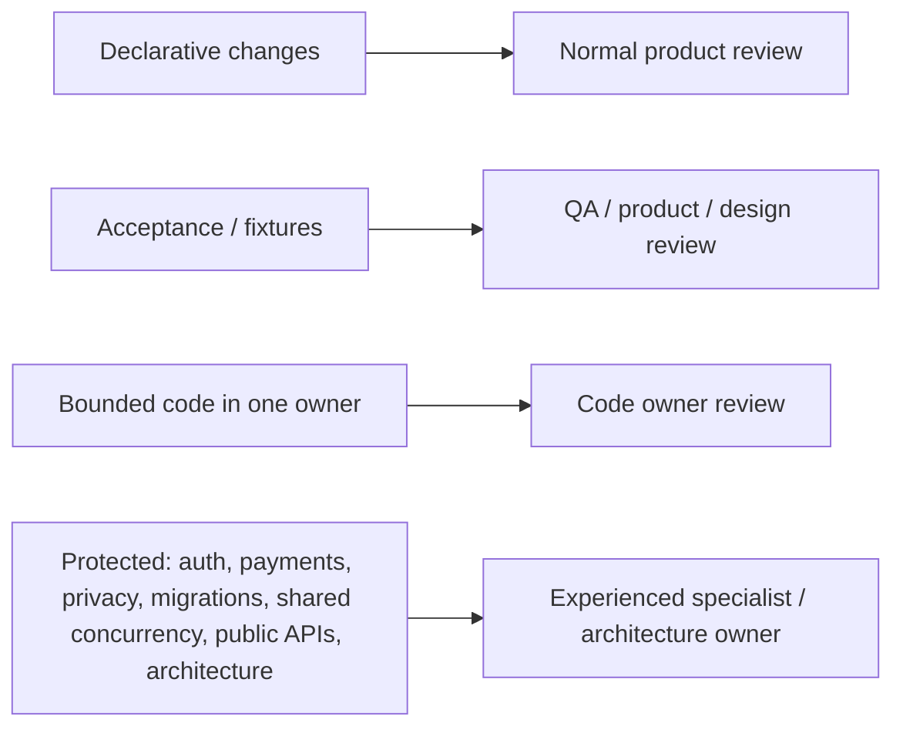

# Contribution without Android expertise

This is the audience guide for contributors who need to change product behaviour without owning
Android lifecycle, Navigation 3, SQLDelight or resource-runtime internals.
[`helix-kmp-source-of-truth.md`](../architecture/helix-kmp-source-of-truth.md) remains the
normative source; subsections keep their original `31.n` numbers.

---


## 31.1 Explicit goal

A contributor should not need to understand Android lifecycle, Nav3 internals, SQLDelight drivers, or Snapshot runtime internals for a task that does not cross those seams.

## 31.2 Normal bounded workflow

```text
product request
 -> identify Feature/Cell/Capability
 -> build-feature Skill
 -> helix-kmp context
 -> edit/generate bounded code
 -> update fixture/test
 -> helix-kmp verify --fast --affected
 -> helix-kmp impact
 -> review evidence
```



## 31.3 Where changes belong

### Change how it looks

- local Feature UI or `:ui:*` if independently reusable.

### Change what product data is displayed

- Feature/Cell presentation mapping;
- Capability Query if product read contract changes.

### Change business behavior

- Capability Command/Query semantics.

### Change cache/network/socket behavior

- Capability implementation/resource owner.

### Change navigation/lifecycle/platform behavior

- protected runtime/platform area; mobile/platform specialist review.

## 31.4 Protected areas

Require explicit experienced review for:

- auth/session;
- payments;
- privacy/security;
- cryptography;
- irreversible DB migrations;
- shared concurrency/resource lifecycle;
- public Capability APIs;
- architecture/control-plane rule changes.
