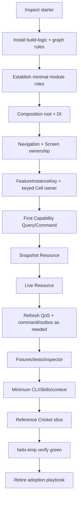

# Helix KMP one-time adoption model for the existing KMP starter

This is the one-time model for converting a lightly configured KMP starter into a Helix KMP
application foundation. It was retired when adoption completed; the dated phase record is
[`helix-adoption-plan.md`](../architecture/helix-adoption-plan.md) and the evidence is
[`helix-adoption-evidence.md`](../architecture/helix-adoption-evidence.md).
[`helix-kmp-source-of-truth.md`](../architecture/helix-kmp-source-of-truth.md) remains the
normative source; subsections keep their original `29.n` numbers.

---


## 29.0 How the adoption-document decision evolved

The documentation discussion briefly proposed a **New Project Implementation Playbook** intended to bootstrap an empty repository. That was corrected twice as the actual repository context became clearer:

1. it is **not** an empty greenfield project;
2. it is also **not** a large mature legacy migration;
3. it is a lightly configured KMP starter with only a few things already present.

Therefore the greenfield playbook and a heavy `LEGACY / MIGRATING / HELIX` strangler-migration model were both rejected for this situation.

The final one-time document is the **Helix KMP Adoption Playbook**:

> Convert an existing lightly configured KMP starter into a complete Helix KMP application foundation by inspecting first, preserving compatible setup, reshaping ownership, installing the minimum rails, converting the small amount of starter code, building one complete reference slice, verifying all supported targets, and then retiring the playbook.

Documentation packaging decision:

- the Adoption Playbook is **separate from the long-lived documentation ZIP/site**;
- it is self-sufficient during conversion;
- once adoption is complete, normal feature development uses the long-lived Implementation Guide/control-plane workflows and the Adoption Playbook is retired.

This section is source material for the separate disposable **Helix KMP Adoption Playbook**. It is not meant to remain a routine developer workflow after adoption.

## 29.1 Repository situation

The starting repository is:

- not empty;
- not a large legacy production app;
- a small/lightly configured KMP starter with only a few pieces already present.

Therefore use neither a greenfield rebuild nor a large-enterprise strangler migration.

## 29.2 Adoption principle

> **Inspect first, keep compatible setup, reshape ownership, replace only what conflicts with Helix.**

Avoid:

- delete/recreate everything;
- permanent LEGACY/MIGRATING/HELIX taxonomies;
- elaborate debt baselines;
- multi-quarter migration dashboards.

## 29.3 Inventory

Record:

- KMP targets;
- Kotlin/Compose/Gradle/AGP/JDK versions;
- current modules;
- navigation;
- DI;
- network;
- DB;
- screens/ViewModels;
- repositories/use cases;
- WebSockets;
- tests;
- build logic.

Classify each existing element:

```text
KEEP
MODIFY
REPLACE
REMOVE
UNKNOWN
```

## 29.4 Keep/modify/replace defaults

| Starter element | Default |
|---|---|
| working Compose Multiplatform | KEEP |
| target setup | KEEP if product-aligned |
| version catalog | KEEP |
| Ktor | KEEP |
| Kotlin serialization | KEEP |
| SQLDelight | KEEP if working; reshape ownership |
| compatible Koin | KEEP/reshape |
| qualified Nav3 | KEEP |
| other navigation | evaluate/replace only as needed |
| simple sample screen | convert into reference Feature/Screen/Cell |
| Screen VM owning unrelated resources | REFACTOR |
| generic `BaseViewModel` | remove unless technically required |
| generic `Repository<T>` framework | remove unless real product semantics |
| `core/common/utils` junk drawer | split by coherent responsibility |
| pure shared Composable | keep local or move to UI when truly reused |
| HTTP DTO exposed to UI | hide behind Capability |
| global WebSocket manager | replace with keyed capability resource ownership |

## 29.5 Adoption phases



## 29.6 Control-plane minimum during adoption

Section **22.1.1 is the only canonical staging definition**.

Adoption sequence:

```text
P0 before first real Cell
  -> build/reference Cell and first vertical slice
  -> implement P1 thin commands + no-drift agent instructions
  -> only then declare Helix adoption complete
```

Do not maintain a second "establish early / mature later" list here.

## 29.7 Adoption completion

The repository is ready for normal Feature development when:

```text
all required targets build
DI graph verifies
module/dependency rules pass
typed RouteKey works
keyed Cell owner regression passes
one real Cell works
one grouped Capability Query works
one Snapshot Resource works
one Live Resource shares correctly
refresh trigger/freshness split works
fixtures/tests exist
Resource Inspector hooks exist
P0 + P1 control-plane gates from Section 22.1.1 are complete
root agent instructions mention only implemented commands and pass no-drift check
standard helix-kmp verify --fast is green
required full/target qualification gates are green
starter patterns conflicting with Helix are removed
```

After this point, use the normal Implementation Guide/Skills rather than the adoption runbook.
