# Architecture Diagrams

This file contains all the Mermaid diagrams used in the documentation for easy reference and viewing.

## 1. Overall Architecture

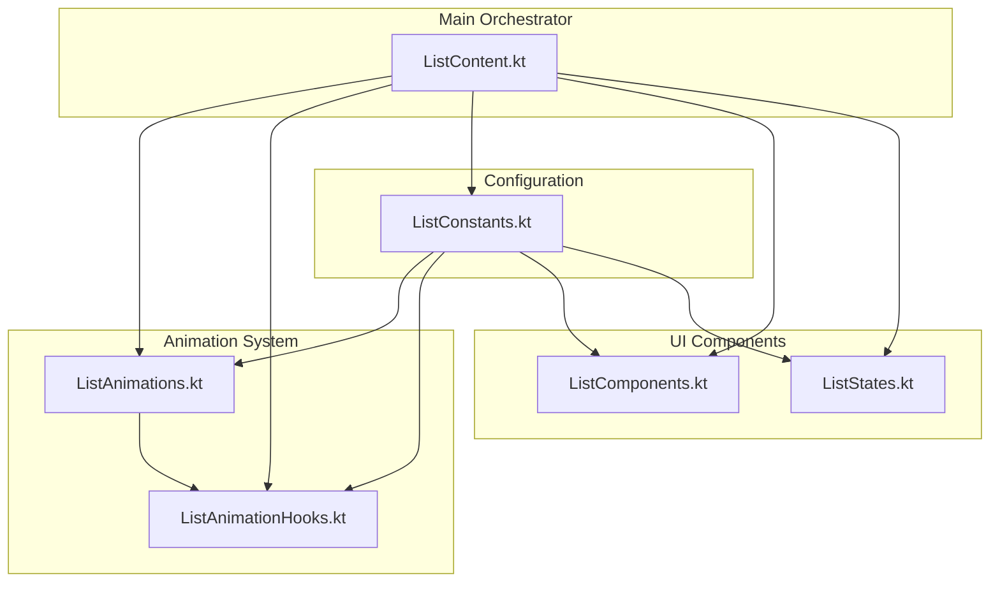

## 2. Animation Strategy Pattern

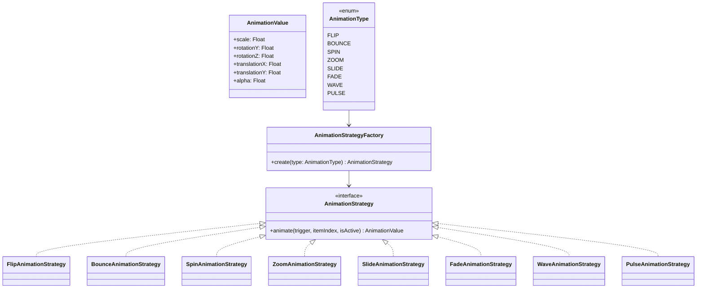

## 3. Animation Hooks

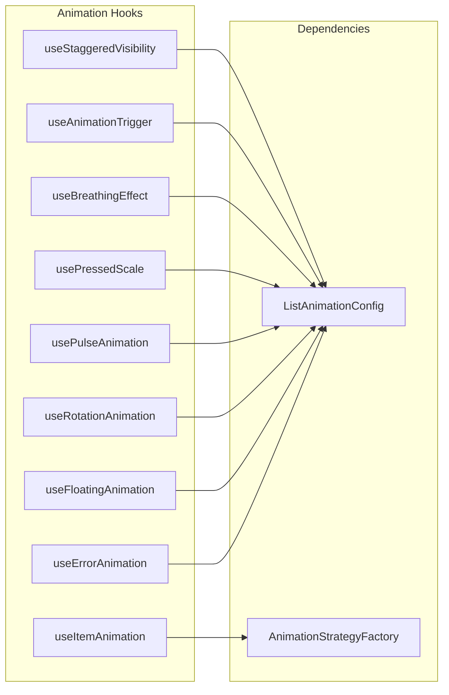

## 4. Configuration Structure

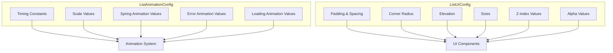

## 5. UI Components Hierarchy

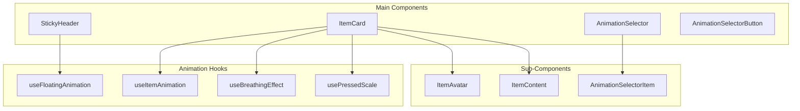

## 6. State Management

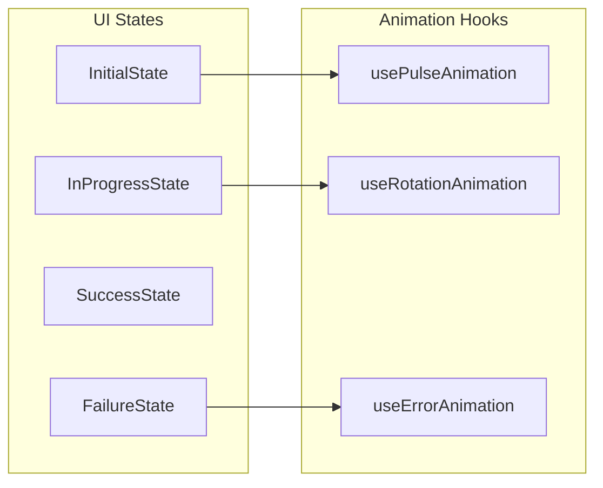

## 7. Main Orchestrator Structure

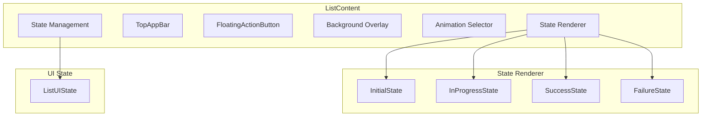

## 8. Data Flow

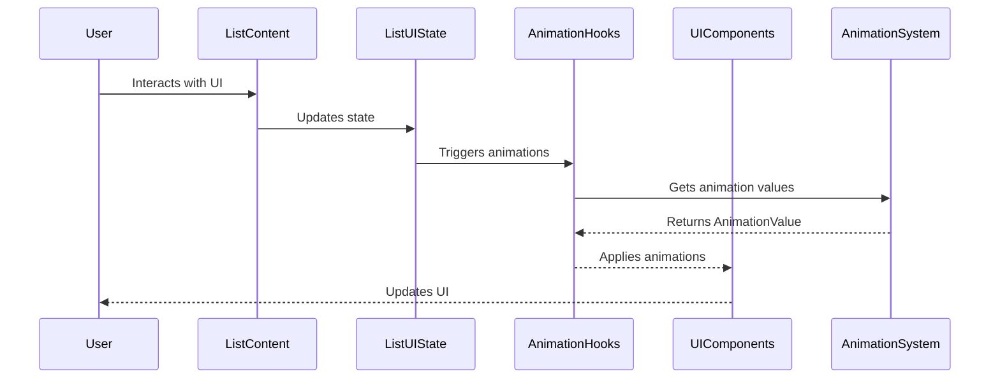

## 9. File Dependencies

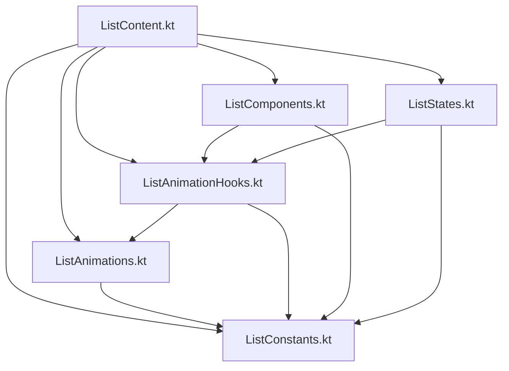

## 10. Component Composition

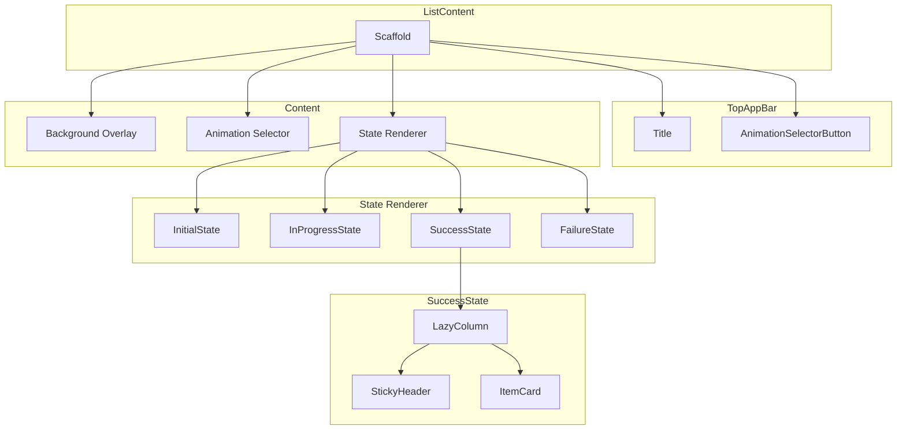

## 11. Animation Flow

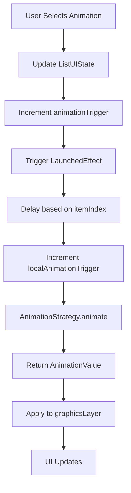

## 12. State Transitions

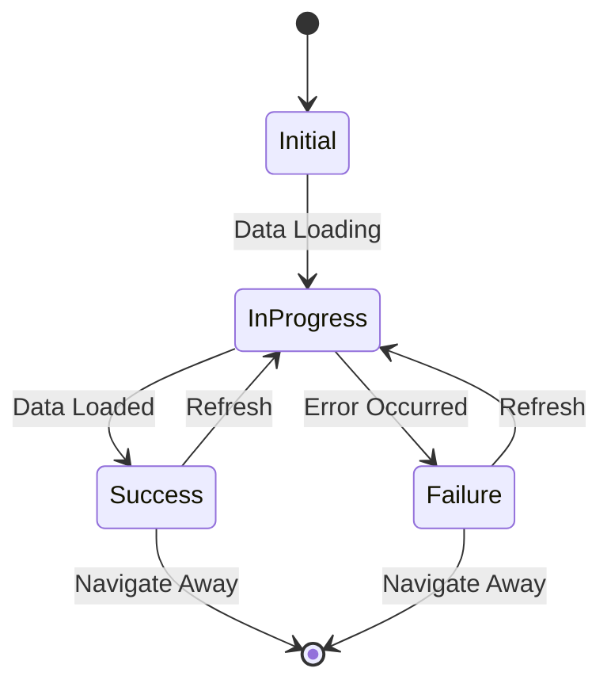

## 13. Hook Dependencies

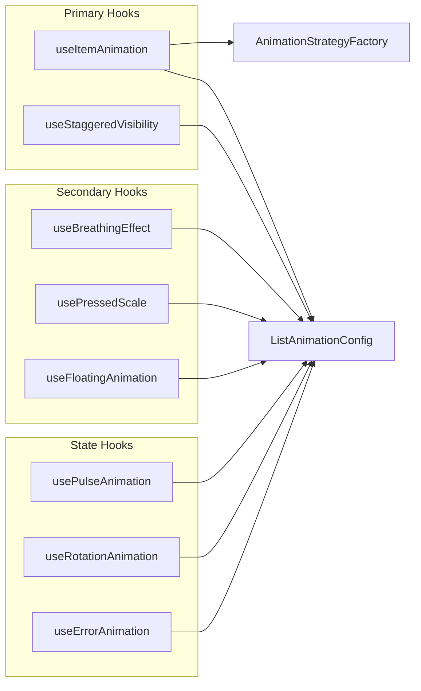

## 14. Configuration Impact

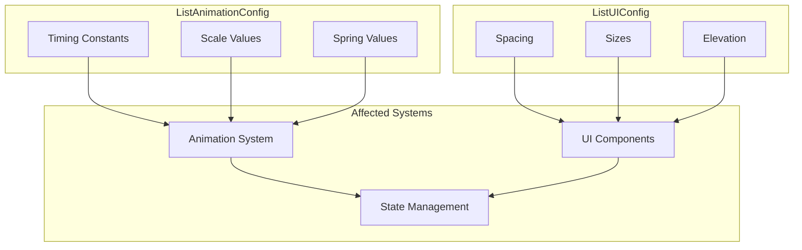

## 15. Testing Architecture

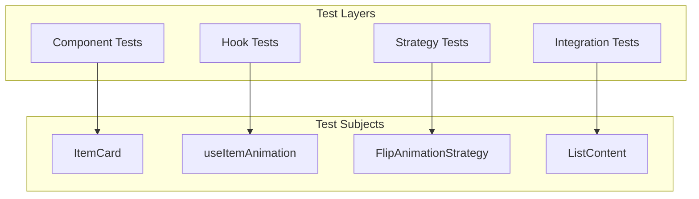

These diagrams provide a comprehensive visual understanding of the refactored architecture. Each diagram can be viewed in any Mermaid-compatible viewer or documentation system. 