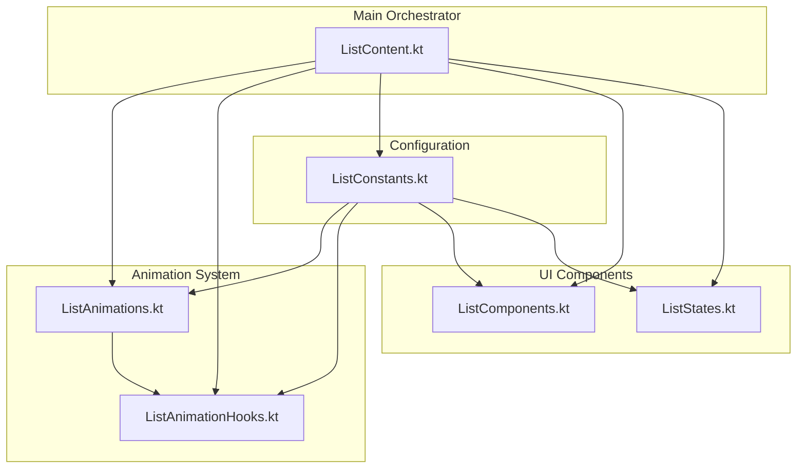
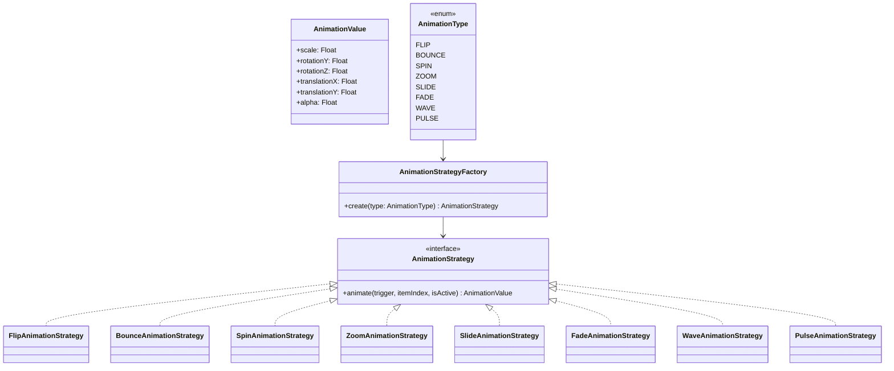
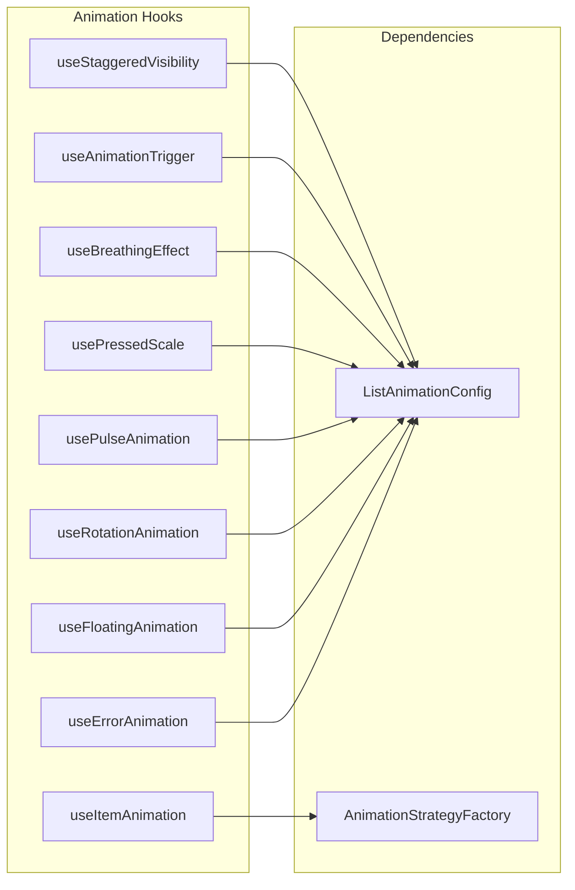
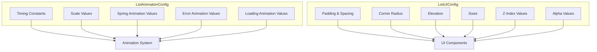
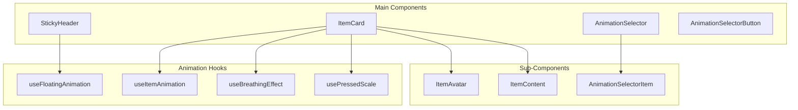
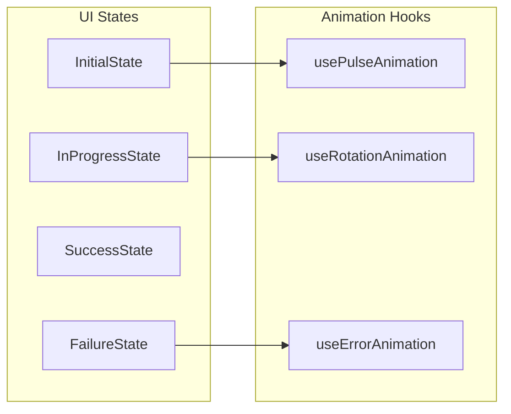
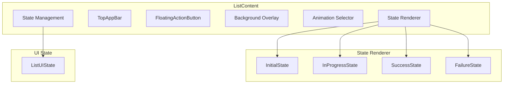
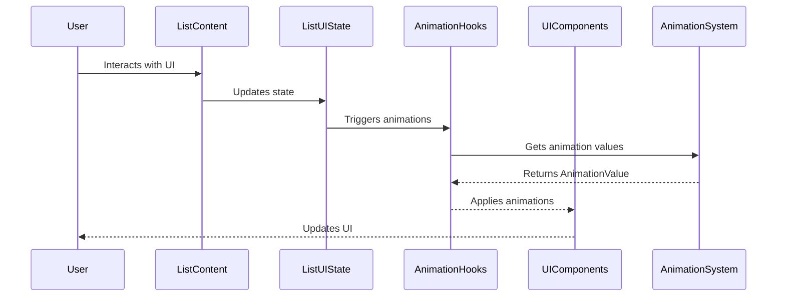

# List Feature Refactoring Documentation

## Overview

This document explains the refactoring of the `ListContent.kt` file from a monolithic 769-line file into a well-structured, maintainable architecture using modern Compose best practices.

## Architecture Overview



## File Structure

```
shared/features/list/src/commonMain/kotlin/dev/mayankmkh/basekmpproject/shared/features/list/ui/
├── ListContent.kt          # Main orchestrator (200 lines)
├── ListAnimations.kt       # Animation strategy pattern (200 lines)
├── ListAnimationHooks.kt   # Custom composable hooks (150 lines)
├── ListConstants.kt        # Configuration constants (100 lines)
├── ListComponents.kt       # Reusable UI components (250 lines)
└── ListStates.kt          # State management composables (150 lines)
```

## Detailed Architecture

### 1. Animation System (`ListAnimations.kt`)

The animation system uses the Strategy Pattern to provide pluggable animation behaviors.



**Key Benefits:**
- **Extensible**: Easy to add new animation types
- **Testable**: Each strategy can be tested independently
- **Maintainable**: Animation logic is isolated and focused

### 2. Custom Animation Hooks (`ListAnimationHooks.kt`)

Reusable composable hooks that encapsulate animation logic.



**Hook Examples:**
```kotlin
// Staggered visibility for list items
val showItems = useStaggeredVisibility(trigger = uiState is Success)

// Item-specific animation
val animationValue = useItemAnimation(
    trigger = animationTrigger,
    itemIndex = itemIndex,
    animationType = selectedAnimation
)

// Breathing effect for cards
val breathScale = useBreathingEffect(delayMillis = itemIndex * 50)
```

### 3. Configuration Management (`ListConstants.kt`)

Centralized configuration for all magic numbers and constants.



**Benefits:**
- **Single Source of Truth**: All constants in one place
- **Easy Maintenance**: Change values without hunting through code
- **Consistency**: Ensures uniform behavior across components

### 4. UI Components (`ListComponents.kt`)

Reusable, focused UI components with clear responsibilities.



**Component Responsibilities:**
- **StickyHeader**: Section headers with floating animation
- **ItemCard**: Individual list items with complex animations
- **ItemAvatar**: Circular avatar with press animations
- **ItemContent**: Text content with proper overflow handling
- **AnimationSelector**: Dropdown for animation selection

### 5. State Management (`ListStates.kt`)

Focused composables for different UI states.



**State Responsibilities:**
- **InitialState**: Loading indicator with pulse animation
- **InProgressState**: Spinning loader with rotation animation
- **SuccessState**: Animated list with staggered items
- **FailureState**: Error display with shake and pulse animations

### 6. Main Orchestrator (`ListContent.kt`)

The main composable that orchestrates all components.



**Orchestrator Responsibilities:**
- **State Management**: Consolidated `ListUIState` object
- **Component Coordination**: Manages interactions between components
- **Animation Triggers**: Controls when animations are triggered
- **Layout Structure**: Scaffold with proper positioning

## Data Flow



## Benefits of Refactoring

### Before vs After

| Aspect | Before | After |
|--------|--------|-------|
| **File Size** | 769 lines | 200 lines (main) + focused modules |
| **Responsibility** | Everything in one file | Single responsibility per file |
| **Animation Logic** | Mixed with UI | Isolated strategy pattern |
| **Constants** | Scattered magic numbers | Centralized configuration |
| **Reusability** | Monolithic functions | Reusable components and hooks |
| **Testability** | Hard to test | Easy to test individual parts |
| **Maintainability** | Difficult to modify | Easy to extend and modify |

### Key Improvements

1. **Separation of Concerns**
   - Animation logic separated from UI rendering
   - State management isolated from business logic
   - Configuration separated from implementation

2. **Strategy Pattern for Animations**
   - Pluggable animation system
   - Easy to add new animation types
   - Testable animation strategies

3. **Custom Composable Hooks**
   - Reusable animation logic
   - Clean separation of concerns
   - Easy to compose complex animations

4. **Configuration Management**
   - Single source of truth for constants
   - Easy to maintain and modify
   - Consistent behavior across components

5. **Component-Based Architecture**
   - Reusable UI components
   - Clear component boundaries
   - Easy to test individual components

## Usage Examples

### Adding a New Animation Type

1. **Add to AnimationType enum:**
```kotlin
enum class AnimationType(val displayName: String) {
    // ... existing types
    SHAKE("Shake")
}
```

2. **Create strategy implementation:**
```kotlin
class ShakeAnimationStrategy : AnimationStrategy {
    @Composable
    override fun animate(trigger: Int, itemIndex: Int, isActive: Boolean): AnimationValue {
        val shake by animateFloatAsState(
            targetValue = if (trigger > 0 && isActive) 1f else 0f,
            animationSpec = tween(400, delayMillis = itemIndex * 100),
            label = "shake"
        )
        return AnimationValue(translationX = (1f - shake) * 20f)
    }
}
```

3. **Add to factory:**
```kotlin
object AnimationStrategyFactory {
    fun create(type: AnimationType): AnimationStrategy {
        return when (type) {
            // ... existing cases
            AnimationType.SHAKE -> ShakeAnimationStrategy()
        }
    }
}
```

### Creating a New Custom Hook

```kotlin
@Composable
fun useCustomAnimation(
    trigger: Int,
    duration: Int = ListAnimationConfig.CUSTOM_DURATION
): Float {
    return animateFloatAsState(
        targetValue = if (trigger > 0) 1f else 0f,
        animationSpec = tween(duration),
        label = "custom"
    ).value
}
```

### Adding Configuration Constants

```kotlin
object ListAnimationConfig {
    // ... existing constants
    const val CUSTOM_DURATION = 800
    const val CUSTOM_SCALE = 1.5f
}
```

## Testing Strategy

### Unit Testing Components

```kotlin
@Test
fun `ItemCard should apply correct animation values`() {
    // Test individual component with mocked dependencies
    composeTestRule.setContent {
        ItemCard(
            item = testItem,
            onItemClick = {},
            itemIndex = 0,
            animationTrigger = 1,
            selectedAnimation = AnimationType.FLIP
        )
    }
    // Assert expected behavior
}
```

### Testing Animation Strategies

```kotlin
@Test
fun `FlipAnimationStrategy should return correct rotation values`() {
    val strategy = FlipAnimationStrategy()
    // Test strategy in isolation
}
```

### Testing Custom Hooks

```kotlin
@Test
fun `useStaggeredVisibility should show items after delay`() {
    // Test hook behavior with different inputs
}
```

## Performance Considerations

1. **Memoization**: Animation strategies are memoized using `remember()`
2. **Lazy Evaluation**: Animations only run when triggered
3. **Staggered Animations**: Items animate with delays to avoid overwhelming the system
4. **Efficient State Updates**: Consolidated state object reduces recompositions

## Future Enhancements

1. **Animation Presets**: Predefined animation combinations
2. **Gesture-Based Animations**: Touch and drag animations
3. **Performance Monitoring**: Animation performance metrics
4. **Accessibility**: Animation preferences for users with motion sensitivity
5. **Theme Integration**: Animation values based on theme settings

## Conclusion

The refactored architecture provides a solid foundation for maintainable, extensible, and testable Compose UI code. The separation of concerns, use of design patterns, and modular structure make it easy to add new features, modify existing behavior, and ensure code quality through comprehensive testing. 